Redwood bacterial ecology
================
Claire Willing
7/9/2020

title: “RedwoodBacterialEcologyMS” author: “Claire Willing” date:
“5/5/2020” output: html\_document: default pdf\_document: default —

``` r
library(phyloseq)
library(vegan)
library(lattice)
library(ggplot2)
library(dplyr)
library(tidyr)
library(gridExtra)
library(nortest)
library(SoDA)
library(ecodist)
library(labdsv)
library(TITAN2)
library(gdm)
library(cowplot)
library(gridGraphics)
library(sjPlot)
library(ggtext)
library(reshape2)
```

Reading in my OTU table (phyloseq)

``` r
##This is commented out because I had to create and save the CSV file for the phyloseq format

#setwd("~/Documents/Research/Thesis_Ch1/Data/CleanData")
#CN=read.csv("CNData_Cleaned.csv", header=T)
    #Calculate CN ratio
    #CNratio=PercentC/PercentN
    ##Append to table
    #CNall<-cbind.data.frame(CNratio, CN)
#attach(CNall)

#Soilread1=read.csv("OtherSoilDataClean.csv", header=T)
#attach(Soilread1)

#Combine all soil data into one dataframe
#merging both datasets
#Soildata<-full_join(Soilread1, CNall)

##mapfile
#METAdata=read.table("BACTERIA_Meta.txt", header = T)
#    Soildata$SiteID<-as.character(Soildata$SiteID)
#    Soildata$Treenum<-as.character(Soildata$Treenum)

    
#METAfull=full_join(METAdata, Soildata)

##Created a new file with full metadata (couldn't script this because of phyloseq)
#write.csv(METAfull, file = "BACTERIAMETA_complete.csv")


##biom file and map file
setwd("~/Dropbox/Research/Thesis_Ch3/CleanData/")
biom_file="bacteriaotu.json"
map_file="MIDMETA_complete.txt"
biomot=import_biom(biom_file, parseFunction=parse_taxonomy_greengenes)
META=import_qiime_sample_data(map_file)
```

Creating phyloseq object

``` r
##merging OTU and metadata
NOTRARE=merge_phyloseq(biomot, META)
```

Rarification to 5000 reads per sample

``` r
set.seed(5)

Bacteriaonly<-subset_taxa(NOTRARE, Kingdom=="Bacteria")

#RARE=rarefy_even_depth(Bacteriaonly, sample.size = 5000)
#save(RARE, file = "RARE.rda")
setwd("~/Dropbox/Research/Thesis_Ch3/CleanData/R")
load(file = "RARE.rda")
```

Subsetting samples by sample type

``` r
##subset by sample type
Roots<-subset_samples(RARE, SampleType=="Root")
Soils<-subset_samples(RARE, SampleType=="Soil")
```

Ordination using default of bray for distance (bray is default method
for ordinate function)

``` r
Publicationcolors <- function(...){
  library(scales)
  discrete_scale("colour","Publication",manual_pal(values = c("#2332A0", "#36B4FC", "#1BFFE8", "#19FF31", "#FFE400", "#FE9400", "#ff5a04", "#AA3407", "red")))
}


ORDtotalvals<-ordinate(RARE, "PCoA")
ORDbray<-plot_ordination(RARE, ORDtotalvals, color = "SiteID", shape = "SampleType")+ geom_point(size=3)+
  Publicationcolors()+
  theme(    
        text = element_text(family = "Helvetica"),
        panel.background = element_rect(fill="transparent", colour = NA),
        plot.background = element_rect(fill="transparent",colour = NA),
        panel.border = element_rect(fill="transparent", colour = "black"),
        axis.title.y = element_text(angle=90, size = 14, margin = margin(r=3, unit = "mm"), 
                                    family="Helvetica"),
        axis.title.x = element_text(size=14, margin = margin(t=3, unit = "mm")),
        axis.text.x = element_text(size=14, margin = unit(c(t = 2.5, r = 0, b = 0, l = 0), "mm")),
        axis.text.y = element_text(size=14, margin = unit(c(t = 0, r = 2.5, b = 0, l = 0), "mm")),
        axis.line = element_blank(),
        axis.ticks.x = element_line(colour = "black"),
        axis.ticks.y = element_line(colour = "black"),
        axis.ticks.length=unit(-1.4, "mm"), 
        panel.grid.major = element_blank(),
        panel.grid.minor = element_blank(),
        legend.key = element_rect(fill="transparent", colour = NA),
        legend.position =c(0.09,0.75),
        legend.key.size= unit(4, "mm"),
        legend.text = element_text(size =10),
        legend.spacing = unit(0, "mm"),
        legend.background = element_rect(fill = "transparent", colour = NA),
        plot.margin=margin(t=2, r=2, b=2, l=2, unit = "mm"),
        strip.background=element_rect(fill="transparent", colour=NA),
        strip.text = element_text(face="bold"))
```

Bar plots

``` r
Top500= names(sort(taxa_sums(RARE), TRUE)[1:500])
Top500=prune_taxa(Top500, RARE)

Top500_Site1<-subset_samples(Top500, SiteID=="1")
Top500_Site2<-subset_samples(Top500, SiteID=="2")
Top500_Site3<-subset_samples(Top500, SiteID=="3")
Top500_Site4<-subset_samples(Top500, SiteID=="4")
Top500_Site5<-subset_samples(Top500, SiteID=="5")
Top500_Site6<-subset_samples(Top500, SiteID=="6")
Top500_Site7<-subset_samples(Top500, SiteID=="7")
Top500_Site8<-subset_samples(Top500, SiteID=="8")


Site1root<- subset_samples(Top500_Site1, SampleType=="Root")
Site1soil<-subset_samples(Top500_Site1, SampleType=="Soil")
Site2root<- subset_samples(Top500_Site2, SampleType=="Root")
Site2soil<-subset_samples(Top500_Site2, SampleType=="Soil")
Site3root<- subset_samples(Top500_Site3, SampleType=="Root")
Site3soil<-subset_samples(Top500_Site3, SampleType=="Soil")
Site4root<- subset_samples(Top500_Site4, SampleType=="Root")
Site4soil<-subset_samples(Top500_Site4, SampleType=="Soil")
Site5root<- subset_samples(Top500_Site5, SampleType=="Root")
Site5soil<-subset_samples(Top500_Site5, SampleType=="Soil")
Site6root<- subset_samples(Top500_Site6, SampleType=="Soil")
Site6soil<-subset_samples(Top500_Site6, SampleType=="Root")
Site7root<- subset_samples(Top500_Site7, SampleType=="Root")
Site7soil<-subset_samples(Top500_Site7, SampleType=="Soil")
Site8root<- subset_samples(Top500_Site8, SampleType=="Root")
Site8soil<-subset_samples(Top500_Site8, SampleType=="Soil")


Site1root <- Site1root %>%
  psmelt() %>%                                       
  arrange(Phylum) 

Site1soil <- Site1soil %>%
  psmelt() %>%                                       
  arrange(Phylum) 

Site2root <- Site2root %>%
  psmelt() %>%                                       
  arrange(Phylum) 

Site2soil <- Site2soil %>%
  psmelt() %>%                                       
  arrange(Phylum) 


Site3root <- Site3root %>%
  psmelt() %>%                                       
  arrange(Phylum) 

Site3soil <- Site3soil %>%
  psmelt() %>%                                       
  arrange(Phylum) 

Site4root <- Site4root %>%
  psmelt() %>%                                       
  arrange(Phylum) 

Site4soil <- Site4soil %>%
  psmelt() %>%                                       
  arrange(Phylum) 

Site5root <- Site5root %>%
  psmelt() %>%                                       
  arrange(Phylum) 

Site5soil <- Site5soil %>%
  psmelt() %>%                                       
  arrange(Phylum) 

Site6root <- Site6root %>%
  psmelt() %>%                                       
  arrange(Phylum) 

Site6soil <- Site6soil %>%
  psmelt() %>%                                       
  arrange(Phylum) 

Site7root <- Site7root %>%
  psmelt() %>%                                       
  arrange(Phylum) 

Site7soil <- Site7soil %>%
  psmelt() %>%                                       
  arrange(Phylum) 

Site8root <- Site8root %>%
  psmelt() %>%                                       
  arrange(Phylum) 

Site8soil <- Site8soil %>%
  psmelt() %>%                                       
  arrange(Phylum) 

Site1root$samptypecode <- "Root"
Site1soil$samptypecode <- "Soil"
Site2root$samptypecode <- "Root"
Site2soil$samptypecode <- "Soil"
Site3root$samptypecode <- "Root"
Site3soil$samptypecode <- "Soil"
Site4root$samptypecode <- "Root"
Site4soil$samptypecode <- "Soil"
Site5root$samptypecode <- "Root"
Site5soil$samptypecode <- "Soil"
Site6root$samptypecode <- "Root"
Site6soil$samptypecode <- "Soil"
Site7root$samptypecode <- "Root"
Site7soil$samptypecode <- "Soil"
Site8root$samptypecode <- "Root"
Site8soil$samptypecode <- "Soil"

Site1root$SiteID <- "1"
Site1soil$SiteID <- "1"
Site2root$SiteID <- "2"
Site2soil$SiteID <- "2"
Site3root$SiteID <- "3"
Site3soil$SiteID <- "3"
Site4root$SiteID <- "4"
Site4soil$SiteID <- "4"
Site5root$SiteID <- "5"
Site5soil$SiteID <- "5"
Site6root$SiteID <- "6"
Site6soil$SiteID <- "6"
Site7root$SiteID <- "7"
Site7soil$SiteID <- "7"
Site8root$SiteID <- "8"
Site8soil$SiteID <- "8"


##colors
barcolors= c(Acidobacteria="#CC6600", Actinobacteria ="#9F993D", Armatimonadetes="#cfdde5", Bacteroidetes="#006D58", Firmicutes="#005b96", Chloroflexi="#0C2340", Gemmatimonadetes="#6497b1", Nitrospirae="#FDD023", Planctomycetes="#000000", Proteobacteria="#2F4236",SC3="turquoise",SM2F11="#0F7E94",SPAM="#560d0d",TM7="#a297c3",Verrucomicrobia="#625682", AD3="#576A00", Chlorobi="#6f0000", WS3="#3A243B", Spirochaetes="#0A00A5")


bars_all<- rbind(Site1root, Site1soil,Site2root, Site2soil, Site3root, Site3soil, Site4root, Site4soil,
                 Site5root, Site5soil, Site6root, Site6soil, Site7root, Site7soil, Site8root, Site8soil)

barplot<-ggplot(data = filter(bars_all), aes(SiteID, Abundance, fill = Phylum)) +
  facet_wrap(~samptypecode,scales="free_x", ncol = 1, strip.position = "right") +
  geom_bar(stat = "identity", position = position_fill()) +
  guides(fill = guide_legend(ncol = 1))+
  scale_colour_manual(values = barcolors, labels=c("Acidobacteria", "Actinobacteria", "AD3", "Bacteroidetes", "Chloroflexi", "Firmicutes", "Gemmatimonadetes", "Nitrospirae", "Proteobacteria", "SPAM", "TM7", "Verrucomicrobia", "WS3", "Unassigned"), name="Type")+ 
      scale_fill_manual(values = barcolors)+
            scale_y_continuous("Relative abundance")+
            xlab("Site ID")+
            theme(
            text = element_text(family = "Helvetica"),
            panel.background = element_rect(fill="transparent", colour = NA),
            plot.background = element_rect(fill="transparent",colour = NA),
            strip.background.x=element_rect(fill="LightGray",colour = NA),
            strip.background.y=element_rect(fill="LightGray",colour = NA),
            panel.border = element_rect(fill="transparent", colour = "black"),
            axis.title.y = element_text(angle=90, size = 14, margin = margin(r=3, unit = "mm")),
            axis.title.x = element_text(size=12, margin = margin(t=3, unit = "mm")),
            axis.text.x = element_text(angle=0, size=14, 
                                       margin = unit(c(t = 2.5, r = 0, b = 0, l = 0), "mm")),
            axis.text.y = element_text(size=14, margin = unit(c(t = 0, r = 2.5, b = 0, l = 0), "mm")),
            axis.line = element_blank(),
            axis.ticks.x = element_blank(),
            axis.ticks.y = element_line(colour = "black"),
            axis.ticks.length=unit(-1.4, "mm"), 
            panel.grid.major = element_blank(),
            panel.grid.minor = element_blank(),
            legend.key = element_rect(fill="transparent", colour = NA),
            legend.box = "horizontal",
            legend.key.size= unit(4, "mm"),
            legend.text = element_text(size =11),
            legend.spacing = unit(0, "mm"),
            legend.background = element_rect(fill = "transparent", colour = NA),
            plot.margin=margin(t=2, r=2, b=2, l=2, unit = "mm"),
            strip.background=element_rect(fill="transparent", colour=NA),
            strip.text = element_text(face="bold"))
```

GDM Step 1: OTU Data for GDM

``` r
##write the rarified meta data into a data frame
dfroot<-as(sample_data(Roots), "data.frame")
dfsoil<-as(sample_data(Soils),"data.frame")

##write a datatable of rarified data 
OTUrootraretemp<-as(otu_table(Roots), "matrix")
OTUrareroot<-as.data.frame(OTUrootraretemp)

OTUsoilraretemp<-as(otu_table(Soils), "matrix")
OTUraresoil<-as.data.frame(OTUsoilraretemp)
      
##calculate bray-curtis distances for fungi (uses vegan)
root.bc<-vegdist(t(OTUrareroot), "bray")
soil.bc<-vegdist(t(OTUraresoil), "bray")

##Extract the rare data
GDMrareroot<-as.data.frame(t(OTUrareroot))
GDMraresoil<-as.data.frame(t(OTUraresoil))

#append SiteID
SampleUnique<-dfroot$SampleUnique
GDMrareroot<-cbind(SampleUnique, GDMrareroot)
SampleUnique<-dfsoil$SampleUnique
GDMraresoil<-cbind(SampleUnique, GDMraresoil)


#write.csv(GDMrareroot, "BacteriaGDM_rareroot.csv")
#write.csv(GDMraresoil, "BacteriaGDM_raresoil.csv")
setwd("~/Dropbox/Research/Thesis_Ch3/CleanData/R")
bioDroot<-read.csv("BacteriaGDM_rareroot.csv", header =T)
bioDsoil<-read.csv("BacteriaGDM_raresoil.csv", header=T)

#remove extraneous columns from getting names formatted between files
bioDroot<-dplyr::select(bioDroot,-X, -UniqueID_root)
bioDsoil<-dplyr::select(bioDsoil,-X, -UniqueID_soil)
```

Step 2: Environmental Data for GDM

``` r
##Pulling all of the potential data that I want to test in the data frame
predD_root<-dplyr::select(dfroot, SampleUnique, aet, djf, jja, pH, FINALP, CEC, CNratio, Latitude, Longitude)
predD_soil<-dplyr::select(dfsoil, SampleUnique, aet, djf, jja, pH, FINALP, CEC, CNratio, Latitude, Longitude)

#write.csv(predD_root, "BacteriaGDM_predD_root.csv")
#write.csv(predD_soil, "BacteriaGDM_predD_soil.csv")


##Had to remove NAs--replaced with same tree sample (only 3 CN ratios had NAs)
setwd("~/Dropbox/Research/Thesis_Ch3/CleanData/R")
predD_root<-read.csv("BacteriaGDM_predD_root.csv", header = T)
predD_soil<-read.csv("BacteriaGDM_predD_soil.csv", header = T)


predD_root<-dplyr::select(predD_root,-X)
predD_soil<-dplyr::select(predD_soil,-X)
```

Step 3: Backwards selection for GDM (removing all non-sig factors in
last step here)

``` r
library(Hmisc)
matrix <-(predD_soil[,2:10])
matrix<-as.matrix(matrix)
corr_ana<-cor(matrix)

#with pvals
corr_ana2<-rcorr(matrix)

##turn into a table
flattenCorrMatrix <- function(cormat, pmat) {
  ut <- upper.tri(cormat)
  data.frame(
    row = rownames(cormat)[row(cormat)[ut]],
    column = rownames(cormat)[col(cormat)[ut]],
    cor  =(cormat)[ut],
    p = pmat[ut]
    )
}
#cormat : matrix of the correlation coefficients
#pmat : matrix of the correlation p-values

#For my data
summary = flattenCorrMatrix(corr_ana2$r, corr_ana2$P)
summary
```

    ##         row    column          cor            p
    ## 1       aet       djf -0.408487114 2.999341e-06
    ## 2       aet       jja -0.392078386 7.960820e-06
    ## 3       djf       jja -0.069501574 4.468436e-01
    ## 4       aet        pH -0.432964839 6.330713e-07
    ## 5       djf        pH -0.090470298 3.216738e-01
    ## 6       jja        pH  0.555330271 3.168488e-11
    ## 7       aet    FINALP -0.139797033 1.245961e-01
    ## 8       djf    FINALP  0.092072992 3.131403e-01
    ## 9       jja    FINALP  0.070094253 4.429683e-01
    ## 10       pH    FINALP -0.320505413 3.193440e-04
    ## 11      aet       CEC -0.236300124 8.783440e-03
    ## 12      djf       CEC -0.113870190 2.117177e-01
    ## 13      jja       CEC  0.023969731 7.932702e-01
    ## 14       pH       CEC -0.219498164 1.513303e-02
    ## 15   FINALP       CEC  0.724387878 0.000000e+00
    ## 16      aet   CNratio -0.249705003 5.541069e-03
    ## 17      djf   CNratio  0.006948488 9.394514e-01
    ## 18      jja   CNratio  0.339723799 1.290598e-04
    ## 19       pH   CNratio -0.040736758 6.559547e-01
    ## 20   FINALP   CNratio  0.405168546 3.669346e-06
    ## 21      CEC   CNratio  0.444740078 2.864752e-07
    ## 22      aet  Latitude  0.855111273 0.000000e+00
    ## 23      djf  Latitude -0.669276259 0.000000e+00
    ## 24      jja  Latitude -0.390689883 8.625938e-06
    ## 25       pH  Latitude -0.438824472 4.282618e-07
    ## 26   FINALP  Latitude -0.078791651 3.883215e-01
    ## 27      CEC  Latitude  0.020783498 8.202507e-01
    ## 28  CNratio  Latitude -0.139868374 1.244020e-01
    ## 29      aet Longitude -0.778470837 0.000000e+00
    ## 30      djf Longitude  0.729930488 0.000000e+00
    ## 31      jja Longitude  0.241404204 7.391182e-03
    ## 32       pH Longitude  0.325532488 2.534104e-04
    ## 33   FINALP Longitude  0.071530209 4.336582e-01
    ## 34      CEC Longitude -0.056317132 5.378096e-01
    ## 35  CNratio Longitude  0.088983893 3.297209e-01
    ## 36 Latitude Longitude -0.978513821 0.000000e+00

``` r
##only CEC and Final P were had a cor value>0.7, so probably best to pull out CEC; not sure how to deal with the ones for lat and long (semi-correlate with lat and long, but they are kept seperate in this analysis)

predD_root<-dplyr::select(predD_root, -CEC, -djf, -jja, -FINALP, -CNratio)
predD_soil<-dplyr::select(predD_soil, -CEC, -djf, -jja, -FINALP, -CNratio)
```

Step 4: Formatting site-pairs and running GSM/backward selections of
models

``` r
library(gdm)
##This is the backwards calculations and it stops at full model-5 of the variables (AET is retained only part of the time, as it is likely co-varied with distance)

#gdmDistroot <- formatsitepair(bioDroot, bioFormat = 1, 
#                       dist = "bray", abundance = FALSE, 
#                       siteColumn = "SampleUnique", XColumn = #"Longitude", YColumn = 
#                         "Latitude", 
#                       sppColumn = NULL, abundColumn = NULL, #sppFilter = 0, 
#                       predData = predD_root, distPreds = NULL, #weightType = "equal")

#gdmDistsoil <- formatsitepair(bioDsoil, bioFormat = 1, 
#                       dist = "bray", abundance = FALSE, 
#                       siteColumn = "SampleUnique", XColumn = #"Longitude", YColumn = 
#                         "Latitude",
#                    sppColumn = NULL, abundColumn = NULL, sppFilter #= 0, 
#                       predData = predD_soil, distPreds = NULL, #weightType = "equal")

#vars <- gdm.varImp(gdmDistroot, geo = TRUE, splines = NULL)
#vars
#varssoil<-gdm.varImp(gdmDistsoil, geo = TRUE, splines = NULL)
#varssoil

##run model
#gdm.modelroot <- gdm(gdmDistroot, geo = FALSE, splines = NULL)
#gdm.modelsoil <- gdm(gdmDistsoil, geo = FALSE, splines = NULL)
#plot(gdm.modelroot, plot.layout = c(2, 2), plot.color = "blue", plot.linewidth = 2.0)
#plot(gdm.modelsoil, plot.layout = c(2, 2), plot.color = "blue", plot.linewidth = 2.0)

#save(vars, file = "gdm_roots_Modelselection.rda")
#save(varssoil, file = "gdm_soil_Modelselection.rda")
#save(gdm.modelroot, file = "gdm_roots.rda")
#save(gdm.modelsoil, file = "gdm_soil.rda")

setwd("~/Dropbox/Research/Thesis_Ch3/CleanData/R/")
load(file = "gdm_roots.rda")
setwd("~/Dropbox/Research/Thesis_Ch3/CleanData/R/")
load(file = "gdm_soil.rda")
load(file= "gdm_roots_Modelselection.rda")
load(file = "gdm_soil_Modelselection.rda")


summary.gdm(gdm.modelroot)
```

    ## [1] 
    ## [1] 
    ## [1] GDM Modelling Summary
    ## [1] Creation Date:  Fri Jun 12 13:21:35 2020
    ## [1] 
    ## [1] Name:  gdm.modelroot
    ## [1] 
    ## [1] Data:  gdmDistroot
    ## [1] 
    ## [1] Samples:  6441
    ## [1] 
    ## [1] Geographical distance used in model fitting?  FALSE
    ## [1] 
    ## [1] NULL Deviance:  193.570810908451
    ## [1] GDM Deviance:  94.7035150513645
    ## [1] Percent Deviance Explained:  51.0755187691216
    ## [1] 
    ## [1] Intercept:  0.71531493395634
    ## [1] 
    ## [1] Predictor 1: aet
    ## [1] Splines: 3
    ## [1] Min Knot: 391.1525058
    ## [1] 50% Knot: 544.0525081
    ## [1] Max Knot: 717.8375107
    ## [1] Coefficient[1]: 0
    ## [1] Coefficient[2]: 0.10290447356968
    ## [1] Coefficient[3]: 0.0878687541705375
    ## [1] 
    ## [1] Predictor 2: pH
    ## [1] Splines: 3
    ## [1] Min Knot: 4.01
    ## [1] 50% Knot: 6.015
    ## [1] Max Knot: 7.28
    ## [1] Coefficient[1]: 0.329178462963538
    ## [1] Coefficient[2]: 0.409426625568286
    ## [1] Coefficient[3]: 0.143202605902954
    ## [1]

``` r
summary.gdm(gdm.modelsoil)
```

    ## [1] 
    ## [1] 
    ## [1] GDM Modelling Summary
    ## [1] Creation Date:  Fri Jun 12 13:21:39 2020
    ## [1] 
    ## [1] Name:  gdm.modelsoil
    ## [1] 
    ## [1] Data:  gdmDistsoil
    ## [1] 
    ## [1] Samples:  7381
    ## [1] 
    ## [1] Geographical distance used in model fitting?  FALSE
    ## [1] 
    ## [1] NULL Deviance:  221.728715289728
    ## [1] GDM Deviance:  87.2251074361178
    ## [1] Percent Deviance Explained:  60.6613390953253
    ## [1] 
    ## [1] Intercept:  0.667826424803519
    ## [1] 
    ## [1] Predictor 1: aet
    ## [1] Splines: 3
    ## [1] Min Knot: 391.1525058
    ## [1] 50% Knot: 544.0525081
    ## [1] Max Knot: 717.8375107
    ## [1] Coefficient[1]: 0.0224979362133733
    ## [1] Coefficient[2]: 0.120401319792996
    ## [1] Coefficient[3]: 0.122539009359248
    ## [1] 
    ## [1] Predictor 2: pH
    ## [1] Splines: 3
    ## [1] Min Knot: 4.01
    ## [1] 50% Knot: 6.055
    ## [1] Max Knot: 7.28
    ## [1] Coefficient[1]: 0.505363253824017
    ## [1] Coefficient[2]: 0.268339959565602
    ## [1] Coefficient[3]: 0.209318280100676
    ## [1]

``` r
# Sum coefficients for each predictor
coefSumsRoot <- c()
for (i in 1:length(gdm.modelroot$predictors)){
  j <- (i * 3) - 2
  coefSumsRoot[i] <- sum(gdm.modelroot$coefficients[j:(j+2)])
}

coefSumsSoil <- c()
for (i in 1:length(gdm.modelsoil$predictors)){
  j <- (i * 3) - 2
  coefSumsSoil[i] <- sum(gdm.modelsoil$coefficients[j:(j+2)])
}
# Add those values to a simple data frame
coeffsRootsBac <- data.frame(predictor = gdm.modelroot$predictors, coefficient = coefSumsRoot)
coeffsRootsBac
```

    ##   predictor coefficient
    ## 1       aet   0.1907732
    ## 2        pH   0.8818077

``` r
coeffsSoilsBac <- data.frame(predictor = gdm.modelsoil$predictors, coefficient = coefSumsSoil)
coeffsSoilsBac
```

    ##   predictor coefficient
    ## 1       aet   0.2654383
    ## 2        pH   0.9830215

GDM Plots

``` r
rootsplines<-isplineExtract(gdm.modelroot)
soilsplines<-isplineExtract(gdm.modelsoil)

GDMsoil<-function(){plot(scale(soilsplines[[1]][,"pH"]), soilsplines[[2]][,"pH"], type="l", 
lwd=3, xlab="Standardized variables (Soils)",ylab="Partial Ecological Distance", tck=.02, las=1, col="#800000")
   points(scale(soilsplines[[1]][,"aet"]), soilsplines[[2]][,"aet"], col="#1b3752", type="l", lwd=3)
   legend("topleft", legend = c("pH", "AET"), col=c("#800000", "#1b3752"), lwd=3, cex=0.8, box.lty=0)
   par(ps = 14, cex = 1, cex.main = 1)}
GDMsoil<-ggdraw(GDMsoil)
  

GDMroot<-function() {plot(scale(rootsplines[[1]][,"pH"]), rootsplines[[2]][,"pH"], type="l", col="#800000", 
lwd=3, xlab="Standardized variables (Roots)", ylab="Partial Ecological Distance", tck=.02, las=1, ylim=c(0, 1.0))
  points(scale(rootsplines[[1]][,"aet"]), rootsplines[[2]][,"aet"], type="l", col="#1b3752",
lwd=3)
   legend("topleft", legend = c("pH", "AET"), col=c("#800000", "#1b3752"), lwd=3, cex=0.8, box.lty=0)
   par(ps = 14, cex = 1, cex.main = 1)}
GDMroot<-ggdraw(GDMroot)
```

``` r
RootsRARE<-subset_samples(RARE, SampleType=="Root")
SoilsRARE<-subset_samples(RARE, SampleType=="Soil")

##Extracting spp counts to a transposed dataframe
BACTERIAdf<-t(as.data.frame(as(otu_table(RARE), "matrix")))
Rootdf<-t(as.data.frame(as(otu_table(RootsRARE), "matrix")))
Soildf<-t(as.data.frame(as(otu_table(SoilsRARE), "matrix")))

##Extracting Metadata    
Bdf<-(as(sample_data(RARE), "data.frame")) 
Rdf<-as(sample_data(RootsRARE), "data.frame")
Sdf<-as(sample_data(SoilsRARE),"data.frame")


##Variance in total, root, and soil fungal comm. across sites
##This is accounting for the nested design; tree num is nested within Site 
adonisresults<-adonis(BACTERIAdf ~ SiteID*SampleType, data=Bdf, strata = Bdf$Treenum, perm=1e3)


##and how different is treenum when you control for site 
adonis(Rootdf~ Treenum, data=Rdf, strata = Rdf$SiteID, perm=1e3)
```

    ## 
    ## Call:
    ## adonis(formula = Rootdf ~ Treenum, data = Rdf, permutations = 1000,      strata = Rdf$SiteID) 
    ## 
    ## Blocks:  strata 
    ## Permutation: free
    ## Number of permutations: 1000
    ## 
    ## Terms added sequentially (first to last)
    ## 
    ##            Df SumsOfSqs MeanSqs F.Model      R2   Pr(>F)   
    ## Treenum     3    0.6929 0.23098  1.3341 0.03511 0.001998 **
    ## Residuals 110   19.0445 0.17313         0.96489            
    ## Total     113   19.7374                 1.00000            
    ## ---
    ## Signif. codes:  0 '***' 0.001 '**' 0.01 '*' 0.05 '.' 0.1 ' ' 1

``` r
adonis(Soildf~ Treenum, data=Sdf, strata = Sdf$SiteID, perm=1e3)
```

    ## 
    ## Call:
    ## adonis(formula = Soildf ~ Treenum, data = Sdf, permutations = 1000,      strata = Sdf$SiteID) 
    ## 
    ## Blocks:  strata 
    ## Permutation: free
    ## Number of permutations: 1000
    ## 
    ## Terms added sequentially (first to last)
    ## 
    ##            Df SumsOfSqs MeanSqs F.Model      R2   Pr(>F)    
    ## Treenum     3     0.610 0.20335  1.0408 0.02578 0.000999 ***
    ## Residuals 118    23.054 0.19537         0.97422             
    ## Total     121    23.664                 1.00000             
    ## ---
    ## Signif. codes:  0 '***' 0.001 '**' 0.01 '*' 0.05 '.' 0.1 ' ' 1

Alpha diversity in Roots

``` r
RichnessROOTS<-estimate_richness(Roots, split = TRUE, measures = NULL)
RichnessROOTS$SampleUnique<-rownames(RichnessROOTS)
SampleData<-as(sample_data(Roots), "data.frame")
RichnessROOTS<-full_join(RichnessROOTS, SampleData)

library(lme4)
library(lmerTest)
##Treenum nested within SiteID (both are random effects)
model3a<-lmer(formula = Simpson~scale(aet)*scale(pH) +(1|SiteID/Treenum), data = RichnessROOTS, REML=F)
model3b<-lmer(formula = Simpson~scale(aet)*scale(pH) +(1|SiteID), data = RichnessROOTS, REML = F)
model3c<-lmer(formula = Simpson~scale(aet)+scale(pH) +(1|SiteID/Treenum), data = RichnessROOTS, REML = F)
model3d<-lmer(formula = Simpson~scale(aet)+scale(pH) +(1|SiteID), data = RichnessROOTS, REML=F)

AIC(model3a, model3b, model3c, model3d)
```

    ##         df       AIC
    ## model3a  7 -733.3916
    ## model3b  6 -729.9728
    ## model3c  6 -734.6880
    ## model3d  5 -730.6525

``` r
BIC(model3a, model3b, model3c, model3d)
```

    ##         df       BIC
    ## model3a  7 -714.2382
    ## model3b  6 -713.5556
    ## model3c  6 -718.2708
    ## model3d  5 -716.9715

``` r
model3c<-lmer(formula = Simpson~scale(aet)+scale(pH) +(1|SiteID/Treenum), data = RichnessROOTS, REML = T)


##Model3c has lowest AIC and BIC; no interaction term and keeps Treenum nested within site
summary(model3c)
```

    ## Linear mixed model fit by REML. t-tests use Satterthwaite's method [
    ## lmerModLmerTest]
    ## Formula: Simpson ~ scale(aet) + scale(pH) + (1 | SiteID/Treenum)
    ##    Data: RichnessROOTS
    ## 
    ## REML criterion at convergence: -711.7
    ## 
    ## Scaled residuals: 
    ##     Min      1Q  Median      3Q     Max 
    ## -3.0767 -0.4521  0.1043  0.5719  2.5126 
    ## 
    ## Random effects:
    ##  Groups         Name        Variance  Std.Dev.
    ##  Treenum:SiteID (Intercept) 2.366e-05 0.004864
    ##  SiteID         (Intercept) 2.562e-06 0.001601
    ##  Residual                   6.809e-05 0.008252
    ## Number of obs: 114, groups:  Treenum:SiteID, 31; SiteID, 8
    ## 
    ## Fixed effects:
    ##              Estimate Std. Error        df t value Pr(>|t|)    
    ## (Intercept)  0.973195   0.001302  4.416666 747.720 1.94e-12 ***
    ## scale(aet)  -0.006700   0.001398  5.039003  -4.793  0.00482 ** 
    ## scale(pH)    0.004113   0.001186 24.146273   3.467  0.00199 ** 
    ## ---
    ## Signif. codes:  0 '***' 0.001 '**' 0.01 '*' 0.05 '.' 0.1 ' ' 1
    ## 
    ## Correlation of Fixed Effects:
    ##            (Intr) scl(t)
    ## scale(aet)  0.014       
    ## scale(pH)  -0.011  0.355

``` r
library(car)
qqp(residuals(model3c), col=2)
```

<!-- -->

    ## [1] 59 96

``` r
##Shannon
model3a.Shannon<-lmer(formula = Shannon~scale(aet)*scale(pH) +(1|SiteID/Treenum), data = RichnessROOTS,REML = F)
model3b.Shannon<-lmer(formula = Shannon~scale(aet)*scale(pH) +(1|SiteID), data = RichnessROOTS,REML = F)
model3c.Shannon<-lmer(formula = Shannon~scale(aet)+scale(pH) +(1|SiteID/Treenum), data = RichnessROOTS, REML = F)
model3d.Shannon<-lmer(formula = Shannon~scale(aet)+scale(pH) +(1|SiteID), data = RichnessROOTS, REML = F)

AIC(model3a.Shannon, model3b.Shannon, model3c.Shannon, model3d.Shannon)
```

    ##                 df      AIC
    ## model3a.Shannon  7 39.29942
    ## model3b.Shannon  6 41.32629
    ## model3c.Shannon  6 37.51513
    ## model3d.Shannon  5 39.46563

``` r
BIC(model3a.Shannon, model3b.Shannon, model3c.Shannon, model3d.Shannon)
```

    ##                 df      BIC
    ## model3a.Shannon  7 58.45281
    ## model3b.Shannon  6 57.74348
    ## model3c.Shannon  6 53.93232
    ## model3d.Shannon  5 53.14662

``` r
##model3d AIC/BIC within 2 of 3c, but no convergenance for 3c, so using 3d (no treenum nested within site)

model3d.Shannon<-lmer(formula = Shannon~scale(aet)+scale(pH) +(1|SiteID), data = RichnessROOTS, REML = T)
qqp(residuals(model3d), col=2)
```

<!-- -->

    ## [1] 59 16

``` r
summary(model3d.Shannon)
```

    ## Linear mixed model fit by REML. t-tests use Satterthwaite's method [
    ## lmerModLmerTest]
    ## Formula: Shannon ~ scale(aet) + scale(pH) + (1 | SiteID)
    ##    Data: RichnessROOTS
    ## 
    ## REML criterion at convergence: 45.4
    ## 
    ## Scaled residuals: 
    ##      Min       1Q   Median       3Q      Max 
    ## -2.60242 -0.64903  0.05537  0.55573  2.91974 
    ## 
    ## Random effects:
    ##  Groups   Name        Variance Std.Dev.
    ##  SiteID   (Intercept) 0.001739 0.0417  
    ##  Residual             0.076657 0.2769  
    ## Number of obs: 114, groups:  SiteID, 8
    ## 
    ## Fixed effects:
    ##             Estimate Std. Error       df t value Pr(>|t|)    
    ## (Intercept)  5.19509    0.02986  5.70490 173.966 7.59e-12 ***
    ## scale(aet)  -0.14307    0.03281  6.49014  -4.360 0.003962 ** 
    ## scale(pH)    0.13095    0.03124 17.65684   4.191 0.000569 ***
    ## ---
    ## Signif. codes:  0 '***' 0.001 '**' 0.01 '*' 0.05 '.' 0.1 ' ' 1
    ## 
    ## Correlation of Fixed Effects:
    ##            (Intr) scl(t)
    ## scale(aet)  0.007       
    ## scale(pH)  -0.008  0.403

``` r
Rootdiversitymodeltab<-tab_model(model3c, model3d.Shannon, auto.label = F)
Rootdiversitymodeltab
```

<table style="border-collapse:collapse; border:none;">

<tr>

<th style="border-top: double; text-align:center; font-style:normal; font-weight:bold; padding:0.2cm;  text-align:left; ">

 

</th>

<th colspan="3" style="border-top: double; text-align:center; font-style:normal; font-weight:bold; padding:0.2cm; ">

Simpson

</th>

<th colspan="3" style="border-top: double; text-align:center; font-style:normal; font-weight:bold; padding:0.2cm; ">

Shannon

</th>

</tr>

<tr>

<td style=" text-align:center; border-bottom:1px solid; font-style:italic; font-weight:normal;  text-align:left; ">

Predictors

</td>

<td style=" text-align:center; border-bottom:1px solid; font-style:italic; font-weight:normal;  ">

Estimates

</td>

<td style=" text-align:center; border-bottom:1px solid; font-style:italic; font-weight:normal;  ">

CI

</td>

<td style=" text-align:center; border-bottom:1px solid; font-style:italic; font-weight:normal;  ">

p

</td>

<td style=" text-align:center; border-bottom:1px solid; font-style:italic; font-weight:normal;  ">

Estimates

</td>

<td style=" text-align:center; border-bottom:1px solid; font-style:italic; font-weight:normal;  ">

CI

</td>

<td style=" text-align:center; border-bottom:1px solid; font-style:italic; font-weight:normal;  col7">

p

</td>

</tr>

<tr>

<td style=" padding:0.2cm; text-align:left; vertical-align:top; text-align:left; ">

(Intercept)

</td>

<td style=" padding:0.2cm; text-align:left; vertical-align:top; text-align:center;  ">

0.97

</td>

<td style=" padding:0.2cm; text-align:left; vertical-align:top; text-align:center;  ">

0.97 – 0.98

</td>

<td style=" padding:0.2cm; text-align:left; vertical-align:top; text-align:center;  ">

<strong>\<0.001

</td>

<td style=" padding:0.2cm; text-align:left; vertical-align:top; text-align:center;  ">

5.20

</td>

<td style=" padding:0.2cm; text-align:left; vertical-align:top; text-align:center;  ">

5.14 – 5.25

</td>

<td style=" padding:0.2cm; text-align:left; vertical-align:top; text-align:center;  col7">

<strong>\<0.001

</td>

</tr>

<tr>

<td style=" padding:0.2cm; text-align:left; vertical-align:top; text-align:left; ">

scale(aet)

</td>

<td style=" padding:0.2cm; text-align:left; vertical-align:top; text-align:center;  ">

\-0.01

</td>

<td style=" padding:0.2cm; text-align:left; vertical-align:top; text-align:center;  ">

\-0.01 – -0.00

</td>

<td style=" padding:0.2cm; text-align:left; vertical-align:top; text-align:center;  ">

<strong>\<0.001

</td>

<td style=" padding:0.2cm; text-align:left; vertical-align:top; text-align:center;  ">

\-0.14

</td>

<td style=" padding:0.2cm; text-align:left; vertical-align:top; text-align:center;  ">

\-0.21 – -0.08

</td>

<td style=" padding:0.2cm; text-align:left; vertical-align:top; text-align:center;  col7">

<strong>\<0.001

</td>

</tr>

<tr>

<td style=" padding:0.2cm; text-align:left; vertical-align:top; text-align:left; ">

scale(pH)

</td>

<td style=" padding:0.2cm; text-align:left; vertical-align:top; text-align:center;  ">

0.00

</td>

<td style=" padding:0.2cm; text-align:left; vertical-align:top; text-align:center;  ">

0.00 – 0.01

</td>

<td style=" padding:0.2cm; text-align:left; vertical-align:top; text-align:center;  ">

<strong>0.001</strong>

</td>

<td style=" padding:0.2cm; text-align:left; vertical-align:top; text-align:center;  ">

0.13

</td>

<td style=" padding:0.2cm; text-align:left; vertical-align:top; text-align:center;  ">

0.07 – 0.19

</td>

<td style=" padding:0.2cm; text-align:left; vertical-align:top; text-align:center;  col7">

<strong>\<0.001

</td>

</tr>

<tr>

<td colspan="7" style="font-weight:bold; text-align:left; padding-top:.8em;">

Random Effects

</td>

</tr>

<tr>

<td style=" padding:0.2cm; text-align:left; vertical-align:top; text-align:left; padding-top:0.1cm; padding-bottom:0.1cm;">

σ<sup>2</sup>

</td>

<td style=" padding:0.2cm; text-align:left; vertical-align:top; padding-top:0.1cm; padding-bottom:0.1cm; text-align:left;" colspan="3">

0.00

</td>

<td style=" padding:0.2cm; text-align:left; vertical-align:top; padding-top:0.1cm; padding-bottom:0.1cm; text-align:left;" colspan="3">

0.08

</td>

<tr>

<td style=" padding:0.2cm; text-align:left; vertical-align:top; text-align:left; padding-top:0.1cm; padding-bottom:0.1cm;">

τ<sub>00</sub>

</td>

<td style=" padding:0.2cm; text-align:left; vertical-align:top; padding-top:0.1cm; padding-bottom:0.1cm; text-align:left;" colspan="3">

0.00 <sub>Treenum:SiteID</sub>

</td>

<td style=" padding:0.2cm; text-align:left; vertical-align:top; padding-top:0.1cm; padding-bottom:0.1cm; text-align:left;" colspan="3">

0.00 <sub>SiteID</sub>

</td>

<tr>

<td style=" padding:0.2cm; text-align:left; vertical-align:top; text-align:left; padding-top:0.1cm; padding-bottom:0.1cm;">

</td>

<td style=" padding:0.2cm; text-align:left; vertical-align:top; padding-top:0.1cm; padding-bottom:0.1cm; text-align:left;" colspan="3">

0.00 <sub>SiteID</sub>

</td>

<td style=" padding:0.2cm; text-align:left; vertical-align:top; padding-top:0.1cm; padding-bottom:0.1cm; text-align:left;" colspan="3">

 

</td>

<tr>

<td style=" padding:0.2cm; text-align:left; vertical-align:top; text-align:left; padding-top:0.1cm; padding-bottom:0.1cm;">

ICC

</td>

<td style=" padding:0.2cm; text-align:left; vertical-align:top; padding-top:0.1cm; padding-bottom:0.1cm; text-align:left;" colspan="3">

0.28

</td>

<td style=" padding:0.2cm; text-align:left; vertical-align:top; padding-top:0.1cm; padding-bottom:0.1cm; text-align:left;" colspan="3">

0.02

</td>

<tr>

<td style=" padding:0.2cm; text-align:left; vertical-align:top; text-align:left; padding-top:0.1cm; padding-bottom:0.1cm;">

N

</td>

<td style=" padding:0.2cm; text-align:left; vertical-align:top; padding-top:0.1cm; padding-bottom:0.1cm; text-align:left;" colspan="3">

4 <sub>Treenum</sub>

</td>

<td style=" padding:0.2cm; text-align:left; vertical-align:top; padding-top:0.1cm; padding-bottom:0.1cm; text-align:left;" colspan="3">

8 <sub>SiteID</sub>

</td>

<tr>

<td style=" padding:0.2cm; text-align:left; vertical-align:top; text-align:left; padding-top:0.1cm; padding-bottom:0.1cm;">

</td>

<td style=" padding:0.2cm; text-align:left; vertical-align:top; padding-top:0.1cm; padding-bottom:0.1cm; text-align:left;" colspan="3">

8 <sub>SiteID</sub>

</td>

<td style=" padding:0.2cm; text-align:left; vertical-align:top; padding-top:0.1cm; padding-bottom:0.1cm; text-align:left;" colspan="3">

 

</td>

<tr>

<td style=" padding:0.2cm; text-align:left; vertical-align:top; text-align:left; padding-top:0.1cm; padding-bottom:0.1cm; border-top:1px solid;">

Observations

</td>

<td style=" padding:0.2cm; text-align:left; vertical-align:top; padding-top:0.1cm; padding-bottom:0.1cm; text-align:left; border-top:1px solid;" colspan="3">

114

</td>

<td style=" padding:0.2cm; text-align:left; vertical-align:top; padding-top:0.1cm; padding-bottom:0.1cm; text-align:left; border-top:1px solid;" colspan="3">

114

</td>

</tr>

<tr>

<td style=" padding:0.2cm; text-align:left; vertical-align:top; text-align:left; padding-top:0.1cm; padding-bottom:0.1cm;">

Marginal R<sup>2</sup> / Conditional R<sup>2</sup>

</td>

<td style=" padding:0.2cm; text-align:left; vertical-align:top; padding-top:0.1cm; padding-bottom:0.1cm; text-align:left;" colspan="3">

0.474 / 0.620

</td>

<td style=" padding:0.2cm; text-align:left; vertical-align:top; padding-top:0.1cm; padding-bottom:0.1cm; text-align:left;" colspan="3">

0.405 / 0.418

</td>

</tr>

</table>

``` r
Simpsonroots<-ggplot(data=RichnessROOTS, aes(x=scale(aet), y=Simpson))+
  stat_summary(fun.data=mean_sdl, fun.args = list(mult=1), geom="errorbar", 
        color="black") +
  stat_summary(fun=mean, geom="point", color="black", size=2)+
  labs(x="AET (scaled; roots)", y="Simpson")+
  geom_abline(aes(intercept=`(Intercept)`, slope=`scale(aet)`), data=as.data.frame(t(fixef(model3c))), color="black", linetype = "dashed")+
  ylim(0.940, 0.997)+
    theme( text = element_text(family = "Helvetica"),
            plot.title = element_text(margin = margin(b=5, r=5, l=5, unit = "mm"),
                                      size = rel(1),
                                      hjust = 0.5),
            panel.background = element_rect(fill="transparent", colour = NA),
            plot.background = element_rect(fill="transparent",colour = NA),
            panel.border = element_rect(fill="transparent", colour = "black"),
            axis.title = element_text(size = rel(1)),
            axis.title.y = element_text(angle=90, size = rel(1), margin = margin(r=3, unit = "mm")),
            axis.title.x = element_text(size=rel(1), margin = margin(t=3, unit = "mm")),
            axis.text.x = element_text(size=12, margin = unit(c(t = 2.5, r = 0, b = 0, l = 0), "mm")),
            axis.text.y = element_text(size=12, margin = unit(c(t = 0, r = 2.5, b = 0, l = 0), "mm")),
            axis.line = element_blank(),
            axis.ticks.x = element_line(colour = "black"),
            axis.ticks.y = element_line(colour = "black"),
            axis.ticks.length=unit(-1.4, "mm"), 
            panel.grid.major = element_blank(),
            panel.grid.minor = element_blank())
Simpsonroots
```

<!-- -->

``` r
Shannonroots<-ggplot(data=RichnessROOTS, aes(x=scale(aet), y=Shannon))+
  stat_summary(fun.data=mean_sdl, fun.args = list(mult=1), 
        geom="errorbar", color="black") +
  stat_summary(fun=mean, geom="point", color="black", size=2)+
  labs(x="AET (scaled; roots)", y="Shannon")+
  geom_abline(aes(intercept=`(Intercept)`, slope=`scale(aet)`), data=as.data.frame(t(fixef(model3d.Shannon))), color="black", linetype = "dashed")+
  ylim(4.5, 6.5)+
  theme( 
            text = element_text(family = "Helvetica"),
            plot.title = element_text(margin = margin(b=5, r=5, l=5, unit = "mm"),
                                      size = rel(1),
                                      hjust = 0.5),
            panel.background = element_rect(fill="transparent", colour = NA),
            plot.background = element_rect(fill="transparent",colour = NA),
            panel.border = element_rect(fill="transparent", colour = "black"),
            axis.title = element_text(size = rel(1)),
            axis.title.y = element_text(angle=90, size = rel(1), margin = margin(r=3, unit = "mm")),
            axis.title.x = element_text(size=rel(1), margin = margin(t=3, unit = "mm")),
            axis.text.x = element_text(size=12, margin = unit(c(t = 2.5, r = 0, b = 0, l = 0), "mm")),
            axis.text.y = element_text(size=12, margin = unit(c(t = 0, r = 2.5, b = 0, l = 0), "mm")),
            axis.line = element_blank(),
            axis.ticks.x = element_line(colour = "black"),
            axis.ticks.y = element_line(colour = "black"),
            axis.ticks.length=unit(-1.4, "mm"), 
            panel.grid.major = element_blank(),
            panel.grid.minor = element_blank())

Shannonroots
```

<!-- -->

Alpha diversity in Soils

``` r
RichnessSOILS<-estimate_richness(Soils, split = TRUE, measures = NULL)
RichnessSOILS$SampleUnique<-rownames(RichnessSOILS)
SampleDataSoil<-as(sample_data(Soils), "data.frame")
RichnessSOILS<-full_join(RichnessSOILS, SampleDataSoil)

##nested ANOVA of Richness and model of Richness
library(lme4)
##Treenum nested within SiteID (both are random effects)


model4a<-lmer(formula = Simpson~scale(aet)*scale(pH) +(1|SiteID/Treenum), data = RichnessSOILS, REML = F)
model4b<-lmer(formula = Simpson~scale(aet)+scale(pH) +(1|SiteID/Treenum), data = RichnessSOILS, REML = F)
model4c<-lmer(formula = Simpson~scale(aet)*scale(pH) +(1|SiteID), data = RichnessSOILS, REML = F)
model4d<-lmer(formula = Simpson~scale(aet)+scale(pH) +(1|SiteID), data = RichnessSOILS, REML = F)


##delt AIC is less than 2, pick one with fewest parameters; delt AIC 2>marginally sig in a likelihood ratio test
AIC(model4a, model4b, model4c, model4d)
```

    ##         df       AIC
    ## model4a  7 -1070.002
    ## model4b  6 -1055.030
    ## model4c  6 -1072.002
    ## model4d  5 -1057.030

``` r
BIC(model4a, model4b, model4c, model4d)
```

    ##         df       BIC
    ## model4a  7 -1050.374
    ## model4b  6 -1038.206
    ## model4c  6 -1055.178
    ## model4d  5 -1043.010

``` r
##Ran model with and without two outliers (row65,row71); same inference, better model fit
RichnessSOILS<-dplyr::filter(RichnessSOILS, Simpson>0.98)

##now with restricted max. likelihood
model4c<-lmer(formula = Simpson~scale(aet)*scale(pH) +(1|SiteID), data = RichnessSOILS, REML = T)
qqp(residuals(model4c), col=2)
```

<!-- -->

    ## [1]  73 109

``` r
##Model4c appears to be best here (the others are overfit)
summary (model4c)
```

    ## Linear mixed model fit by REML. t-tests use Satterthwaite's method [
    ## lmerModLmerTest]
    ## Formula: Simpson ~ scale(aet) * scale(pH) + (1 | SiteID)
    ##    Data: RichnessSOILS
    ## 
    ## REML criterion at convergence: -1119.1
    ## 
    ## Scaled residuals: 
    ##     Min      1Q  Median      3Q     Max 
    ## -3.4286 -0.4015  0.1484  0.6716  1.9130 
    ## 
    ## Random effects:
    ##  Groups   Name        Variance  Std.Dev. 
    ##  SiteID   (Intercept) 8.338e-07 0.0009131
    ##  Residual             2.738e-06 0.0016546
    ## Number of obs: 119, groups:  SiteID, 8
    ## 
    ## Fixed effects:
    ##                        Estimate Std. Error         df  t value Pr(>|t|)    
    ## (Intercept)           0.9935558  0.0003707  6.0732816 2680.098  < 2e-16 ***
    ## scale(aet)           -0.0003438  0.0003895  7.4440043   -0.883  0.40506    
    ## scale(pH)             0.0010563  0.0002397 58.9325609    4.407  4.5e-05 ***
    ## scale(aet):scale(pH)  0.0007409  0.0002467 52.5939605    3.003  0.00408 ** 
    ## ---
    ## Signif. codes:  0 '***' 0.001 '**' 0.01 '*' 0.05 '.' 0.1 ' ' 1
    ## 
    ## Correlation of Fixed Effects:
    ##             (Intr) scl(t) scl(H)
    ## scale(aet)  0.080               
    ## scale(pH)   0.041  0.292        
    ## scl(t):s(H) 0.269  0.384  0.136

``` r
model4a.shannon<-lmer(formula = Shannon~scale(aet)*scale(pH) +(1|SiteID/Treenum), data = RichnessSOILS,REML = F)
model4b.shannon<-lmer(formula = Shannon~scale(aet)*scale(pH) +(1|SiteID/Treenum), data = RichnessSOILS,REML = F)
model4c.shannon<-lmer(formula = Shannon~scale(aet)*scale(pH) +(1|SiteID), data = RichnessSOILS,REML = F)
model4d.shannon<-lmer(formula = Shannon~scale(aet)+scale(pH) +(1|SiteID), data = RichnessSOILS,REML = F)

AIC(model4a.shannon, model4b.shannon, model4c.shannon, model4d.shannon)
```

    ##                 df        AIC
    ## model4a.shannon  7 -100.40815
    ## model4b.shannon  7 -100.40815
    ## model4c.shannon  6 -102.10715
    ## model4d.shannon  5  -81.66042

``` r
BIC(model4a.shannon, model4b.shannon, model4c.shannon, model4d.shannon)
```

    ##                 df       BIC
    ## model4a.shannon  7 -80.95429
    ## model4b.shannon  7 -80.95429
    ## model4c.shannon  6 -85.43241
    ## model4d.shannon  5 -67.76480

``` r
#model4c.shannon has lowest AIC and BIC
model4c.shannon<-lmer(formula = Shannon~scale(aet)*scale(pH) +(1|SiteID), data = RichnessSOILS,REML = T)
summary(model4c.shannon)
```

    ## Linear mixed model fit by REML. t-tests use Satterthwaite's method [
    ## lmerModLmerTest]
    ## Formula: Shannon ~ scale(aet) * scale(pH) + (1 | SiteID)
    ##    Data: RichnessSOILS
    ## 
    ## REML criterion at convergence: -90.9
    ## 
    ## Scaled residuals: 
    ##     Min      1Q  Median      3Q     Max 
    ## -3.6532 -0.6479  0.1503  0.7355  1.7485 
    ## 
    ## Random effects:
    ##  Groups   Name        Variance Std.Dev.
    ##  SiteID   (Intercept) 0.004548 0.06744 
    ##  Residual             0.021186 0.14555 
    ## Number of obs: 119, groups:  SiteID, 8
    ## 
    ## Fixed effects:
    ##                      Estimate Std. Error       df t value Pr(>|t|)    
    ## (Intercept)           6.07321    0.02860  6.05623 212.318 5.87e-13 ***
    ## scale(aet)           -0.06700    0.03044  7.42288  -2.201   0.0615 .  
    ## scale(pH)             0.10502    0.02028 45.86134   5.178 4.86e-06 ***
    ## scale(aet):scale(pH)  0.10039    0.02080 40.64760   4.826 1.99e-05 ***
    ## ---
    ## Signif. codes:  0 '***' 0.001 '**' 0.01 '*' 0.05 '.' 0.1 ' ' 1
    ## 
    ## Correlation of Fixed Effects:
    ##             (Intr) scl(t) scl(H)
    ## scale(aet)  0.098               
    ## scale(pH)   0.036  0.305        
    ## scl(t):s(H) 0.293  0.405  0.110

``` r
library(car)
qqp(residuals(model4c.shannon), col=2)
```

<!-- -->

    ## [1] 106  29

``` r
Simpsonsoils<-ggplot(data=RichnessSOILS, aes(x=scale(aet), y=Simpson))+
  stat_summary(fun.data=mean_sdl, fun.args = list(mult=1), 
        geom="errorbar", color="darkgray") +
  stat_summary(fun=mean, geom="point", color="darkgray", size=2)+
  labs(x="AET (scaled; soils)", y="Simpson")+      
  #geom_abline(aes(intercept=`(Intercept)`, slope=`scale(aet)`),   
  #            data=as.data.frame(t(fixef(model4c))),color="darkgrey", linetype = "twodash")+
  ylim(0.940, 0.997)+
  theme(
            text = element_text(family = "Helvetica"),
            plot.title = element_text(margin = margin(b=5, r=5, l=5, unit = "mm"),
                                      size = rel(1),
                                      hjust = 0.5),
            panel.background = element_rect(fill="transparent", colour = NA),
            plot.background = element_rect(fill="transparent",colour = NA),
            panel.border = element_rect(fill="transparent", colour = "black"),
            axis.title = element_text(size = rel(1)),
            axis.title.y = element_text(angle=90, size = rel(1), margin = margin(r=3, unit = "mm")),
            axis.title.x = element_text(size=rel(1), margin = margin(t=3, unit = "mm")),
            axis.text.x = element_text(size=12, margin = unit(c(t = 2.5, r = 0, b = 0, l = 0), "mm")),
            axis.text.y = element_text(size=12, margin = unit(c(t = 0, r = 2.5, b = 0, l = 0), "mm")),
            axis.line = element_blank(),
            axis.ticks.x = element_line(colour = "black"),
            axis.ticks.y = element_line(colour = "black"),
            axis.ticks.length=unit(-1.4, "mm"), 
            panel.grid.major = element_blank(),
            panel.grid.minor = element_blank())
 Simpsonsoils 
```

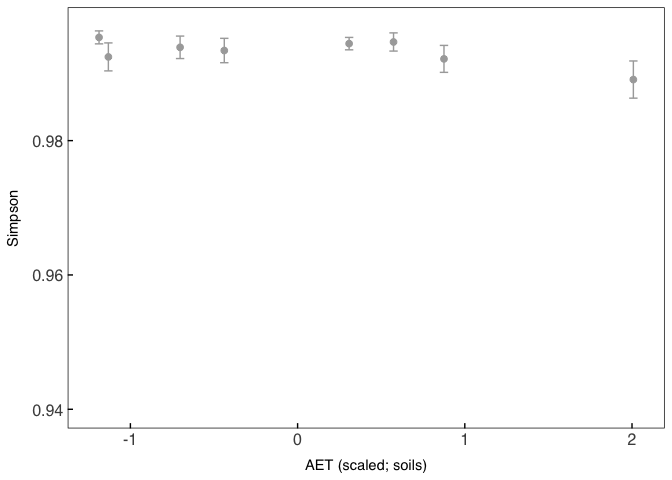<!-- -->

``` r
Shannonsoils<-ggplot(data=RichnessSOILS, aes(x=scale(aet), y=Shannon))+
  stat_summary(fun.data=mean_sdl, fun.args = list(mult=1), 
        geom="errorbar", color="darkgray") +
  stat_summary(fun=mean, geom="point", color="darkgray", size=2)+
  labs(x="AET (scaled; soils)", y="Shannon")+ 
   geom_abline(aes(intercept=`(Intercept)`, slope=`scale(aet)`), data=as.data.frame(t(fixef(model4c.shannon))), color="darkgrey", linetype = "twodash")+
  ylim(4.5, 6.5)+
  theme(
          text = element_text(family = "Helvetica"),
          plot.title = element_text(margin = margin(b=5, r=5, l=5, unit = "mm"),
                                      size = rel(1),
                                      hjust = 0.5),
            panel.background = element_rect(fill="transparent", colour = NA),
            plot.background = element_rect(fill="transparent",colour = NA),
            panel.border = element_rect(fill="transparent", colour = "black"),
            axis.title = element_text(size = rel(1)),
            axis.title.y = element_text(angle=90, size = rel(1), margin = margin(r=3, unit = "mm")),
            axis.title.x = element_text(size=rel(1), margin = margin(t=3, unit = "mm")),
            axis.text.x = element_text(size=12, margin = unit(c(t = 2.5, r = 0, b = 0, l = 0), "mm")),
            axis.text.y = element_text(size=12, margin = unit(c(t = 0, r = 2.5, b = 0, l = 0), "mm")),
            axis.line = element_blank(),
            axis.ticks.x = element_line(colour = "black"),
            axis.ticks.y = element_line(colour = "black"),
            axis.ticks.length=unit(-1.4, "mm"), 
            panel.grid.major = element_blank(),
            panel.grid.minor = element_blank())
Shannonsoils
```

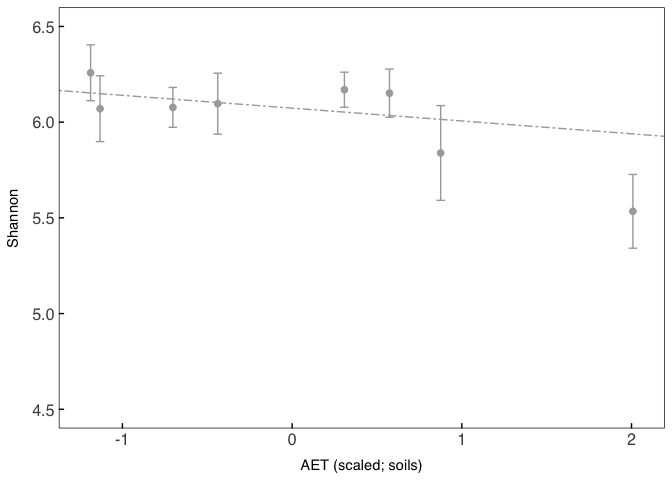<!-- -->

Rank abundance

``` r
Roots1<-subset_samples(Roots, SiteID=="1")
Roots2<-subset_samples(Roots, SiteID=="2")
Roots3<-subset_samples(Roots, SiteID=="3")
Roots4<-subset_samples(Roots, SiteID=="4")
Roots5<-subset_samples(Roots, SiteID=="5")
Roots6<-subset_samples(Roots, SiteID=="6")
Roots7<-subset_samples(Roots, SiteID=="7")
Roots8<-subset_samples(Roots, SiteID=="8")


Soils1<-subset_samples(Soils, SiteID=="1")
Soils2<-subset_samples(Soils, SiteID=="2")
Soils3<-subset_samples(Soils, SiteID=="3")
Soils4<-subset_samples(Soils, SiteID=="4")
Soils5<-subset_samples(Soils, SiteID=="5")
Soils6<-subset_samples(Soils, SiteID=="6")
Soils7<-subset_samples(Soils, SiteID=="7")
Soils8<-subset_samples(Soils, SiteID=="8")


Rootslow<-merge_phyloseq(Roots8, Roots7, Roots6, Roots4)
Rootsmd<-merge_phyloseq(Roots5, Roots3)
Rootshigh<-merge_phyloseq(Roots1, Roots2)

Soilslow<-merge_phyloseq(Soils8, Soils7, Soils6, Soils4)
Soilsmd<-merge_phyloseq(Soils5, Soils3)
Soilshigh<-merge_phyloseq(Soils1, Soils2)


##AET low (roots)
phyloTemplow = transform_sample_counts(Rootslow, function(x) 1e+02 * x/sum(x))
clusterDatalow = psmelt(phyloTemplow)
clusterDatalow = filter(clusterDatalow,Abundance > 0)
# this is where the mean is calculated and the taxa to display is chosen
clusterAgglow = aggregate(Abundance ~ OTU + Phylum,data=clusterDatalow,mean)
# filtering and picking the number to display
clusterAgglow = clusterAgglow[order(-clusterAgglow$Abundance),][1:50,]
clusterAgglow$AET="C"
clusterAgglow$SampleType="Root"

##AET low (soils)
phyloTemplowsoil = transform_sample_counts(Soilslow, function(x) 1e+02 * x/sum(x))
clusterDatalowsoil = psmelt(phyloTemplowsoil)
clusterDatalowsoil = filter(clusterDatalowsoil,Abundance > 0)
# this is where the mean is calculated and the taxa to display is chosen
clusterAgglowsoil = aggregate(Abundance ~ OTU + Phylum,data=clusterDatalowsoil,mean)
# filtering and picking the number to display
clusterAgglowsoil = clusterAgglowsoil[order(-clusterAgglowsoil$Abundance),][1:50,]
clusterAgglowsoil$AET="C"
clusterAgglowsoil$SampleType="Soil"


##AET Md (roots)
phyloTempmd = transform_sample_counts(Rootsmd, function(x) 1e+02 * x/sum(x))
clusterDatamd = psmelt(phyloTempmd)
clusterDatamd = filter(clusterDatamd,Abundance > 0)
clusterAggmd = aggregate(Abundance ~ OTU + Phylum,data=clusterDatamd,mean)
clusterAggmd = clusterAggmd[order(-clusterAggmd$Abundance),][1:50,]
clusterAggmd$AET="B"
clusterAggmd$SampleType="Root"

##AET Md (soils)
phyloTempmdsoils = transform_sample_counts(Soilsmd, function(x) 1e+02 * x/sum(x))
clusterDatamdsoils = psmelt(phyloTempmdsoils)
clusterDatamdsoils = filter(clusterDatamdsoils,Abundance > 0)
clusterAggmdsoils = aggregate(Abundance ~ OTU + Phylum,data=clusterDatamdsoils,mean)
clusterAggmdsoils = clusterAggmdsoils[order(-clusterAggmdsoils$Abundance),][1:50,]
clusterAggmdsoils$AET="B"
clusterAggmdsoils$SampleType="Soil"

##AET High (roots)
phyloTemphigh = transform_sample_counts(Rootshigh, function(x) 1e+02 * x/sum(x))
clusterDatahigh = psmelt(phyloTemphigh)
clusterDatahigh = filter(clusterDatahigh,Abundance > 0)
clusterAgghigh = aggregate(Abundance ~ OTU + Phylum,data=clusterDatahigh,mean)
clusterAgghigh = clusterAgghigh[order(-clusterAgghigh$Abundance),][1:50,]
clusterAgghigh$AET="A"
clusterAgghigh$SampleType="Root"


##AET High (soils)
phyloTemphighsoils = transform_sample_counts(Soilshigh, function(x) 1e+02 * x/sum(x))
clusterDatahighsoils = psmelt(phyloTemphighsoils)
clusterDatahighsoils = filter(clusterDatahighsoils,Abundance > 0)
clusterAgghighsoils = aggregate(Abundance ~ OTU + Phylum,data=clusterDatahighsoils,mean)
clusterAgghighsoils = clusterAgghighsoils[order(-clusterAgghighsoils$Abundance),][1:50,]
clusterAgghighsoils$AET="A"
clusterAgghighsoils$SampleType="Soil"

Tempclus<-full_join(clusterAgglow,clusterAggmd)
Tempclus<-full_join(Tempclus, clusterAgghigh)
Tempclus<-full_join(Tempclus, clusterAgglowsoil)
Tempclus<-full_join(Tempclus, clusterAggmdsoils)
Cluterfull<-full_join(Tempclus, clusterAgghighsoils)

##bring together full dataset

clusterDatahigh$AET="A"
clusterDatahighsoils$AET="A"
clusterDatamd$AET="B"
clusterDatamdsoils$AET="B"
clusterDatalow$AET="C"
clusterDatalowsoil$AET="C"

fulldataclus<-full_join(clusterDatahigh, clusterDatahighsoils)
fulldataclus<-full_join(fulldataclus, clusterDatamd)
fulldataclus<-full_join(fulldataclus, clusterDatamdsoils)
fulldataclus<-full_join(fulldataclus, clusterDatalow)
fulldataclus<-full_join(fulldataclus, clusterDatalowsoil)


Cluterfull2 <-Cluterfull %>% 
  group_by(SampleType, AET) %>% 
  mutate(.r = row_number())

fulldataclus2<-fulldataclus%>% 
  group_by(SampleType, aet) %>% 
  mutate(.r = row_number())

Taxanames<-as.data.frame(taxtab(RARE))
Taxanames$OTU<-row.names(Taxanames)
Cluterfull2<-inner_join(Cluterfull2, Taxanames)

Clusterfull2<-Cluterfull2 %>% 
  group_by(SampleType, AET) %>% 
  mutate(.r = row_number())

#write.csv(Cluterfull2, "RankAbundanceTaxa.csv")
setwd("~/Dropbox/Research/Thesis_Ch3/CleanData/R")
motile<-read.csv("RankAbundanceTaxa.csv", header = T)

Cluterfull2 <-motile %>% 
  group_by(SampleType, AET) %>% 
  mutate(.r = row_number())


# New facet label names for supp variable
labs <- c("High AET (600-700 mm)", "Medium AET (500-600 mm)", "Low AET (400-500 mm)")
names(labs) <- c("A", "B", "C")
  
Rankabundanceplot<-ggplot(motile,aes(x=.r,y=Abundance)) +
    geom_bar(aes(fill=Phylum),stat="identity") + 
    facet_grid(AET~SampleType, scales = "free_x", 
               labeller = labeller(AET = labs))+
    theme(axis.ticks = element_blank(), axis.text.x = element_blank()) +
    scale_y_log10()+ylim(0, 17.5)+
    xlab("Abundance Rank")+
    ylab("Relative Abundance (%)")+
    scale_colour_manual(values=barcolors)+
    scale_fill_manual(values=barcolors)+
    theme(
            text = element_text(family = "Helvetica"),
            panel.background = element_rect(fill="transparent", colour = NA),
            plot.background = element_rect(fill="transparent",colour = NA),
            strip.background.x=element_rect(fill="LightGray",colour = NA),
            strip.background.y=element_rect(fill="LightGray",colour = NA),
            panel.border = element_rect(fill="transparent", colour = "black"),
            axis.title = element_text(size = rel(1)),
            axis.title.y = element_text(angle=90, size = 12, margin = margin(r=3, unit = "mm")),
            axis.title.x = element_text(size=14, margin = margin(t=3, unit = "mm")),
            axis.text.x = element_blank(),
            axis.text.y = element_text(size=14, margin = unit(c(t = 0, r = 2.5, b = 0, l = 0), "mm")),
            axis.line = element_blank(),
            axis.ticks.x = element_blank(),
            axis.ticks.y = element_line(colour = "black"),
            axis.ticks.length=unit(-1.4, "mm"),
            panel.grid.major = element_blank(),
            panel.grid.minor = element_blank(),
            legend.key = element_rect(fill="transparent", colour = NA),
            legend.direction = "vertical",
            #legend.position = c(0.9,0.5),
            legend.justification = c(0,0),
            legend.key.size= unit(4, "mm"),
            legend.text = element_text(size =12),
            legend.title = element_text(size =12, face="bold"),
            legend.margin = margin(0,0,0,0),
            legend.box.margin=margin(1,1,1,1),
            legend.background = element_rect(fill = "transparent", colour = NA),
            plot.margin=margin(t=5, r=10, b=5, l=10, unit = "mm"),
            strip.text.x=element_text(size=12),
            strip.text.y=element_text(size=12))
```

Rank barplot

``` r
library(stringr)
my.labels <- c("OTU 0; *Bradyrhizobium sp.*", "OTU 1; *Rhodoplanes sp.*", "OTU 2; *Streptomyces sp.*")

Toptaxafull0<-dplyr::filter(fulldataclus2,OTU=="0")
Toptaxafull1<-dplyr::filter(fulldataclus2,OTU=="1", SampleType=="Soil")
Toptaxafull2<-dplyr::filter(fulldataclus2,OTU=="2", SampleType=="Root")
Toptaxacomplete<-full_join(Toptaxafull0, Toptaxafull1)
Toptaxacomplete<-full_join(Toptaxacomplete, Toptaxafull2)


Toptaxaaverage<-(Toptaxacomplete) %>% 
  group_by(OTU, SampleType, AET)%>% 
  summarise(Meansumm=mean(Abundance),
            SD=sd(Abundance))

Toptaxapoint<-(Toptaxacomplete) %>% 
  group_by(OTU, SampleType, AET)


Toptaxaplot<-ggplot(Toptaxaaverage, aes(x=rev(AET),y=Meansumm, color = str_wrap(OTU,width=10)))+
  geom_path(Toptaxaaverage, mapping=aes(x=rev(AET),y=Meansumm, group=OTU))+
  geom_pointrange(aes(
      ymin = Toptaxaaverage$Meansumm-Toptaxaaverage$SD, 
      ymax = Toptaxaaverage$Meansumm+Toptaxaaverage$SD),
                    linetype='solid')+
  scale_x_discrete(labels = c("Low", "Medium", "High"))+
  facet_grid(SampleType~., labeller = labeller(AET = labs))+
    ylim(0, 22.5)+
    xlab("Actual evapotranspiration")+
    ylab("Relative Abundance (%)")+
  scale_colour_manual(values = c("2" = "#AFEEEE", "0"="#5e0e0e", "1"="#e76262"), labels=my.labels, name="Morphology")+
    theme(
            text = element_text(family = "Helvetica"),
            panel.background = element_rect(fill="transparent", colour = NA),
            plot.background = element_rect(fill="transparent",colour = NA),
            strip.background.x=element_rect(fill="LightGray",colour = NA),
            strip.background.y=element_rect(fill="LightGray",colour = NA),
            panel.border = element_rect(fill="transparent", colour = "black"),
            axis.title = element_text(size = rel(1)),
            axis.title.y = element_text(angle=90, size = 12, margin = margin(r=3, unit = "mm")),
            axis.title.x = element_text(size=12, margin = margin(t=3, unit = "mm")),
            axis.text.x = element_text(size=10, margin = unit(c(t = 2.5, r = 0, b = 0, l = 0), "mm")),
            axis.text.y = element_text(size=10, margin = unit(c(t = 0, r = 2.5, b = 0, l = 0), "mm")),
            axis.line = element_blank(),
            axis.ticks.x = element_blank(),
            axis.ticks.y = element_line(colour = "black"),
            axis.ticks.length=unit(-1.4, "mm"),
            panel.grid.major = element_blank(),
            panel.grid.minor = element_blank(),
            legend.key = element_rect(fill="transparent", colour = NA),
            legend.direction = "vertical",
            #legend.position = c(0.9,0.5),
            #legend.justification = c("right","bottom"),
            legend.key.height= unit(4, "mm"),
            legend.text = ggtext::element_markdown(),
            legend.margin = unit(0, "mm"),
            legend.background = element_rect(fill = "transparent", colour = NA),
            #legend.title = element_text(face="italic", size = rel(1)),
            plot.margin=margin(t=5, r=10, b=5, l=10, unit = "mm"),
            strip.text.x=element_text(size=10),
            strip.text.y=element_text(size=10))


Brady<-dplyr::filter(fulldataclus2, OTU=="0")
Strepto<-dplyr::filter(fulldataclus2, OTU=="2")

Bradymoda<-glmer(formula = Abundance~scale(aet)*SampleType +(1|SiteID/Treenum), data = Brady)
Bradymodb<-glmer(formula = Abundance~scale(aet)+SampleType +(1|SiteID/Treenum), data = Brady)
Bradymodc<-glmer(formula = Abundance~scale(aet)*SampleType*scale(pH) +(1|SiteID/Treenum), data = Brady)
Bradymodc<-glmer(formula = Abundance~scale(aet)*SampleType+(1|SiteID), data = Brady)
Bradymodd<-glmer(formula = Abundance~scale(aet)*SampleType*scale(pH) +(1|SiteID/Treenum), data = Brady)
Bradymode<-glmer(formula = Abundance~scale(aet)*SampleType+scale(pH) +(1|SiteID/Treenum), data = Brady)
Bradymodf<-glmer(formula = Abundance~scale(aet)*SampleType*scale(pH) +(1|SiteID), data = Brady)

AIC(Bradymoda,Bradymodb, Bradymodc, Bradymodd,Bradymode,Bradymodf)
```

    ##           df      AIC
    ## Bradymoda  7 1132.724
    ## Bradymodb  6 1194.673
    ## Bradymodc  6 1138.053
    ## Bradymodd 11 1110.114
    ## Bradymode  8 1112.833
    ## Bradymodf 10 1111.947

``` r
BIC(Bradymoda,Bradymodb, Bradymodc, Bradymodd, Bradymode, Bradymodf)
```

    ##           df      BIC
    ## Bradymoda  7 1156.971
    ## Bradymodb  6 1215.456
    ## Bradymodc  6 1158.836
    ## Bradymodd 11 1148.216
    ## Bradymode  8 1140.543
    ## Bradymodf 10 1146.585

``` r
##now restricting max likelihood
Bradymodf<-glmer(formula = Abundance~scale(aet)*SampleType*scale(pH) +(1|SiteID), data = Brady)

summary(Bradymode)
```

    ## Linear mixed model fit by REML ['lmerMod']
    ## Formula: Abundance ~ scale(aet) * SampleType + scale(pH) + (1 | SiteID/Treenum)
    ##    Data: Brady
    ## 
    ## REML criterion at convergence: 1096.8
    ## 
    ## Scaled residuals: 
    ##     Min      1Q  Median      3Q     Max 
    ## -2.9528 -0.5249 -0.0480  0.4166  3.5092 
    ## 
    ## Random effects:
    ##  Groups         Name        Variance Std.Dev.
    ##  Treenum:SiteID (Intercept) 0.480    0.6928  
    ##  SiteID         (Intercept) 1.107    1.0520  
    ##  Residual                   5.502    2.3455  
    ## Number of obs: 236, groups:  Treenum:SiteID, 32; SiteID, 8
    ## 
    ## Fixed effects:
    ##                           Estimate Std. Error t value
    ## (Intercept)                11.8850     0.4500  26.412
    ## scale(aet)                  2.7638     0.4641   5.955
    ## SampleTypeSoil             -8.6322     0.3070 -28.117
    ## scale(pH)                  -1.3858     0.2641  -5.247
    ## scale(aet):SampleTypeSoil  -2.7315     0.3072  -8.892
    ## 
    ## Correlation of Fixed Effects:
    ##             (Intr) scl(t) SmplTS scl(H)
    ## scale(aet)   0.014                     
    ## SampleTypSl -0.355  0.009              
    ## scale(pH)   -0.006  0.243 -0.005       
    ## scl(t):SmTS  0.010 -0.339 -0.006  0.003

``` r
qqp(residuals(Bradymode), col=2)
```

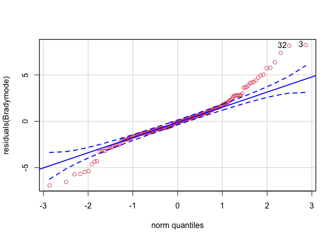<!-- -->

    ## [1]  3 32

``` r
#strepto

Streptoclean<-dplyr::filter(Strepto, Abundance<14.0)

streptomoda<-glmer(formula = Abundance~scale(aet)*SampleType +(1|SiteID/Treenum), data = Streptoclean)
streptomoda1<-glmer(formula = Abundance~scale(aet)*SampleType +(1|SiteID), data = Streptoclean)
streptomodb<-glmer(formula = Abundance~scale(aet)+SampleType +(1|SiteID/Treenum), data = Streptoclean)
streptomodc<-glmer(formula = Abundance~scale(aet)*scale(pH) +(1|SiteID/Treenum), data = Streptoclean)
streptomodc1<-glmer(formula = Abundance~scale(aet)+scale(pH) +(1|SiteID/Treenum), data = Streptoclean)
streptomodd<-glmer(formula = Abundance~scale(aet)*SampleType*scale(pH) +(1|SiteID/Treenum), data = Streptoclean)
streptomode<-glmer(formula = Abundance~scale(aet)*SampleType+scale(pH) +(1|SiteID/Treenum), data = Streptoclean)
streptomodf<-glmer(formula = Abundance~scale(aet)*SampleType*scale(pH) +(1|SiteID), data = Streptoclean)
streptomoda<-glmer(formula = Abundance~scale(aet)*SampleType +(1|SiteID/Treenum), data = Streptoclean)


AIC(streptomoda,streptomodb, streptomodc, streptomodd,streptomode,streptomodf, streptomodc1, streptomoda1)
```

    ##              df       AIC
    ## streptomoda   7  955.0349
    ## streptomodb   6  961.0468
    ## streptomodc   7 1127.7662
    ## streptomodd  11  964.9312
    ## streptomode   8  958.1428
    ## streptomodf  10  971.1076
    ## streptomodc1  6 1124.8857
    ## streptomoda1  6  961.3369

``` r
BIC(streptomoda,streptomodb, streptomodc, streptomodd,streptomode,streptomodf, streptomoda1)
```

    ##              df       BIC
    ## streptomoda   7  979.2222
    ## streptomodb   6  981.7787
    ## streptomodc   7 1151.9534
    ## streptomodd  11 1002.9397
    ## streptomode   8  985.7854
    ## streptomodf  10 1005.6608
    ## streptomoda1  6  982.0689

``` r
##best fit is streptomoda
qqp(residuals(streptomoda), col=2)
```

    ## [1] 122 123

``` r
streptomoda<-glmer(formula = Abundance~scale(aet)*SampleType +(1|SiteID/Treenum), data = Streptoclean)

summary(streptomoda)
```

    ## Linear mixed model fit by REML ['lmerMod']
    ## Formula: Abundance ~ scale(aet) * SampleType + (1 | SiteID/Treenum)
    ##    Data: Streptoclean
    ## 
    ## REML criterion at convergence: 941
    ## 
    ## Scaled residuals: 
    ##     Min      1Q  Median      3Q     Max 
    ## -2.7774 -0.4787 -0.0378  0.2876  4.0551 
    ## 
    ## Random effects:
    ##  Groups         Name        Variance Std.Dev.
    ##  Treenum:SiteID (Intercept) 0.46098  0.6790  
    ##  SiteID         (Intercept) 0.02398  0.1548  
    ##  Residual                   2.91014  1.7059  
    ## Number of obs: 234, groups:  Treenum:SiteID, 32; SiteID, 8
    ## 
    ## Fixed effects:
    ##                           Estimate Std. Error t value
    ## (Intercept)                 4.2487     0.2095  20.278
    ## scale(aet)                 -0.9573     0.2088  -4.585
    ## SampleTypeSoil             -3.6094     0.2246 -16.067
    ## scale(aet):SampleTypeSoil   0.6860     0.2246   3.055
    ## 
    ## Correlation of Fixed Effects:
    ##             (Intr) scl(t) SmplTS
    ## scale(aet)  -0.006              
    ## SampleTypSl -0.563  0.017       
    ## scl(t):SmTS  0.017 -0.554 -0.007

``` r
qqp(residuals(streptomoda), col=2)
```

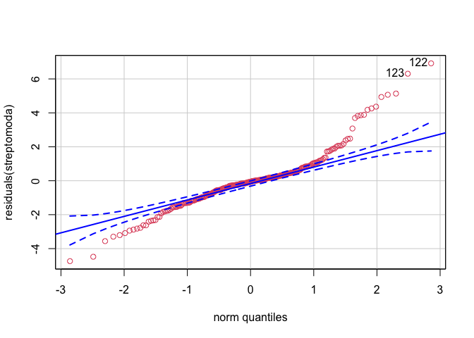<!-- -->

    ## [1] 122 123

Pie chart

``` r
motileroot<-dplyr::filter(motile, SampleType=="Root")
motilesoil<-dplyr::filter(motile, SampleType=="Soil")

motilerootlow<-dplyr::filter(motileroot, AET=="C")
sum_motilerootlow<-sum(motilerootlow$Abundance)

lowrootlegend<- ggplot(motilerootlow, aes(x="", y=Abundance/sum_motilerootlow, fill=Morphology))+
geom_bar(width = 1, stat = "identity")+coord_polar("y", start=0)+
   theme_minimal()+
  scale_colour_manual(values=c("#202020","gray", "#E8E8E8"))+
    scale_fill_manual(values=c("#202020","gray", "#E8E8E8"))+
  theme(text = element_text(family = "Helvetica"),
          axis.title = element_blank(), 
          axis.text = element_text(size =14),
          legend.key.size= unit(4, "mm"),
          legend.justification = c(0,0),
          legend.title = element_text(size =12, face="bold"),
          legend.margin = margin(0,0,0,0),
          legend.box.margin=margin(0,0,0,0),
          legend.text = element_text(size =12))

legend<-get_legend(lowrootlegend)


motilerootlow<-dplyr::filter(motileroot, AET=="C")
sum_motilerootlow<-sum(motilerootlow$Abundance)
lowroot<- ggplot(motilerootlow, aes(x="", y=Abundance/sum_motilerootlow, fill=Morphology))+
geom_bar(width = 1, stat = "identity")+coord_polar("y", start=0)+
   theme_minimal()+
  scale_colour_manual(values=c("#202020","gray", "#E8E8E8"))+
    scale_fill_manual(values=c("#202020","gray", "#E8E8E8"))+
  theme(plot.margin=margin(t=2, r=2, b=2, l=2, unit = "mm"),
        axis.text.x=element_blank(),          
          axis.title = element_blank(), 
        legend.position = "none", 
        axis.text = element_text(size =9))


motilerootmd<-dplyr::filter(motileroot, AET=="B")
sum_motilerootmd<-sum(motilerootmd$Abundance)
mdroot<- ggplot(motilerootmd, aes(x="", y=Abundance/sum_motilerootmd, fill=Morphology))+
geom_bar(width = 1, stat = "identity")+coord_polar("y", start=0)+
  scale_colour_manual(values=c("#202020","gray", "#E8E8E8"))+
    scale_fill_manual(values=c("#202020","gray", "#E8E8E8"))+
  theme_minimal()+
  theme(plot.margin=margin(t=2, r=2, b=2, l=2, unit = "mm"),
        axis.text.x=element_blank(),
          axis.title = element_blank(),
         legend.position = "none")


motileroothigh<-dplyr::filter(motileroot, AET=="A")
sum_motileroothigh<-sum(motileroothigh$Abundance)
highroot<- ggplot(motileroothigh, aes(x="", y=Abundance/sum_motileroothigh, fill=Morphology))+
geom_bar(width = 1, stat = "identity")+coord_polar("y", start=0)+
  scale_colour_manual(values=c("#202020","gray", "#E8E8E8"))+
    scale_fill_manual(values=c("#202020","gray", "#E8E8E8"))+
  theme_minimal()+
  theme(plot.margin=margin(t=2, r=2, b=2, l=2, unit = "mm"),
        axis.text.x=element_blank(),          
        axis.title = element_blank(),
        legend.position = "none", 
        axis.text = element_text(size =9))

motilesoillow<-dplyr::filter(motilesoil, AET=="C")
sum_motilesoillow<-sum(motilesoillow$Abundance)
lowsoil<- ggplot(motilesoillow, aes(x="", y=Abundance/sum_motilesoillow, fill=Morphology))+
geom_bar(width = 1, stat = "identity")+coord_polar("y", start=0)+
  scale_colour_manual(values=c("#202020","gray", "#E8E8E8"))+
    scale_fill_manual(values=c("#202020","gray", "#E8E8E8"))+
   theme_minimal()+
  theme(plot.margin=margin(t=2, r=2, b=2, l=2, unit = "mm"),
        axis.text.x=element_blank(),          
          axis.title = element_blank(),
        legend.position = "none", 
        axis.text = element_text(size =9))

motilesoilmd<-dplyr::filter(motilesoil, AET=="B")
sum_motilesoilmd<-sum(motilesoilmd$Abundance)
mdsoil<- ggplot(motilesoilmd, aes(x="", y=Abundance/sum_motilesoilmd, fill=Morphology))+
geom_bar(width = 1, stat = "identity")+coord_polar("y", start=0)+
  scale_colour_manual(values=c("#202020","gray", "#E8E8E8"))+
    scale_fill_manual(values=c("#202020","gray", "#E8E8E8"))+
  theme_minimal()+
  theme(plot.margin=margin(t=2, r=2, b=2, l=2, unit = "mm"),
        axis.text.x=element_blank(),          
          axis.title = element_blank(),
        legend.position = "none", 
        axis.text = element_text(size =9))


motilesoilhigh<-dplyr::filter(motilesoil, AET=="A")
sum_motilesoilhigh<-sum(motilesoilhigh$Abundance)
highsoil<- ggplot(motilesoilhigh, aes(x="", y=Abundance/sum_motilesoilhigh, fill=Morphology))+
geom_bar(width = 1, stat = "identity")+coord_polar("y", start=0)+
  scale_colour_manual(values=c("#202020","gray", "#E8E8E8"))+
    scale_fill_manual(values=c( "#202020","gray", "#E8E8E8"))+
  theme_minimal()+
  theme(plot.margin=margin(t=2, r=2, b=2, l=2, unit = "mm"),
        axis.text.x=element_blank(),          
          axis.title = element_blank(),
        legend.position = "none", 
        axis.text = element_text(size =9))


legendrank<-get_legend(Rankabundanceplot)
Rankabundanceplot2<-Rankabundanceplot+theme(legend.position = "none")

Legends<-cowplot::plot_grid(legendrank,legend, NULL,
                            align="v",
                            rel_heights = c(1, 1, 1),
                            ncol = 1)

Rankabundanceplotfull<-ggdraw()+
     draw_plot(Rankabundanceplot2)+
     draw_plot(lowroot,
               x = 0.24, y = 0.07, width = 0.35, height = 0.35, scale=0.6)+
     draw_plot(mdroot, 
               x = 0.24, y = 0.36, width = 0.35, height = 0.35, scale=0.6)+
     draw_plot(highroot, 
               x = 0.24, y = 0.65, width = 0.35, height = 0.35, scale=0.6)+
  draw_plot(lowsoil,
               x = 0.63, y = 0.07, width = 0.35, height = 0.35, scale=0.6)+
     draw_plot(mdsoil, 
               x = 0.63, y = 0.36, width = 0.35, height = 0.35, scale=0.6)+
     draw_plot(highsoil, 
               x = 0.63, y = 0.65, width = 0.35, height = 0.35, scale=0.6)


RANKFULLplot<-cowplot::plot_grid(Rankabundanceplotfull,Legends,   
                   rel_widths = c(3.9,2),
                   align="hv")

##while these trends are definitely are present across the larger dataset, they seem to be largely driven by relative increases/declines in the top competitors for roots (most abundant couple of taxa)
```

Actino

``` r
#Top500roots = names(sort(taxa_sums(Roots), TRUE)[1:500])
#Top500roots <- prune_taxa(Top500roots, Roots)
#Top500soils = names(sort(taxa_sums(Soils), TRUE)[1:500])
#Top500soils <- prune_taxa(Top500soils, Soils)


#Standardized by read count
Top500roots = transform_sample_counts(Roots, function(x) 100 * x/sum(x*100))
Top500soils = transform_sample_counts(Soils, function(x) 100 * x/sum(x*100))


#Pulling data out of phyloseq object
Roottable<-as(otu_table(Top500roots), "matrix")
Roottable<-as.data.frame((Roottable))
Roottable$OTU<-rownames(Roottable)
Roottax<-as.data.frame(as(tax_table(Top500roots), "matrix"))
Roottax$OTU<-rownames(Roottax) 
SampleData<-as(sample_data(Top500roots), "data.frame")


Actinodf<-full_join(Roottable, Roottax)
Actinodf<-filter(Actinodf, Phylum=="Actinobacteria")
Amycetalesdf<-full_join(Roottable, Roottax)
Amycetalesdf<-filter(Amycetalesdf, Order=="Actinomycetales")
Piedf<-full_join(Roottable, Roottax)
#write.csv(Piedf, "Bacterialmorphology.csv")

Actinosums<-colSums(Actinodf[,1:114])
Actinosumsdf=as.data.frame(Actinosums)
Amycetalessums<-colSums(Amycetalesdf[,1:114])
Amycetalessumdf=as.data.frame(Amycetalessums)

Actinosumsdf$SampleUnique<-rownames(Actinosumsdf)
Actinodf<-full_join(Actinosumsdf, SampleData)
Actinodf$Type="Root;Actinobacteria"
Amycetalessumdf$SampleUnique<-rownames(Amycetalessumdf)
Amycetalesdf<-full_join(Amycetalessumdf, SampleData)
Amycetalesdf$Type="Root;Actinomycetales"


#Pulling data out of phyloseq object
Soiltable<-(as(otu_table(Top500soils), "matrix"))
Soiltable<-as.data.frame((Soiltable))
Soiltable$OTU<-rownames(Soiltable)
Soiltax<-as.data.frame(as(tax_table(Top500soils), "matrix"))
Soiltax$OTU<-rownames(Soiltax) 
SampleDataSoil<-as(sample_data(Top500soils), "data.frame")


SoilActinodf<-full_join(Soiltable, Soiltax)
SoilActinodf<-filter(SoilActinodf, Phylum=="Actinobacteria")
SoilAmycetalesdf<-full_join(Soiltable, Soiltax)
SoilAmycetalesdf<-filter(SoilAmycetalesdf, Order=="Actinomycetales")

SoilActinosums<-colSums(SoilActinodf[,1:122])
SoilActinosumsdf=as.data.frame(SoilActinosums)
SoilAmycetalessums<-colSums(SoilAmycetalesdf[,1:122])
SoilAmycetalessumsdf=as.data.frame(SoilAmycetalessums)


SoilActinosumsdf$SampleUnique<-rownames(SoilActinosumsdf)
SoilActinodf<-full_join(SoilActinosumsdf, SampleDataSoil)
SoilActinodf$Type="Soil;Actinobacteria"
SoilAmycetalessumsdf$SampleUnique<-rownames(SoilAmycetalessumsdf)
SoilAmycetalesdf<-full_join(SoilAmycetalessumsdf, SampleDataSoil)
SoilAmycetalesdf$Type="Soil;Actinomycetales"

##model

library(lme4)
library(lmerTest) ##must load this package for the pvalues


##need to join the data; then do a model with both;
Actinodf$SampleType="Root"
Actinodf$SampID="Actinobacteria_Root"
SoilActinodf$SampleType="Soil"
SoilActinodf$SampID="Actinobacteria_Soil"
SoilActinodf$Actinosums<-SoilActinodf$SoilActinosums
Actinofulldf<-full_join(Actinodf, SoilActinodf)

Amycetalesdf$SampleType="Root"
Amycetalesdf$SampID="Actinomycetales_Root"
SoilAmycetalesdf$SampleType="Soil"
SoilAmycetalesdf$SampID="Actinomycetales_Soil"
SoilAmycetalesdf$Amycetalessums<-SoilAmycetalesdf$SoilAmycetalessums
Amycetalesfulldf<-full_join(Amycetalesdf, SoilAmycetalesdf)

##Full model (both soil and root data; sample type*aet interaction)
model1a<-lmer(formula = Actinosums~scale(aet)*SampleType +(1|SiteID/Treenum), data = Actinofulldf, REML = F)

model1b<-lmer(formula = Actinosums~SampleType+ scale(aet)*scale(pH) +(1|SiteID/Treenum), data = Actinofulldf, REML = F)

model1c<-lmer(formula = Actinosums~scale(aet)+SampleType +(1|SiteID/Treenum), data = Actinofulldf, REML = F)

model1d<-lmer(formula = Actinosums~SampleType*scale(aet)*scale(pH) +(1|SiteID/Treenum), data = Actinofulldf, REML = F)

model1e<-lmer(formula = Actinosums~SampleType*scale(aet)*scale(pH) +(1|SiteID), data = Actinofulldf, REML = F)


AIC(model1a, model1b, model1c, model1d, model1e)
```

    ##         df       AIC
    ## model1a  7 -708.9783
    ## model1b  8 -703.9273
    ## model1c  6 -707.6615
    ## model1d 11 -702.9764
    ## model1e 10 -701.2633

``` r
BIC(model1a, model1b, model1c, model1d, model1e)
```

    ##         df       BIC
    ## model1a  7 -684.7315
    ## model1b  8 -676.2167
    ## model1c  6 -686.8785
    ## model1d 11 -664.8742
    ## model1e 10 -666.6250

``` r
##Selecting Model1c; 1A and 1C are the lowest scores (within 2 points for AIC and BIC; 1C has less parameters, so selecting this as the most parsimonious model (no interaction term for Sample Type and does not include soil pH; significant correlation between Actino abundance and sample type and Actino abundance and AET)
model1c<-lmer(formula = Actinosums~scale(aet)+SampleType +(1|SiteID/Treenum), data = Actinofulldf, REML = T)

qqp(residuals(model1c), col=2)
```

    ## [1] 42 19

``` r
##Visual inspection of residuals--all look good (no outliers)

summary(model1c)
```

    ## Linear mixed model fit by REML. t-tests use Satterthwaite's method [
    ## lmerModLmerTest]
    ## Formula: Actinosums ~ scale(aet) + SampleType + (1 | SiteID/Treenum)
    ##    Data: Actinofulldf
    ## 
    ## REML criterion at convergence: -696.6
    ## 
    ## Scaled residuals: 
    ##     Min      1Q  Median      3Q     Max 
    ## -3.7994 -0.6932 -0.0786  0.5836  3.9013 
    ## 
    ## Random effects:
    ##  Groups         Name        Variance  Std.Dev.
    ##  Treenum:SiteID (Intercept) 0.0002144 0.01464 
    ##  SiteID         (Intercept) 0.0007585 0.02754 
    ##  Residual                   0.0024697 0.04970 
    ## Number of obs: 236, groups:  Treenum:SiteID, 32; SiteID, 8
    ## 
    ## Fixed effects:
    ##                  Estimate Std. Error         df t value Pr(>|t|)    
    ## (Intercept)      0.224645   0.011118   7.258552  20.206  1.2e-07 ***
    ## scale(aet)      -0.040405   0.010617   5.976316  -3.806  0.00897 ** 
    ## SampleTypeSoil  -0.061613   0.006505 209.626826  -9.472  < 2e-16 ***
    ## ---
    ## Signif. codes:  0 '***' 0.001 '**' 0.01 '*' 0.05 '.' 0.1 ' ' 1
    ## 
    ## Correlation of Fixed Effects:
    ##             (Intr) scl(t)
    ## scale(aet)   0.023       
    ## SampleTypSl -0.304  0.007

``` r
coef = fixef(model1c)

##the residuals are normally distributed; I have 1 outlier
library(car)
qqp(residuals(model1c), col=2)
```

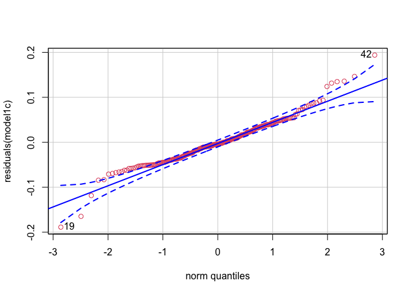<!-- -->

    ## [1] 42 19

``` r
##just Actinomycetales 

model1a_myc<-lmer(formula = Amycetalessums~scale(aet)*SampleType +(1|SiteID/Treenum), data = Amycetalesfulldf, REML = F)

model1b_myc<-lmer(formula = Amycetalessums~SampleType+ scale(aet)*scale(pH) +(1|SiteID/Treenum), data = Amycetalesfulldf, REML = F)

model1c_myc<-lmer(formula = Amycetalessums~scale(aet)+SampleType +(1|SiteID/Treenum), data = Amycetalesfulldf, REML = F)

model1d_myc<-lmer(formula = Amycetalessums~SampleType*scale(aet)*scale(pH) +(1|SiteID/Treenum), data = Amycetalesfulldf, REML = F)

model1e_myc<-lmer(formula = Amycetalessums~SampleType*scale(aet)*scale(pH) +(1|SiteID), data = Amycetalesfulldf, REML = F)

AIC(model1a_myc, model1b_myc, model1c_myc, model1d_myc, model1e_myc)
```

    ##             df       AIC
    ## model1a_myc  7 -804.7337
    ## model1b_myc  8 -783.4257
    ## model1c_myc  6 -786.9742
    ## model1d_myc 11 -802.5723
    ## model1e_myc 10 -800.5168

``` r
BIC(model1a_myc, model1b_myc, model1c_myc, model1d_myc, model1e_myc)
```

    ##             df       BIC
    ## model1a_myc  7 -780.4869
    ## model1b_myc  8 -755.7151
    ## model1c_myc  6 -766.1912
    ## model1d_myc 11 -764.4701
    ## model1e_myc 10 -765.8785

``` r
##Selecting Model1a; 1A and  for Actinomycetales; most parsimonious (full model)
model1aAmycetales<-lmer(formula = Amycetalessums~scale(aet)*SampleType +(1|SiteID/Treenum), data = Amycetalesfulldf, REML = T)

summary(model1aAmycetales)
```

    ## Linear mixed model fit by REML. t-tests use Satterthwaite's method [
    ## lmerModLmerTest]
    ## Formula: Amycetalessums ~ scale(aet) * SampleType + (1 | SiteID/Treenum)
    ##    Data: Amycetalesfulldf
    ## 
    ## REML criterion at convergence: -784.3
    ## 
    ## Scaled residuals: 
    ##     Min      1Q  Median      3Q     Max 
    ## -3.7835 -0.4450 -0.0739  0.3568  4.5634 
    ## 
    ## Random effects:
    ##  Groups         Name        Variance  Std.Dev.
    ##  Treenum:SiteID (Intercept) 0.0001631 0.01277 
    ##  SiteID         (Intercept) 0.0001788 0.01337 
    ##  Residual                   0.0016656 0.04081 
    ## Number of obs: 236, groups:  Treenum:SiteID, 32; SiteID, 8
    ## 
    ## Fixed effects:
    ##                             Estimate Std. Error         df t value Pr(>|t|)    
    ## (Intercept)                 0.159378   0.006505   8.978070  24.502 1.56e-09 ***
    ## scale(aet)                 -0.029813   0.006503   8.876046  -4.585  0.00137 ** 
    ## SampleTypeSoil             -0.101437   0.005343 208.565638 -18.985  < 2e-16 ***
    ## scale(aet):SampleTypeSoil   0.024204   0.005346 207.180307   4.528 1.00e-05 ***
    ## ---
    ## Signif. codes:  0 '***' 0.001 '**' 0.01 '*' 0.05 '.' 0.1 ' ' 1
    ## 
    ## Correlation of Fixed Effects:
    ##             (Intr) scl(t) SmplTS
    ## scale(aet)   0.009              
    ## SampleTypSl -0.427  0.012       
    ## scl(t):SmTS  0.012 -0.422 -0.006

``` r
coefAmyc = fixef(model1aAmycetales)
```

Removing Actinomycetales from Actinos to see if relationship with AET is
impacted

``` r
Actinodf<-full_join(Roottable, Roottax)
```

    ## Joining, by = "OTU"

``` r
Actinodf<-filter(Actinodf, Phylum=="Actinobacteria")
Actinodfminusmycetales<-filter(Actinodf, Order!="Actinomycetales")
Actinodfsoil<-full_join(Soiltable, Soiltax)
```

    ## Joining, by = "OTU"

``` r
Actinodfsoil<-filter(Actinodfsoil, Phylum=="Actinobacteria")
Actinodfminusmycetalessoil<-filter(Actinodfsoil, Order!="Actinomycetales")


Actinodfminusmycetalessums<-colSums(Actinodfminusmycetales[,1:114])
Actinodfminusmycetalessumsdf=as.data.frame(Actinodfminusmycetalessums)
minusmycetalessumssoil<-colSums(Actinodfminusmycetalessoil[,1:122])
minusmycetalessumsdfsoil=as.data.frame(minusmycetalessumssoil)


Actinodfminusmycetalessumsdf$SampleUnique<-rownames(Actinodfminusmycetalessumsdf)
Actinodfminusmycetalessumsdf<-full_join(Actinodfminusmycetalessumsdf, SampleData)
```

    ## Joining, by = "SampleUnique"

``` r
Actinodfminusmycetalessumsdf$Type="Root;Notmycetales"

minusmycetalessumsdfsoil$SampleUnique<-rownames(minusmycetalessumsdfsoil)
minusmycetalessumsdfsoil<-full_join(minusmycetalessumsdfsoil, SampleDataSoil)
```

    ## Joining, by = "SampleUnique"

``` r
minusmycetalessumsdfsoil$Type="Soil;Notmycetales"

Actinodfminusmycetalessumsdf$SampleType="Root"
Actinodfminusmycetalessumsdf$SampID="Minusmycetales_Root"
minusmycetalessumsdfsoil$SampleType="Soil"
minusmycetalessumsdfsoil$SampID="Minusmycetales_Soil"
minusmycetalessumsdfsoil$Actinodfminusmycetalessums<-minusmycetalessumsdfsoil$minusmycetalessumssoil
Notmycetalesfulldf<-full_join(Actinodfminusmycetalessumsdf, minusmycetalessumsdfsoil)
```

    ## Joining, by = c("Actinodfminusmycetalessums", "SampleUnique", "Site", "SiteID", "Cardinaldirection", "SiteLocation", "Treenum", "SampleType", "aet", "cwd", "djf", "jja", "ppt", "tmn", "tmx", "ppt_aet", "Latitude", "Longitude", "SampleName", "pH", "FINALP", "FINALK", "FINALCA", "FINALMG", "FINALZN", "FINALB", "FINALMN", "FINALCU", "FINALFE", "FINALPB", "FINALAL", "FINALNA", "FINALS", "Exch_Acid", "CEC", "CA_Base_Sat", "MG_Base_Sat", "K_Base_Sat", "Scoop_Dens", "CNratio", "PercentN", "PercentC", "Type", "SampID")

``` r
##models without Actinomycetales
model1aminus<-glmer(formula =
                     Actinodfminusmycetalessums~scale(aet)*SampleType +(1|SiteID/Treenum), data = Notmycetalesfulldf)
```

    ## Warning in glmer(formula = Actinodfminusmycetalessums ~ scale(aet) * SampleType
    ## + : calling glmer() with family=gaussian (identity link) as a shortcut to lmer()
    ## is deprecated; please call lmer() directly

``` r
model1bminus<-glmer(formula = Actinodfminusmycetalessums~SampleType+ scale(aet)*scale(pH) +(1|SiteID/Treenum), data = Notmycetalesfulldf)
```

    ## Warning in glmer(formula = Actinodfminusmycetalessums ~ SampleType + scale(aet)
    ## * : calling glmer() with family=gaussian (identity link) as a shortcut to lmer()
    ## is deprecated; please call lmer() directly

``` r
model1cminus<-glmer(formula = Actinodfminusmycetalessums~scale(aet)+SampleType +(1|SiteID/Treenum), data = Notmycetalesfulldf)
```

    ## Warning in glmer(formula = Actinodfminusmycetalessums ~ scale(aet) + SampleType
    ## + : calling glmer() with family=gaussian (identity link) as a shortcut to lmer()
    ## is deprecated; please call lmer() directly

``` r
model1dminus<-glmer(formula = Actinodfminusmycetalessums~SampleType*scale(aet)*scale(pH) +(1|SiteID/Treenum), data = Notmycetalesfulldf)
```

    ## Warning in glmer(formula = Actinodfminusmycetalessums ~ SampleType * scale(aet)
    ## * : calling glmer() with family=gaussian (identity link) as a shortcut to lmer()
    ## is deprecated; please call lmer() directly

``` r
model1eminus<-glmer(formula = Actinodfminusmycetalessums~SampleType*scale(aet)*scale(pH) +(1|SiteID), data = Notmycetalesfulldf)
```

    ## Warning in glmer(formula = Actinodfminusmycetalessums ~ SampleType * scale(aet)
    ## * : calling glmer() with family=gaussian (identity link) as a shortcut to lmer()
    ## is deprecated; please call lmer() directly

``` r
AIC(model1aminus, model1bminus, model1cminus, model1dminus, model1eminus)
```

    ##              df       AIC
    ## model1aminus  7 -978.2629
    ## model1bminus  8 -957.4277
    ## model1cminus  6 -977.2495
    ## model1dminus 11 -937.4046
    ## model1eminus 10 -934.9338

``` r
BIC(model1aminus, model1bminus, model1cminus, model1dminus, model1eminus)
```

    ##              df       BIC
    ## model1aminus  7 -954.0161
    ## model1bminus  8 -929.7170
    ## model1cminus  6 -956.4665
    ## model1dminus 11 -899.3024
    ## model1eminus 10 -900.2955

``` r
hist(Notmycetalesfulldf$Actinodfminusmycetalessums)
```

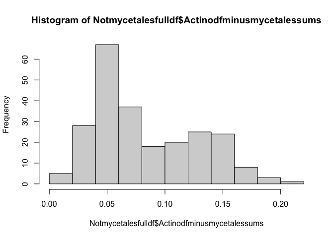<!-- -->

``` r
model1aminus<-lmer(formula =
                     Actinodfminusmycetalessums~scale(aet)*SampleType +(1|SiteID/Treenum), data = Notmycetalesfulldf, REML=T)

summary(model1aminus)
```

    ## Linear mixed model fit by REML. t-tests use Satterthwaite's method [
    ## lmerModLmerTest]
    ## Formula: 
    ## Actinodfminusmycetalessums ~ scale(aet) * SampleType + (1 | SiteID/Treenum)
    ##    Data: Notmycetalesfulldf
    ## 
    ## REML criterion at convergence: -992.3
    ## 
    ## Scaled residuals: 
    ##     Min      1Q  Median      3Q     Max 
    ## -3.3240 -0.6574 -0.0799  0.4930  4.1610 
    ## 
    ## Random effects:
    ##  Groups         Name        Variance  Std.Dev.
    ##  Treenum:SiteID (Intercept) 8.185e-05 0.009047
    ##  SiteID         (Intercept) 3.619e-04 0.019025
    ##  Residual                   6.491e-04 0.025478
    ## Number of obs: 236, groups:  Treenum:SiteID, 32; SiteID, 8
    ## 
    ## Fixed effects:
    ##                             Estimate Std. Error         df t value Pr(>|t|)    
    ## (Intercept)                 0.062445   0.007324   6.713308   8.526 7.69e-05 ***
    ## scale(aet)                 -0.016317   0.007337   6.687596  -2.224 0.063264 .  
    ## SampleTypeSoil              0.040705   0.003339 207.053100  12.192  < 2e-16 ***
    ## scale(aet):SampleTypeSoil  -0.011990   0.003339 205.699839  -3.590 0.000413 ***
    ## ---
    ## Signif. codes:  0 '***' 0.001 '**' 0.01 '*' 0.05 '.' 0.1 ' ' 1
    ## 
    ## Correlation of Fixed Effects:
    ##             (Intr) scl(t) SmplTS
    ## scale(aet)   0.024              
    ## SampleTypSl -0.237  0.007       
    ## scl(t):SmTS  0.007 -0.234 -0.007

``` r
qqp(residuals(model1aminus), col=2)
```

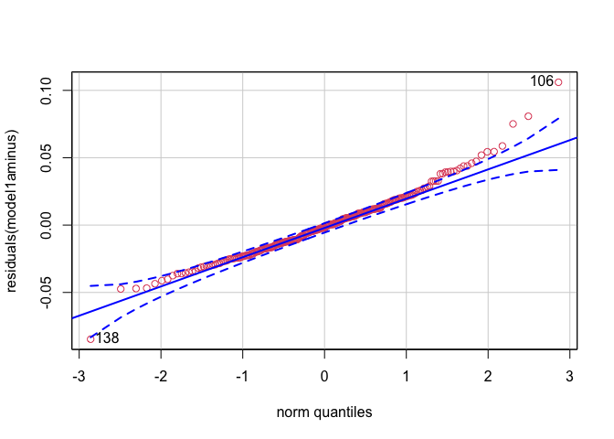<!-- -->

    ## [1] 106 138

``` r
coefminusAmyc = fixef(model1aminus)

tab_model(model1aminus)
```

<table style="border-collapse:collapse; border:none;">

<tr>

<th style="border-top: double; text-align:center; font-style:normal; font-weight:bold; padding:0.2cm;  text-align:left; ">

 

</th>

<th colspan="3" style="border-top: double; text-align:center; font-style:normal; font-weight:bold; padding:0.2cm; ">

Actinodfminusmycetalessums

</th>

</tr>

<tr>

<td style=" text-align:center; border-bottom:1px solid; font-style:italic; font-weight:normal;  text-align:left; ">

Predictors

</td>

<td style=" text-align:center; border-bottom:1px solid; font-style:italic; font-weight:normal;  ">

Estimates

</td>

<td style=" text-align:center; border-bottom:1px solid; font-style:italic; font-weight:normal;  ">

CI

</td>

<td style=" text-align:center; border-bottom:1px solid; font-style:italic; font-weight:normal;  ">

p

</td>

</tr>

<tr>

<td style=" padding:0.2cm; text-align:left; vertical-align:top; text-align:left; ">

(Intercept)

</td>

<td style=" padding:0.2cm; text-align:left; vertical-align:top; text-align:center;  ">

0.06

</td>

<td style=" padding:0.2cm; text-align:left; vertical-align:top; text-align:center;  ">

0.05 – 0.08

</td>

<td style=" padding:0.2cm; text-align:left; vertical-align:top; text-align:center;  ">

<strong>\<0.001

</td>

</tr>

<tr>

<td style=" padding:0.2cm; text-align:left; vertical-align:top; text-align:left; ">

aet

</td>

<td style=" padding:0.2cm; text-align:left; vertical-align:top; text-align:center;  ">

\-0.02

</td>

<td style=" padding:0.2cm; text-align:left; vertical-align:top; text-align:center;  ">

\-0.03 – -0.00

</td>

<td style=" padding:0.2cm; text-align:left; vertical-align:top; text-align:center;  ">

<strong>0.026</strong>

</td>

</tr>

<tr>

<td style=" padding:0.2cm; text-align:left; vertical-align:top; text-align:left; ">

SampleType \[Soil\]

</td>

<td style=" padding:0.2cm; text-align:left; vertical-align:top; text-align:center;  ">

0.04

</td>

<td style=" padding:0.2cm; text-align:left; vertical-align:top; text-align:center;  ">

0.03 – 0.05

</td>

<td style=" padding:0.2cm; text-align:left; vertical-align:top; text-align:center;  ">

<strong>\<0.001

</td>

</tr>

<tr>

<td style=" padding:0.2cm; text-align:left; vertical-align:top; text-align:left; ">

aet \* SampleType \[Soil\]

</td>

<td style=" padding:0.2cm; text-align:left; vertical-align:top; text-align:center;  ">

\-0.01

</td>

<td style=" padding:0.2cm; text-align:left; vertical-align:top; text-align:center;  ">

\-0.02 – -0.01

</td>

<td style=" padding:0.2cm; text-align:left; vertical-align:top; text-align:center;  ">

<strong>\<0.001

</td>

</tr>

<tr>

<td colspan="4" style="font-weight:bold; text-align:left; padding-top:.8em;">

Random Effects

</td>

</tr>

<tr>

<td style=" padding:0.2cm; text-align:left; vertical-align:top; text-align:left; padding-top:0.1cm; padding-bottom:0.1cm;">

σ<sup>2</sup>

</td>

<td style=" padding:0.2cm; text-align:left; vertical-align:top; padding-top:0.1cm; padding-bottom:0.1cm; text-align:left;" colspan="3">

0.00

</td>

<tr>

<td style=" padding:0.2cm; text-align:left; vertical-align:top; text-align:left; padding-top:0.1cm; padding-bottom:0.1cm;">

τ<sub>00</sub> <sub>Treenum:SiteID</sub>

</td>

<td style=" padding:0.2cm; text-align:left; vertical-align:top; padding-top:0.1cm; padding-bottom:0.1cm; text-align:left;" colspan="3">

0.00

</td>

<tr>

<td style=" padding:0.2cm; text-align:left; vertical-align:top; text-align:left; padding-top:0.1cm; padding-bottom:0.1cm;">

τ<sub>00</sub> <sub>SiteID</sub>

</td>

<td style=" padding:0.2cm; text-align:left; vertical-align:top; padding-top:0.1cm; padding-bottom:0.1cm; text-align:left;" colspan="3">

0.00

</td>

<tr>

<td style=" padding:0.2cm; text-align:left; vertical-align:top; text-align:left; padding-top:0.1cm; padding-bottom:0.1cm;">

ICC

</td>

<td style=" padding:0.2cm; text-align:left; vertical-align:top; padding-top:0.1cm; padding-bottom:0.1cm; text-align:left;" colspan="3">

0.41

</td>

<tr>

<td style=" padding:0.2cm; text-align:left; vertical-align:top; text-align:left; padding-top:0.1cm; padding-bottom:0.1cm;">

N <sub>Treenum</sub>

</td>

<td style=" padding:0.2cm; text-align:left; vertical-align:top; padding-top:0.1cm; padding-bottom:0.1cm; text-align:left;" colspan="3">

4

</td>

<tr>

<td style=" padding:0.2cm; text-align:left; vertical-align:top; text-align:left; padding-top:0.1cm; padding-bottom:0.1cm;">

N <sub>SiteID</sub>

</td>

<td style=" padding:0.2cm; text-align:left; vertical-align:top; padding-top:0.1cm; padding-bottom:0.1cm; text-align:left;" colspan="3">

8

</td>

<tr>

<td style=" padding:0.2cm; text-align:left; vertical-align:top; text-align:left; padding-top:0.1cm; padding-bottom:0.1cm; border-top:1px solid;">

Observations

</td>

<td style=" padding:0.2cm; text-align:left; vertical-align:top; padding-top:0.1cm; padding-bottom:0.1cm; text-align:left; border-top:1px solid;" colspan="3">

236

</td>

</tr>

<tr>

<td style=" padding:0.2cm; text-align:left; vertical-align:top; text-align:left; padding-top:0.1cm; padding-bottom:0.1cm;">

Marginal R<sup>2</sup> / Conditional R<sup>2</sup>

</td>

<td style=" padding:0.2cm; text-align:left; vertical-align:top; padding-top:0.1cm; padding-bottom:0.1cm; text-align:left;" colspan="3">

0.471 / 0.686

</td>

</tr>

</table>

``` r
##Plot
Notmycetalessumm<-(Notmycetalesfulldf) %>% 
  group_by(SampID, SampleType, aet)%>% 
  summarise(Meansumm=mean(na.exclude(Actinodfminusmycetalessums)),
            SD=sd(na.exclude(Actinodfminusmycetalessums)))
```

    ## `summarise()` regrouping output by 'SampID', 'SampleType' (override with `.groups` argument)

``` r
ggplot(Notmycetalessumm, aes(x=scale(aet), y = Meansumm, fill=SampleType)) +
  geom_pointrange(aes(
      ymin = Notmycetalessumm$Meansumm-Notmycetalessumm$SD, 
      ymax = Notmycetalessumm$Meansumm+Notmycetalessumm$SD),
                    position=position_jitter(width=0.02), 
                    linetype='solid', shape=21)+
geom_abline(aes(intercept=coefminusAmyc[1]+coefminusAmyc[3], slope=coefminusAmyc[2]+coefminusAmyc[4]), data=as.data.frame(coefminusAmyc), color="#8BB8E8")+ geom_abline(aes(intercept=coefminusAmyc[1], slope=coefminusAmyc[2]), data=as.data.frame(coefminusAmyc), color="#FF9900")
```

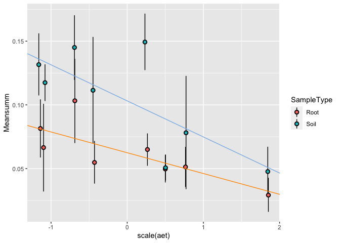<!-- -->

Actinoplot

``` r
##Plots
Actinosumm<-(Actinofulldf) %>% 
  group_by(SampID, SampleType, aet)%>% 
  summarise(Meansumm=mean(na.exclude(Actinosums)),
            SD=sd(na.exclude(Actinosums)))
```

    ## `summarise()` regrouping output by 'SampID', 'SampleType' (override with `.groups` argument)

``` r
Actinosumm$PhyloResolution="Actinobacteria"

Amycetalessumm<-(Amycetalesfulldf) %>% 
  group_by(SampID, SampleType, aet)%>% 
  summarise(Meansumm=mean(na.exclude(Amycetalessums)),
            SD=sd(na.exclude(Amycetalessums)))
```

    ## `summarise()` regrouping output by 'SampID', 'SampleType' (override with `.groups` argument)

``` r
Amycetalessumm$PhyloResolution="Actinomycetales"

Notmycetalessumm<-(Notmycetalesfulldf) %>% 
  group_by(SampID, SampleType, aet)%>% 
  summarise(Meansumm=mean(na.exclude(Actinodfminusmycetalessums)),
            SD=sd(na.exclude(Actinodfminusmycetalessums)))
```

    ## `summarise()` regrouping output by 'SampID', 'SampleType' (override with `.groups` argument)

``` r
Notmycetalessumm$PhyloResolution="NotActinomycetales"

PhylumOrderdata<-full_join(Actinosumm, Notmycetalessumm)
```

    ## Joining, by = c("SampID", "SampleType", "aet", "Meansumm", "SD", "PhyloResolution")

``` r
Actinoplot<-ggplot(PhylumOrderdata, aes(x=scale(aet), y = Meansumm, color=SampID, fill=SampleType)) +
  geom_pointrange(aes(
      ymin = PhylumOrderdata$Meansumm-PhylumOrderdata$SD, 
      ymax = PhylumOrderdata$Meansumm+PhylumOrderdata$SD),
                    position=position_jitter(width=0.02), 
                    linetype='solid', shape=21)+
  geom_abline(aes(intercept=coef[1], slope=coef[2]), data=as.data.frame(coef), color="#BE5504")+
  geom_abline(aes(intercept=coef[1]+coef[3], slope=coef[2]), data=as.data.frame(coef), color="#246bb5")+
  geom_abline(aes(intercept=coefminusAmyc[1], slope=coefminusAmyc[2]), data=as.data.frame(coefminusAmyc), color="#FF9900")+
  geom_abline(aes(intercept=coefminusAmyc[1]+coefminusAmyc[3], slope=coefminusAmyc[2]+coefminusAmyc[4]), data=as.data.frame(coefminusAmyc), color="#8BB8E8")+
  guides(color=guide_legend("Identity", nrow=2, byrow = T))+
  labs(x="AET (scaled)", y="Relative Abundance")+
  scale_fill_manual(values=c("black", "darkgray"), name="Sample Type")+
  scale_color_manual(values = c("Actinobacteria_Root" = "#BE5504", "Actinobacteria_Soil"="#246bb5", "Minusmycetales_Root"="#FF9900", "Minusmycetales_Soil"="#8BB8E8"), labels=c("Actinobacteria (Root)", "Actinobacteria (Soil)", "Exluding Actinomycetales (Root)", "Exluding Actinomycetales (Soil)"), name="Group")+
  theme(
            text = element_text(family = "Helvetica"),
            plot.title = element_text(margin = margin(b=5, r=5, l=5, unit = "mm"),
                                      size = rel(1),
                                      hjust = 0.5),
            panel.background = element_rect(fill="transparent", colour = NA),
            plot.background = element_rect(fill="transparent",colour = NA),
            panel.border = element_rect(fill="transparent", colour = "black"),
            axis.title = element_text(size = rel(1)),
            axis.title.y = element_text(angle=90, size = rel(1), margin = margin(r=3, unit = "mm")),
            axis.title.x = element_text(size=rel(1), margin = margin(t=3, unit = "mm")),
            axis.text.x = element_text(size=12, margin = unit(c(t = 2.5, r = 0, b = 0, l = 0), "mm")),
            axis.text.y = element_text(size=12, margin = unit(c(t = 0, r = 2.5, b = 0, l = 0), "mm")),
            axis.line = element_blank(),
            axis.ticks.x = element_line(colour = "black"),
            axis.ticks.y = element_line(colour = "black"),
            axis.ticks.length=unit(-1.4, "mm"), 
            panel.grid.major = element_blank(),
            panel.grid.minor = element_blank(),
            legend.text = element_text(size=10),
            legend.title = element_text(size =10,face = "bold" ),
            legend.position = "top", legend.box = "vertical")
```

Chloroflexi and Firmicutes

``` r
#Standardized by read count
Top500roots = transform_sample_counts(Roots, function(x) 100 * x/sum(x*100))
Top500soils = transform_sample_counts(Soils, function(x) 100 * x/sum(x*100))


#Pulling data out of phyloseq object
Roottable<-as(otu_table(Top500roots), "matrix")
Roottable<-as.data.frame((Roottable))
Roottable$OTU<-rownames(Roottable)
Roottax<-as.data.frame(as(tax_table(Top500roots), "matrix"))
Roottax$OTU<-rownames(Roottax) 
SampleData<-as(sample_data(Top500roots), "data.frame")


Chloroflexidf<-full_join(Roottable, Roottax)
```

    ## Joining, by = "OTU"

``` r
Chloroflexidf<-filter(Chloroflexidf, Phylum=="Chloroflexi")
Firmicutesdf<-full_join(Roottable, Roottax)
```

    ## Joining, by = "OTU"

``` r
Firmicutesdf<-filter(Firmicutesdf, Phylum=="Firmicutes")

Chloroflexisums<-colSums(Chloroflexidf[,1:114])
Chloroflexisumsdf=as.data.frame(Chloroflexisums)
Firmicutessums<-colSums(Firmicutesdf[,1:114])
Firmicutessumdf=as.data.frame(Firmicutessums)

Chloroflexisumsdf$SampleUnique<-rownames(Chloroflexisumsdf)
Chloroflexidf<-full_join(Chloroflexisumsdf, SampleData)
```

    ## Joining, by = "SampleUnique"

``` r
Chloroflexidf$Type="Root;Chloroflexi"
Firmicutessumdf$SampleUnique<-rownames(Firmicutessumdf)
Firmicutesdf<-full_join(Firmicutessumdf, SampleData)
```

    ## Joining, by = "SampleUnique"

``` r
Firmicutesdf$Type="Root;Firmicutes"


#Pulling data out of phyloseq object
Soiltable<-(as(otu_table(Top500soils), "matrix"))
Soiltable<-as.data.frame((Soiltable))
Soiltable$OTU<-rownames(Soiltable)
Soiltax<-as.data.frame(as(tax_table(Top500soils), "matrix"))
Soiltax$OTU<-rownames(Soiltax) 
SampleDataSoil<-as(sample_data(Top500soils), "data.frame")


SoilChloroflexidf<-full_join(Soiltable, Soiltax)
```

    ## Joining, by = "OTU"

``` r
SoilChloroflexidf<-filter(SoilChloroflexidf, Phylum=="Chloroflexi")
SoilFirmicutesdf<-full_join(Soiltable, Soiltax)
```

    ## Joining, by = "OTU"

``` r
SoilFirmicutesdf<-filter(SoilFirmicutesdf, Phylum=="Firmicutes")

SoilChloroflexisums<-colSums(SoilChloroflexidf[,1:122])
SoilChloroflexisumsdf=as.data.frame(SoilChloroflexisums)
SoilFirmicutessums<-colSums(SoilFirmicutesdf[,1:122])
SoilFirmicutessumsdf=as.data.frame(SoilFirmicutessums)


SoilChloroflexisumsdf$SampleUnique<-rownames(SoilChloroflexisumsdf)
SoilChloroflexidf<-full_join(SoilChloroflexisumsdf, SampleDataSoil)
```

    ## Joining, by = "SampleUnique"

``` r
SoilChloroflexidf$Type="Soil;Chloroflexi"
SoilFirmicutessumsdf$SampleUnique<-rownames(SoilFirmicutessumsdf)
SoilFirmicutesdf<-full_join(SoilFirmicutessumsdf, SampleDataSoil)
```

    ## Joining, by = "SampleUnique"

``` r
SoilFirmicutesdf$Type="Soil;Firmicutes"

##models

##need to join the data; then do a model with both;
Chloroflexisumsdf$Samptype="Root"
SoilChloroflexidf$SampleType="Soil"
SoilChloroflexidf$Chloroflexisums<-SoilChloroflexidf$SoilChloroflexisums
Chloroflexifulldf<-full_join(Chloroflexidf, SoilChloroflexidf)
```

    ## Joining, by = c("Chloroflexisums", "SampleUnique", "Site", "SiteID", "Cardinaldirection", "SiteLocation", "Treenum", "SampleType", "aet", "cwd", "djf", "jja", "ppt", "tmn", "tmx", "ppt_aet", "Latitude", "Longitude", "SampleName", "pH", "FINALP", "FINALK", "FINALCA", "FINALMG", "FINALZN", "FINALB", "FINALMN", "FINALCU", "FINALFE", "FINALPB", "FINALAL", "FINALNA", "FINALS", "Exch_Acid", "CEC", "CA_Base_Sat", "MG_Base_Sat", "K_Base_Sat", "Scoop_Dens", "CNratio", "PercentN", "PercentC", "Type")

``` r
Firmicutesdf$Samptype="Root"
SoilFirmicutesdf$SampleType="Soil"
SoilFirmicutesdf$Firmicutessums<-SoilFirmicutesdf$SoilFirmicutessums
Firmicutesfulldf<-full_join(Firmicutesdf, SoilFirmicutesdf)
```

    ## Joining, by = c("Firmicutessums", "SampleUnique", "Site", "SiteID", "Cardinaldirection", "SiteLocation", "Treenum", "SampleType", "aet", "cwd", "djf", "jja", "ppt", "tmn", "tmx", "ppt_aet", "Latitude", "Longitude", "SampleName", "pH", "FINALP", "FINALK", "FINALCA", "FINALMG", "FINALZN", "FINALB", "FINALMN", "FINALCU", "FINALFE", "FINALPB", "FINALAL", "FINALNA", "FINALS", "Exch_Acid", "CEC", "CA_Base_Sat", "MG_Base_Sat", "K_Base_Sat", "Scoop_Dens", "CNratio", "PercentN", "PercentC", "Type")

``` r
hist(Firmicutesfulldf$Firmicutessums)
```

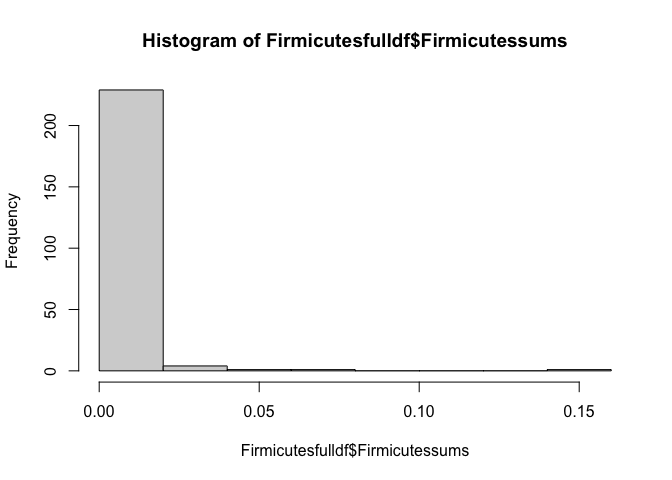<!-- -->

``` r
##Full model (both soil and root data; sample type*aet interaction)
Chloroflexifulldfclean<-dplyr::filter(Chloroflexifulldf, Chloroflexisums<0.18)

hist(Chloroflexifulldfclean$Chloroflexisums)
```

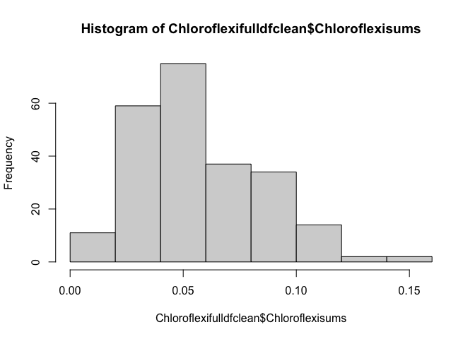<!-- -->

``` r
Chloromodel1a<-glmer(formula = Chloroflexisums~scale(aet)*SampleType +(1|SiteID/Treenum), data = Chloroflexifulldfclean)
```

    ## Warning in glmer(formula = Chloroflexisums ~ scale(aet) * SampleType + (1 | :
    ## calling glmer() with family=gaussian (identity link) as a shortcut to lmer() is
    ## deprecated; please call lmer() directly

``` r
Chloromodel1b<-glmer(formula = Chloroflexisums~SampleType+ scale(aet)*scale(pH) +(1|SiteID/Treenum), data = Chloroflexifulldfclean)
```

    ## Warning in glmer(formula = Chloroflexisums ~ SampleType + scale(aet) * scale(pH)
    ## + : calling glmer() with family=gaussian (identity link) as a shortcut to lmer()
    ## is deprecated; please call lmer() directly

``` r
Chloromodel1c<-glmer(formula = Chloroflexisums~scale(aet)+SampleType +(1|SiteID/Treenum), data = Chloroflexifulldfclean)
```

    ## Warning in glmer(formula = Chloroflexisums ~ scale(aet) + SampleType + (1 | :
    ## calling glmer() with family=gaussian (identity link) as a shortcut to lmer() is
    ## deprecated; please call lmer() directly

``` r
Chloromodel1d<-glmer(formula = Chloroflexisums~SampleType*scale(aet)*scale(pH) +(1|SiteID/Treenum), data = Chloroflexifulldfclean)
```

    ## Warning in glmer(formula = Chloroflexisums ~ SampleType * scale(aet) * scale(pH)
    ## + : calling glmer() with family=gaussian (identity link) as a shortcut to lmer()
    ## is deprecated; please call lmer() directly

``` r
Chloromodel1e<-glmer(formula = Chloroflexisums~SampleType*scale(aet)*scale(pH) +(1|SiteID), data = Chloroflexifulldfclean)
```

    ## Warning in glmer(formula = Chloroflexisums ~ SampleType * scale(aet) * scale(pH)
    ## + : calling glmer() with family=gaussian (identity link) as a shortcut to lmer()
    ## is deprecated; please call lmer() directly

``` r
AIC(Chloromodel1a, Chloromodel1b, Chloromodel1c, Chloromodel1d, Chloromodel1e)
```

    ##               df       AIC
    ## Chloromodel1a  7 -1070.057
    ## Chloromodel1b  8 -1020.788
    ## Chloromodel1c  6 -1028.041
    ## Chloromodel1d 11 -1046.363
    ## Chloromodel1e 10 -1045.329

``` r
BIC(Chloromodel1a, Chloromodel1b, Chloromodel1c, Chloromodel1d, Chloromodel1e)
```

    ##               df       BIC
    ## Chloromodel1a  7 -1045.870
    ## Chloromodel1b  8  -993.145
    ## Chloromodel1c  6 -1007.309
    ## Chloromodel1d 11 -1008.354
    ## Chloromodel1e 10 -1010.776

``` r
##Selecting ChloroModel1a (lowest AIC and BIC)


Chloromodel1a<-glmer(formula = Chloroflexisums~scale(aet)*SampleType +(1|SiteID/Treenum), data = Chloroflexifulldfclean)
```

    ## Warning in glmer(formula = Chloroflexisums ~ scale(aet) * SampleType + (1 | :
    ## calling glmer() with family=gaussian (identity link) as a shortcut to lmer() is
    ## deprecated; please call lmer() directly

``` r
qqp(residuals(Chloromodel1a), col=2)
```

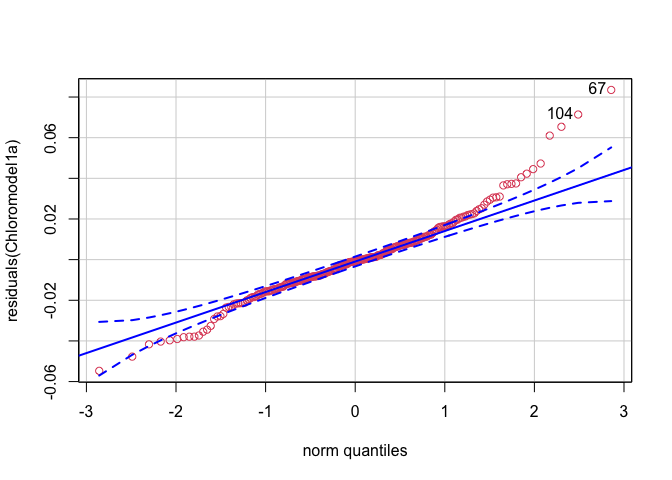<!-- -->

    ## [1]  67 104

``` r
##Visual inspection; removed 2 outliers 


##just Firmicutes 
##There were 4 extreme outliers (much higher abundance) that needed to be removed to fit a model (filtered these out)
Firmicutesfulldf<-dplyr::filter(Firmicutesfulldf, Firmicutessums<0.038)
hist(Firmicutesfulldf$Firmicutessums)
```

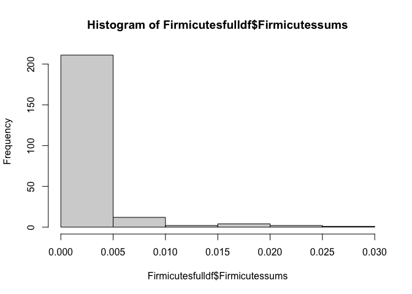<!-- -->

``` r
Firmicutesmodel1a<-glmer(formula = Firmicutessums~scale(aet)*SampleType +(1|SiteID/Treenum), data = Firmicutesfulldf)
```

    ## Warning in glmer(formula = Firmicutessums ~ scale(aet) * SampleType + (1 | :
    ## calling glmer() with family=gaussian (identity link) as a shortcut to lmer() is
    ## deprecated; please call lmer() directly

``` r
Firmicutesmodel1b<-glmer(formula = Firmicutessums~SampleType+ scale(aet)*scale(pH) +(1|SiteID/Treenum), data = Firmicutesfulldf)
```

    ## Warning in glmer(formula = Firmicutessums ~ SampleType + scale(aet) * scale(pH)
    ## + : calling glmer() with family=gaussian (identity link) as a shortcut to lmer()
    ## is deprecated; please call lmer() directly

``` r
Firmicutesmodel1c<-glmer(formula = Firmicutessums~scale(aet)+SampleType +(1|SiteID/Treenum), data = Firmicutesfulldf)
```

    ## Warning in glmer(formula = Firmicutessums ~ scale(aet) + SampleType + (1 | :
    ## calling glmer() with family=gaussian (identity link) as a shortcut to lmer() is
    ## deprecated; please call lmer() directly

``` r
Firmicutesmodel1d<-glmer(formula = Firmicutessums~SampleType*scale(aet)*scale(pH) +(1|SiteID/Treenum), data = Firmicutesfulldf)
```

    ## Warning in glmer(formula = Firmicutessums ~ SampleType * scale(aet) * scale(pH)
    ## + : calling glmer() with family=gaussian (identity link) as a shortcut to lmer()
    ## is deprecated; please call lmer() directly

``` r
Firmicutesmodel1e<-glmer(formula = Firmicutessums~SampleType*scale(aet)*scale(pH) +(1|SiteID), data = Firmicutesfulldf)
```

    ## Warning in glmer(formula = Firmicutessums ~ SampleType * scale(aet) * scale(pH)
    ## + : calling glmer() with family=gaussian (identity link) as a shortcut to lmer()
    ## is deprecated; please call lmer() directly

``` r
Firmicutesmodel1f<-glmer(formula = Firmicutessums~SampleType +(1|SiteID), data = Firmicutesfulldf)
```

    ## Warning in glmer(formula = Firmicutessums ~ SampleType + (1 | SiteID), data =
    ## Firmicutesfulldf): calling glmer() with family=gaussian (identity link) as a
    ## shortcut to lmer() is deprecated; please call lmer() directly

``` r
AIC(Firmicutesmodel1a, Firmicutesmodel1b, Firmicutesmodel1c, Firmicutesmodel1d, Firmicutesmodel1e,Firmicutesmodel1f)
```

    ##                   df       AIC
    ## Firmicutesmodel1a  7 -1893.180
    ## Firmicutesmodel1b  8 -1876.997
    ## Firmicutesmodel1c  6 -1908.570
    ## Firmicutesmodel1d 11 -1830.964
    ## Firmicutesmodel1e 10 -1811.498
    ## Firmicutesmodel1f  4 -1902.548

``` r
BIC(Firmicutesmodel1a, Firmicutesmodel1b, Firmicutesmodel1c, Firmicutesmodel1d, Firmicutesmodel1e, Firmicutesmodel1f)
```

    ##                   df       BIC
    ## Firmicutesmodel1a  7 -1869.053
    ## Firmicutesmodel1b  8 -1849.423
    ## Firmicutesmodel1c  6 -1887.890
    ## Firmicutesmodel1d 11 -1793.050
    ## Firmicutesmodel1e 10 -1777.031
    ## Firmicutesmodel1f  4 -1888.761

``` r
##Selected model 
Firmicutesmodel1f<-glmer(formula = Firmicutessums~SampleType +(1|SiteID), data = Firmicutesfulldf)
```

    ## Warning in glmer(formula = Firmicutessums ~ SampleType + (1 | SiteID), data =
    ## Firmicutesfulldf): calling glmer() with family=gaussian (identity link) as a
    ## shortcut to lmer() is deprecated; please call lmer() directly

``` r
library(car)
qqp(residuals(Firmicutesmodel1f), col=2)
```

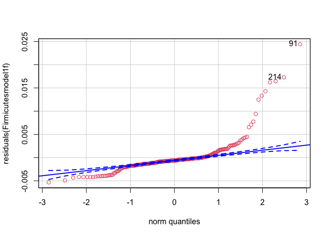<!-- -->

    ## [1]  91 214

``` r
summary(Firmicutesmodel1f)
```

    ## Linear mixed model fit by REML ['lmerMod']
    ## Formula: Firmicutessums ~ SampleType + (1 | SiteID)
    ##    Data: Firmicutesfulldf
    ## 
    ## REML criterion at convergence: -1910.5
    ## 
    ## Scaled residuals: 
    ##     Min      1Q  Median      3Q     Max 
    ## -1.4644 -0.3699 -0.1678  0.0385  6.7221 
    ## 
    ## Random effects:
    ##  Groups   Name        Variance  Std.Dev.
    ##  SiteID   (Intercept) 1.934e-06 0.001391
    ##  Residual             1.319e-05 0.003631
    ## Number of obs: 232, groups:  SiteID, 8
    ## 
    ## Fixed effects:
    ##                 Estimate Std. Error t value
    ## (Intercept)    0.0015107  0.0006008   2.514
    ## SampleTypeSoil 0.0011267  0.0004776   2.359
    ## 
    ## Correlation of Fixed Effects:
    ##             (Intr)
    ## SampleTypSl -0.415

``` r
SampleDataAll<-as(sample_data(RARE), "data.frame")
SampleDataSoil<-as(sample_data(Soils), "data.frame")
SampleDataRoots<-as(sample_data(Roots), "data.frame")

bacteriasoils<-Soildf; Soildf[Soildf>0]=1 
bacteriasoils<-Soildf; Soildf[Soildf>0]=1 

bacteriaroots<-Rootdf; Rootdf[Rootdf>0]=1 
bacteriaroots<-Rootdf; Rootdf[Rootdf>0]=1 


library(betapart)
bacteria.dist.roots<-beta.pair(bacteriaroots, index.family = "jaccard");
bacteria.dist.soils<-beta.pair(bacteriasoils, index.family = "jaccard");

aetdistsoil<-dist(dfsoil$aet)
aetdistroot<-dist(dfroot$aet)

pHdistsoil<-dist(dfsoil$pH)
pHdistroot<-dist(dfroot$pH)


mantel(bacteria.dist.roots$beta.jtu~aetdistroot)
```

    ##    mantelr      pval1      pval2      pval3  llim.2.5% ulim.97.5% 
    ##  0.3259502  0.0010000  1.0000000  0.0010000  0.2934974  0.3583621

``` r
nestednessroots<-mantel(bacteria.dist.roots$beta.jne~aetdistroot)

mantel(bacteria.dist.roots$beta.jtu~pHdistroot)
```

    ##    mantelr      pval1      pval2      pval3  llim.2.5% ulim.97.5% 
    ##  0.6518074  0.0010000  1.0000000  0.0010000  0.6189340  0.6875289

``` r
mantel(bacteria.dist.roots$beta.jne~pHdistroot)
```

    ##      mantelr        pval1        pval2        pval3    llim.2.5%   ulim.97.5% 
    ## -0.041722707  0.841000000  0.160000000  0.308000000 -0.086314494 -0.003020699

``` r
mantel(bacteria.dist.soils$beta.jtu~aetdistsoil)
```

    ##    mantelr      pval1      pval2      pval3  llim.2.5% ulim.97.5% 
    ##  0.3545620  0.0010000  1.0000000  0.0010000  0.3187559  0.3928135

``` r
nestednesssoils<-mantel(bacteria.dist.soils$beta.jne~aetdistsoil)

mantel(bacteria.dist.soils$beta.jtu~pHdistsoil)
```

    ##    mantelr      pval1      pval2      pval3  llim.2.5% ulim.97.5% 
    ##  0.6337444  0.0010000  1.0000000  0.0010000  0.5963663  0.6695709

``` r
mantel(bacteria.dist.soils$beta.jne~pHdistsoil)
```

    ##    mantelr      pval1      pval2      pval3  llim.2.5% ulim.97.5% 
    ##  0.2327619  0.0010000  1.0000000  0.0010000  0.1714565  0.2803446

``` r
mantel(bacteria.dist.soils$beta.jac~pHdistsoil)
```

    ##    mantelr      pval1      pval2      pval3  llim.2.5% ulim.97.5% 
    ##  0.6830649  0.0010000  1.0000000  0.0010000  0.6321003  0.7120277

``` r
mantel(bacteria.dist.roots$beta.jac~pHdistroot)
```

    ##    mantelr      pval1      pval2      pval3  llim.2.5% ulim.97.5% 
    ##  0.6633387  0.0010000  1.0000000  0.0010000  0.6277730  0.6995764

``` r
mantel(bacteria.dist.soils$beta.jac~aetdistsoil)
```

    ##    mantelr      pval1      pval2      pval3  llim.2.5% ulim.97.5% 
    ##  0.5022075  0.0010000  1.0000000  0.0010000  0.4728482  0.5414242

``` r
mantel(bacteria.dist.roots$beta.jac~aetdistroot)
```

    ##    mantelr      pval1      pval2      pval3  llim.2.5% ulim.97.5% 
    ##  0.3956956  0.0010000  1.0000000  0.0010000  0.3606327  0.4333772

``` r
Bnestedsoil <- data.frame(matrix(unlist(bacteria.dist.soils$beta.jne), byrow=T))
Bnestedsoil_aet<-data.frame(matrix(unlist(aetdistsoil), byrow=T))
Bnestedsoilz<-cbind(Bnestedsoil, Bnestedsoil_aet)
Bnestedsoilz<-Bnestedsoilz %>% 
  dplyr::rename(
        AET=matrix.unlist.aetdistsoil...byrow...T.,
        Nestedness=matrix.unlist.bacteria.dist.soils.beta.jne...byrow...T.)
Bnestedsoilz$SampleType<-"Soil"

Bnestedroot<-data.frame(matrix(unlist(bacteria.dist.roots$beta.jne), byrow=T))
Bnestedroot_aet<-data.frame(matrix(unlist(aetdistroot), byrow=T))
Bnestedrootz<-cbind(Bnestedroot, Bnestedroot_aet)

Bnestedrootz<-Bnestedrootz %>% 
  dplyr::rename(
        AET=matrix.unlist.aetdistroot...byrow...T.,
        Nestedness=matrix.unlist.bacteria.dist.roots.beta.jne...byrow...T.)
Bnestedrootz$SampleType<-"Root"


Bnested<-dplyr::full_join(Bnestedrootz, Bnestedsoilz)
```

    ## Joining, by = c("Nestedness", "AET", "SampleType")

``` r
Bnestedplot<-ggplot(data=Bnested, aes(AET, Nestedness))+
geom_point(alpha=0.08)+ labs(x="Difference in AET", y=expression(Nestedness~(beta[nes])))+
  ylim(0, 0.3)+
  facet_wrap(~SampleType,scales="free_x", ncol = 1, strip.position = "right")+
  geom_smooth(method = "lm", se = F, color="red", size=0.4)+
  theme(
            text = element_text(family = "Helvetica"),
            plot.title = element_text(margin = margin(b=5, r=5, l=5, unit = "mm"),
                                      size = rel(1),
                                      hjust = 0.5),
            panel.background = element_rect(fill="transparent", colour = NA),
            plot.background = element_rect(fill="transparent",colour = NA),
            panel.border = element_rect(fill="transparent", colour = "black"),
            axis.title = element_text(size = rel(1)),
            axis.title.y = element_text(angle=90, size = rel(1), margin = margin(r=3, unit = "mm")),
            axis.title.x = element_text(size=rel(1), margin = margin(t=3, unit = "mm")),
            axis.text.x = element_text(size=12, margin = unit(c(t = 2.5, r = 0, b = 0, l = 0), "mm")),
            axis.text.y = element_text(size=12, margin = unit(c(t = 0, r = 2.5, b = 0, l = 0), "mm")),
            axis.line = element_blank(),
            axis.ticks.x = element_line(colour = "black"),
            axis.ticks.y = element_line(colour = "black"),
            axis.ticks.length=unit(-1.4, "mm"), 
            panel.grid.major = element_blank(),
            panel.grid.minor = element_blank())


##soils
z <- betadiver(bacteriasoils, "z")
mod <- with(SampleDataSoil, betadisper(z, SiteID))
mod
```

    ## 
    ##  Homogeneity of multivariate dispersions
    ## 
    ## Call: betadisper(d = z, group = SiteID)
    ## 
    ## No. of Positive Eigenvalues: 121
    ## No. of Negative Eigenvalues: 0
    ## 
    ## Average distance to median:
    ##      1      2      3      4      5      6      7      8 
    ## 0.3989 0.3953 0.3812 0.3847 0.4038 0.3977 0.4353 0.4218 
    ## 
    ## Eigenvalues for PCoA axes:
    ## (Showing 8 of 121 eigenvalues)
    ##  PCoA1  PCoA2  PCoA3  PCoA4  PCoA5  PCoA6  PCoA7  PCoA8 
    ## 4.1802 1.5593 0.9307 0.9059 0.7105 0.6128 0.5411 0.4778

``` r
betadist <- data.frame(matrix(unlist(mod$distances), byrow=F))
betasite<-data.frame(matrix(unlist(mod$group), byrow=F))
betadispsoils<-cbind(betasite,betadist)

##roots
zr<-betadiver(bacteriaroots, "z")
modr <- with(SampleDataRoots, betadisper(zr, SiteID))
betadistr <- data.frame(matrix(unlist(modr$distances), byrow=F))
betasiter<-data.frame(matrix(unlist(modr$group), byrow=F))
betadisproots<-cbind(betasiter,betadistr)

##join with sample data
betadispsoils<-betadispsoils %>% 
  dplyr::rename(
        BetaDist=matrix.unlist.mod.distances...byrow...F.,
        SiteID_delete=matrix.unlist.mod.group...byrow...F.)
  betadispsoils<-cbind(betadispsoils, SampleDataSoil)

betadisproots<-betadisproots %>% 
  dplyr::rename(
        BetaDist=matrix.unlist.modr.distances...byrow...F.,
        SiteID_delete=matrix.unlist.modr.group...byrow...F.)
  betadisproots<-cbind(betadisproots, SampleDataRoots)

##combine root and soil into one df
betadispall<-full_join(betadisproots, betadispsoils)
```

    ## Joining, by = c("SiteID_delete", "BetaDist", "SampleUnique", "Site", "SiteID", "Cardinaldirection", "SiteLocation", "Treenum", "SampleType", "aet", "cwd", "djf", "jja", "ppt", "tmn", "tmx", "ppt_aet", "Latitude", "Longitude", "SampleName", "pH", "FINALP", "FINALK", "FINALCA", "FINALMG", "FINALZN", "FINALB", "FINALMN", "FINALCU", "FINALFE", "FINALPB", "FINALAL", "FINALNA", "FINALS", "Exch_Acid", "CEC", "CA_Base_Sat", "MG_Base_Sat", "K_Base_Sat", "Scoop_Dens", "CNratio", "PercentN", "PercentC")

``` r
library(lme4)
library(lmerTest)

##modelselection
betadispmodela<-lmer(formula = BetaDist~scale(aet)*scale(pH)*SampleType +(1|SiteID/Treenum), data = betadispall, REML = F)
betadispmodelb<-lmer(formula = BetaDist~scale(aet)+scale(pH)+SampleType +(1|SiteID/Treenum), data = betadispall, REML = F)
```

    ## boundary (singular) fit: see ?isSingular

``` r
betadispmodelc<-lmer(formula = BetaDist~scale(aet)+scale(pH) +(1|SiteID/Treenum), data = betadispall, REML = F)
```

    ## boundary (singular) fit: see ?isSingular

``` r
betadispmodeld<-lmer(formula = BetaDist~scale(aet)+SampleType +(1|SiteID/Treenum), data = betadispall, REML = F)
```

    ## boundary (singular) fit: see ?isSingular

``` r
betadispmodele<-lmer(formula = BetaDist~scale(aet)+(1|SiteID/Treenum), data = betadispall, REML = F)
```

    ## boundary (singular) fit: see ?isSingular

``` r
betadispmodelf<-lmer(formula = BetaDist~scale(aet)+scale(pH) +(1|SiteID), data = betadispall, REML = F)
```

    ## boundary (singular) fit: see ?isSingular

``` r
betadispmodelg<-lmer(formula = BetaDist~scale(aet)+SampleType +(1|SiteID), data = betadispall, REML = F)
```

    ## boundary (singular) fit: see ?isSingular

``` r
betadispmodelh<-lmer(formula = BetaDist~scale(aet) +(1|SiteID), data = betadispall, REML = F)
```

    ## boundary (singular) fit: see ?isSingular

``` r
AIC(betadispmodela, betadispmodelb, betadispmodelc, betadispmodeld, betadispmodele, betadispmodelf, betadispmodelg, betadispmodelh)
```

    ##                df       AIC
    ## betadispmodela 11 -701.9247
    ## betadispmodelb  7 -691.0502
    ## betadispmodelc  6 -686.1994
    ## betadispmodeld  6 -690.7430
    ## betadispmodele  5 -685.8409
    ## betadispmodelf  5 -682.7457
    ## betadispmodelg  5 -686.6084
    ## betadispmodelh  4 -681.7567

``` r
BIC(betadispmodela, betadispmodelb, betadispmodelc, betadispmodeld, betadispmodele, betadispmodelf, betadispmodelg, betadispmodelh)
```

    ##                df       BIC
    ## betadispmodela 11 -663.8226
    ## betadispmodelb  7 -666.8034
    ## betadispmodelc  6 -665.4164
    ## betadispmodeld  6 -669.9600
    ## betadispmodele  5 -668.5217
    ## betadispmodelf  5 -665.4266
    ## betadispmodelg  5 -669.2893
    ## betadispmodelh  4 -667.9014

``` r
betadispmodeld<-lmer(formula = BetaDist~scale(aet)+SampleType +(1|SiteID/Treenum), data = betadispall)
```

    ## boundary (singular) fit: see ?isSingular

``` r
library(dplyr)
betadispallgroup<-(betadispall) %>% 
  group_by(SiteID)%>% 
  summarise(MeanDisp=mean(na.exclude(BetaDist)),
            SD=sd(na.exclude(BetaDist)),
            SiteID=SiteID)
```

    ## `summarise()` regrouping output by 'SiteID' (override with `.groups` argument)

``` r
betadispplotsite<-ggplot(data=betadispall, aes(SiteID, BetaDist, fill=SiteID)) +
  geom_boxplot(outlier.shape = NA) + geom_jitter(width = 0.2, alpha=0.4)+
  labs(x="Site ID", y="Dispersion")+
  facet_wrap(~SampleType,scales="free_x", ncol = 1, strip.position = "right")+scale_fill_manual(values = c("#2332A0", "#36B4FC", "#1BFFE8", "#19FF31", "#FFE400", "#FE9400", "#ff5a04", "#AA3407", "red"))+
  theme(
            text = element_text(family = "Helvetica"),
            plot.title = element_text(margin = margin(b=5, r=5, l=5, unit = "mm"),
                                      size = rel(1),
                                      hjust = 0.5),
            panel.background = element_rect(fill="transparent", colour = NA),
            plot.background = element_rect(fill="transparent",colour = NA),
            panel.border = element_rect(fill="transparent", colour = "black"),
            axis.title = element_text(size = rel(1)),
            axis.title.y = element_text(angle=90, size = rel(1), margin = margin(r=3, unit = "mm")),
            axis.title.x = element_text(size=rel(1), margin = margin(t=3, unit = "mm")),
            axis.text.x = element_text(size=12, margin = unit(c(t = 2.5, r = 0, b = 0, l = 0), "mm")),
            axis.text.y = element_text(size=12, margin = unit(c(t = 0, r = 2.5, b = 0, l = 0), "mm")),
            axis.line = element_blank(),
            axis.ticks.x = element_line(colour = "black"),
            axis.ticks.y = element_line(colour = "black"),
            axis.ticks.length=unit(-1.4, "mm"), 
            panel.grid.major = element_blank(),
            panel.grid.minor = element_blank(),
            legend.position = "none")
```

``` r
setwd("~/Dropbox/Research/Thesis_Ch3/Manuscript/Molecular Ecology Submission/Resubmission/MinorRevisions")
Figure1A<-cowplot::plot_grid(ORDbray,
                            rel_heights = c(0.1, 1.85),
                            labels = c("a)"),
                            label_fontfamily = "sans")

Figure1B<-cowplot::plot_grid(barplot,
                            ncol=1,
                            labels = c("b)"),
                            label_fontfamily = "sans")

Figure1AB<-cowplot::plot_grid(Figure1A,Figure1B,
                            rel_widths = c(3.9,2.8),
                            nrow=1)
##Adonis results
adonisresults
```

    ## 
    ## Call:
    ## adonis(formula = BACTERIAdf ~ SiteID * SampleType, data = Bdf,      permutations = 1000, strata = Bdf$Treenum) 
    ## 
    ## Blocks:  strata 
    ## Permutation: free
    ## Number of permutations: 1000
    ## 
    ## Terms added sequentially (first to last)
    ## 
    ##                    Df SumsOfSqs MeanSqs F.Model      R2   Pr(>F)    
    ## SiteID              7    12.112  1.7303  14.046 0.22369 0.000999 ***
    ## SampleType          1    10.589 10.5890  85.962 0.19557 0.000999 ***
    ## SiteID:SampleType   7     4.344  0.6206   5.038 0.08024 0.000999 ***
    ## Residuals         220    27.100  0.1232         0.50051             
    ## Total             235    54.145                 1.00000             
    ## ---
    ## Signif. codes:  0 '***' 0.001 '**' 0.01 '*' 0.05 '.' 0.1 ' ' 1

``` r
setwd("~/Dropbox/Research/Thesis_Ch3/Manuscript/Molecular Ecology Submission/Resubmission/MinorRevisions")
#ggsave("Figure1AB.pdf", plot = Figure1AB, width = 10.3, height = 5.3) 


Figure2be<-cowplot::plot_grid(Shannonroots, Shannonsoils,Simpsonroots,Simpsonsoils,
                   labels = c("b)", "c)", "d)", "e)"), 
                   label_size = 12, 
                   label_fontfamily = "sans")

Figure2a<-cowplot::plot_grid(Actinoplot, 
                            #rel_heights = c(1.85, 0.1),
                            ncol=1,
                            labels = c("a)"),
                            label_fontfamily = "sans")

Figure2AB<-cowplot::plot_grid(Figure2a,Figure2be,
                            rel_heights = c(2.2,2),
                            ncol=1,
                            label_size = 12, 
                            label_fontfamily = "sans")
setwd("~/Dropbox/Research/Thesis_Ch3/Manuscript/Molecular Ecology Submission/Resubmission/MinorRevisions")
#ggsave("Figure2AB.pdf", plot = Figure2AB, width =8 , height = 9.1) 

Figure3<-cowplot::plot_grid(RANKFULLplot)
setwd("~/Dropbox/Research/Thesis_Ch3/Manuscript/Molecular Ecology Submission/Resubmission/MinorRevisions")
#ggsave("Figure3.pdf", plot = Figure3, width =12 , height = 8) 


Figure4<-cowplot::plot_grid(Toptaxaplot)
  
setwd("~/Dropbox/Research/Thesis_Ch3/Manuscript/Molecular Ecology Submission/Resubmission/MinorRevisions")
#ggsave("Figure4.pdf", plot = Figure4, width =6 , height = 4) 


##Supplemental

FigureS1<-cowplot::plot_grid(GDMsoil, GDMroot,
                  labels = c("a)", "b)"), 
                  label_size = 14,
                  vjust=4.8,
                  label_fontfamily = "sans")
setwd("~/Dropbox/Research/Thesis_Ch3/Manuscript/Molecular Ecology Submission/Resubmission/MinorRevisions")
#ggsave("FigureS1.pdf", plot = FigureS1, width =8 , height = 3.85)


FigureS2<-cowplot::plot_grid(Bnestedplot)
setwd("~/Dropbox/Research/Thesis_Ch3/Manuscript/Molecular Ecology Submission/Resubmission/MinorRevisions")
ggsave("FigureS2.jpeg", plot = FigureS2, width =6 , height = 5, dpi = 600)
nestednessroots
```

    ##    mantelr      pval1      pval2      pval3  llim.2.5% ulim.97.5% 
    ##  0.1370679  0.0020000  0.9990000  0.0020000  0.1012891  0.1748739

``` r
nestednesssoils
```

    ##    mantelr      pval1      pval2      pval3  llim.2.5% ulim.97.5% 
    ##  0.4277754  0.0010000  1.0000000  0.0010000  0.3952012  0.4639834

``` r
FigureS3<-cowplot::plot_grid(betadispplotsite)
setwd("~/Dropbox/Research/Thesis_Ch3/Manuscript/Molecular Ecology Submission/Resubmission/MinorRevisions")
#ggsave("FigureS3.pdf", plot = FigureS3, width =6 , height = 5)


#Tables
ModeltableActino<-tab_model(model1c,model1aminus, auto.label = F)
ModeltableActino
```

<table style="border-collapse:collapse; border:none;">

<tr>

<th style="border-top: double; text-align:center; font-style:normal; font-weight:bold; padding:0.2cm;  text-align:left; ">

 

</th>

<th colspan="3" style="border-top: double; text-align:center; font-style:normal; font-weight:bold; padding:0.2cm; ">

Actinosums

</th>

<th colspan="3" style="border-top: double; text-align:center; font-style:normal; font-weight:bold; padding:0.2cm; ">

Actinodfminusmycetalessums

</th>

</tr>

<tr>

<td style=" text-align:center; border-bottom:1px solid; font-style:italic; font-weight:normal;  text-align:left; ">

Predictors

</td>

<td style=" text-align:center; border-bottom:1px solid; font-style:italic; font-weight:normal;  ">

Estimates

</td>

<td style=" text-align:center; border-bottom:1px solid; font-style:italic; font-weight:normal;  ">

CI

</td>

<td style=" text-align:center; border-bottom:1px solid; font-style:italic; font-weight:normal;  ">

p

</td>

<td style=" text-align:center; border-bottom:1px solid; font-style:italic; font-weight:normal;  ">

Estimates

</td>

<td style=" text-align:center; border-bottom:1px solid; font-style:italic; font-weight:normal;  ">

CI

</td>

<td style=" text-align:center; border-bottom:1px solid; font-style:italic; font-weight:normal;  col7">

p

</td>

</tr>

<tr>

<td style=" padding:0.2cm; text-align:left; vertical-align:top; text-align:left; ">

(Intercept)

</td>

<td style=" padding:0.2cm; text-align:left; vertical-align:top; text-align:center;  ">

0.22

</td>

<td style=" padding:0.2cm; text-align:left; vertical-align:top; text-align:center;  ">

0.20 – 0.25

</td>

<td style=" padding:0.2cm; text-align:left; vertical-align:top; text-align:center;  ">

<strong>\<0.001

</td>

<td style=" padding:0.2cm; text-align:left; vertical-align:top; text-align:center;  ">

0.06

</td>

<td style=" padding:0.2cm; text-align:left; vertical-align:top; text-align:center;  ">

0.05 – 0.08

</td>

<td style=" padding:0.2cm; text-align:left; vertical-align:top; text-align:center;  col7">

<strong>\<0.001

</td>

</tr>

<tr>

<td style=" padding:0.2cm; text-align:left; vertical-align:top; text-align:left; ">

scale(aet)

</td>

<td style=" padding:0.2cm; text-align:left; vertical-align:top; text-align:center;  ">

\-0.04

</td>

<td style=" padding:0.2cm; text-align:left; vertical-align:top; text-align:center;  ">

\-0.06 – -0.02

</td>

<td style=" padding:0.2cm; text-align:left; vertical-align:top; text-align:center;  ">

<strong>\<0.001

</td>

<td style=" padding:0.2cm; text-align:left; vertical-align:top; text-align:center;  ">

\-0.02

</td>

<td style=" padding:0.2cm; text-align:left; vertical-align:top; text-align:center;  ">

\-0.03 – -0.00

</td>

<td style=" padding:0.2cm; text-align:left; vertical-align:top; text-align:center;  col7">

<strong>0.026</strong>

</td>

</tr>

<tr>

<td style=" padding:0.2cm; text-align:left; vertical-align:top; text-align:left; ">

SampleTypeSoil

</td>

<td style=" padding:0.2cm; text-align:left; vertical-align:top; text-align:center;  ">

\-0.06

</td>

<td style=" padding:0.2cm; text-align:left; vertical-align:top; text-align:center;  ">

\-0.07 – -0.05

</td>

<td style=" padding:0.2cm; text-align:left; vertical-align:top; text-align:center;  ">

<strong>\<0.001

</td>

<td style=" padding:0.2cm; text-align:left; vertical-align:top; text-align:center;  ">

0.04

</td>

<td style=" padding:0.2cm; text-align:left; vertical-align:top; text-align:center;  ">

0.03 – 0.05

</td>

<td style=" padding:0.2cm; text-align:left; vertical-align:top; text-align:center;  col7">

<strong>\<0.001

</td>

</tr>

<tr>

<td style=" padding:0.2cm; text-align:left; vertical-align:top; text-align:left; ">

scale(aet):SampleTypeSoil

</td>

<td style=" padding:0.2cm; text-align:left; vertical-align:top; text-align:center;  ">

</td>

<td style=" padding:0.2cm; text-align:left; vertical-align:top; text-align:center;  ">

</td>

<td style=" padding:0.2cm; text-align:left; vertical-align:top; text-align:center;  ">

</td>

<td style=" padding:0.2cm; text-align:left; vertical-align:top; text-align:center;  ">

\-0.01

</td>

<td style=" padding:0.2cm; text-align:left; vertical-align:top; text-align:center;  ">

\-0.02 – -0.01

</td>

<td style=" padding:0.2cm; text-align:left; vertical-align:top; text-align:center;  col7">

<strong>\<0.001

</td>

</tr>

<tr>

<td colspan="7" style="font-weight:bold; text-align:left; padding-top:.8em;">

Random Effects

</td>

</tr>

<tr>

<td style=" padding:0.2cm; text-align:left; vertical-align:top; text-align:left; padding-top:0.1cm; padding-bottom:0.1cm;">

σ<sup>2</sup>

</td>

<td style=" padding:0.2cm; text-align:left; vertical-align:top; padding-top:0.1cm; padding-bottom:0.1cm; text-align:left;" colspan="3">

0.00

</td>

<td style=" padding:0.2cm; text-align:left; vertical-align:top; padding-top:0.1cm; padding-bottom:0.1cm; text-align:left;" colspan="3">

0.00

</td>

<tr>

<td style=" padding:0.2cm; text-align:left; vertical-align:top; text-align:left; padding-top:0.1cm; padding-bottom:0.1cm;">

τ<sub>00</sub>

</td>

<td style=" padding:0.2cm; text-align:left; vertical-align:top; padding-top:0.1cm; padding-bottom:0.1cm; text-align:left;" colspan="3">

0.00 <sub>Treenum:SiteID</sub>

</td>

<td style=" padding:0.2cm; text-align:left; vertical-align:top; padding-top:0.1cm; padding-bottom:0.1cm; text-align:left;" colspan="3">

0.00 <sub>Treenum:SiteID</sub>

</td>

<tr>

<td style=" padding:0.2cm; text-align:left; vertical-align:top; text-align:left; padding-top:0.1cm; padding-bottom:0.1cm;">

</td>

<td style=" padding:0.2cm; text-align:left; vertical-align:top; padding-top:0.1cm; padding-bottom:0.1cm; text-align:left;" colspan="3">

0.00 <sub>SiteID</sub>

</td>

<td style=" padding:0.2cm; text-align:left; vertical-align:top; padding-top:0.1cm; padding-bottom:0.1cm; text-align:left;" colspan="3">

0.00 <sub>SiteID</sub>

</td>

<tr>

<td style=" padding:0.2cm; text-align:left; vertical-align:top; text-align:left; padding-top:0.1cm; padding-bottom:0.1cm;">

ICC

</td>

<td style=" padding:0.2cm; text-align:left; vertical-align:top; padding-top:0.1cm; padding-bottom:0.1cm; text-align:left;" colspan="3">

0.28

</td>

<td style=" padding:0.2cm; text-align:left; vertical-align:top; padding-top:0.1cm; padding-bottom:0.1cm; text-align:left;" colspan="3">

0.41

</td>

<tr>

<td style=" padding:0.2cm; text-align:left; vertical-align:top; text-align:left; padding-top:0.1cm; padding-bottom:0.1cm;">

N

</td>

<td style=" padding:0.2cm; text-align:left; vertical-align:top; padding-top:0.1cm; padding-bottom:0.1cm; text-align:left;" colspan="3">

4 <sub>Treenum</sub>

</td>

<td style=" padding:0.2cm; text-align:left; vertical-align:top; padding-top:0.1cm; padding-bottom:0.1cm; text-align:left;" colspan="3">

4 <sub>Treenum</sub>

</td>

<tr>

<td style=" padding:0.2cm; text-align:left; vertical-align:top; text-align:left; padding-top:0.1cm; padding-bottom:0.1cm;">

</td>

<td style=" padding:0.2cm; text-align:left; vertical-align:top; padding-top:0.1cm; padding-bottom:0.1cm; text-align:left;" colspan="3">

8 <sub>SiteID</sub>

</td>

<td style=" padding:0.2cm; text-align:left; vertical-align:top; padding-top:0.1cm; padding-bottom:0.1cm; text-align:left;" colspan="3">

8 <sub>SiteID</sub>

</td>

<tr>

<td style=" padding:0.2cm; text-align:left; vertical-align:top; text-align:left; padding-top:0.1cm; padding-bottom:0.1cm; border-top:1px solid;">

Observations

</td>

<td style=" padding:0.2cm; text-align:left; vertical-align:top; padding-top:0.1cm; padding-bottom:0.1cm; text-align:left; border-top:1px solid;" colspan="3">

236

</td>

<td style=" padding:0.2cm; text-align:left; vertical-align:top; padding-top:0.1cm; padding-bottom:0.1cm; text-align:left; border-top:1px solid;" colspan="3">

236

</td>

</tr>

<tr>

<td style=" padding:0.2cm; text-align:left; vertical-align:top; text-align:left; padding-top:0.1cm; padding-bottom:0.1cm;">

Marginal R<sup>2</sup> / Conditional R<sup>2</sup>

</td>

<td style=" padding:0.2cm; text-align:left; vertical-align:top; padding-top:0.1cm; padding-bottom:0.1cm; text-align:left;" colspan="3">

0.424 / 0.587

</td>

<td style=" padding:0.2cm; text-align:left; vertical-align:top; padding-top:0.1cm; padding-bottom:0.1cm; text-align:left;" colspan="3">

0.471 / 0.686

</td>

</tr>

</table>

``` r
OTUmodeltab<-tab_model(Bradymode, streptomoda, auto.label = F)
OTUmodeltab
```

<table style="border-collapse:collapse; border:none;">

<tr>

<th style="border-top: double; text-align:center; font-style:normal; font-weight:bold; padding:0.2cm;  text-align:left; ">

 

</th>

<th colspan="3" style="border-top: double; text-align:center; font-style:normal; font-weight:bold; padding:0.2cm; ">

Abundance

</th>

<th colspan="3" style="border-top: double; text-align:center; font-style:normal; font-weight:bold; padding:0.2cm; ">

Abundance

</th>

</tr>

<tr>

<td style=" text-align:center; border-bottom:1px solid; font-style:italic; font-weight:normal;  text-align:left; ">

Predictors

</td>

<td style=" text-align:center; border-bottom:1px solid; font-style:italic; font-weight:normal;  ">

Estimates

</td>

<td style=" text-align:center; border-bottom:1px solid; font-style:italic; font-weight:normal;  ">

CI

</td>

<td style=" text-align:center; border-bottom:1px solid; font-style:italic; font-weight:normal;  ">

p

</td>

<td style=" text-align:center; border-bottom:1px solid; font-style:italic; font-weight:normal;  ">

Estimates

</td>

<td style=" text-align:center; border-bottom:1px solid; font-style:italic; font-weight:normal;  ">

CI

</td>

<td style=" text-align:center; border-bottom:1px solid; font-style:italic; font-weight:normal;  col7">

p

</td>

</tr>

<tr>

<td style=" padding:0.2cm; text-align:left; vertical-align:top; text-align:left; ">

(Intercept)

</td>

<td style=" padding:0.2cm; text-align:left; vertical-align:top; text-align:center;  ">

11.88

</td>

<td style=" padding:0.2cm; text-align:left; vertical-align:top; text-align:center;  ">

11.00 – 12.77

</td>

<td style=" padding:0.2cm; text-align:left; vertical-align:top; text-align:center;  ">

<strong>\<0.001

</td>

<td style=" padding:0.2cm; text-align:left; vertical-align:top; text-align:center;  ">

4.25

</td>

<td style=" padding:0.2cm; text-align:left; vertical-align:top; text-align:center;  ">

3.84 – 4.66

</td>

<td style=" padding:0.2cm; text-align:left; vertical-align:top; text-align:center;  col7">

<strong>\<0.001

</td>

</tr>

<tr>

<td style=" padding:0.2cm; text-align:left; vertical-align:top; text-align:left; ">

scale(aet)

</td>

<td style=" padding:0.2cm; text-align:left; vertical-align:top; text-align:center;  ">

2.76

</td>

<td style=" padding:0.2cm; text-align:left; vertical-align:top; text-align:center;  ">

1.85 – 3.67

</td>

<td style=" padding:0.2cm; text-align:left; vertical-align:top; text-align:center;  ">

<strong>\<0.001

</td>

<td style=" padding:0.2cm; text-align:left; vertical-align:top; text-align:center;  ">

\-0.96

</td>

<td style=" padding:0.2cm; text-align:left; vertical-align:top; text-align:center;  ">

\-1.37 – -0.55

</td>

<td style=" padding:0.2cm; text-align:left; vertical-align:top; text-align:center;  col7">

<strong>\<0.001

</td>

</tr>

<tr>

<td style=" padding:0.2cm; text-align:left; vertical-align:top; text-align:left; ">

SampleTypeSoil

</td>

<td style=" padding:0.2cm; text-align:left; vertical-align:top; text-align:center;  ">

\-8.63

</td>

<td style=" padding:0.2cm; text-align:left; vertical-align:top; text-align:center;  ">

\-9.23 – -8.03

</td>

<td style=" padding:0.2cm; text-align:left; vertical-align:top; text-align:center;  ">

<strong>\<0.001

</td>

<td style=" padding:0.2cm; text-align:left; vertical-align:top; text-align:center;  ">

\-3.61

</td>

<td style=" padding:0.2cm; text-align:left; vertical-align:top; text-align:center;  ">

\-4.05 – -3.17

</td>

<td style=" padding:0.2cm; text-align:left; vertical-align:top; text-align:center;  col7">

<strong>\<0.001

</td>

</tr>

<tr>

<td style=" padding:0.2cm; text-align:left; vertical-align:top; text-align:left; ">

scale(pH)

</td>

<td style=" padding:0.2cm; text-align:left; vertical-align:top; text-align:center;  ">

\-1.39

</td>

<td style=" padding:0.2cm; text-align:left; vertical-align:top; text-align:center;  ">

\-1.90 – -0.87

</td>

<td style=" padding:0.2cm; text-align:left; vertical-align:top; text-align:center;  ">

<strong>\<0.001

</td>

<td style=" padding:0.2cm; text-align:left; vertical-align:top; text-align:center;  ">

</td>

<td style=" padding:0.2cm; text-align:left; vertical-align:top; text-align:center;  ">

</td>

<td style=" padding:0.2cm; text-align:left; vertical-align:top; text-align:center;  col7">

</td>

</tr>

<tr>

<td style=" padding:0.2cm; text-align:left; vertical-align:top; text-align:left; ">

scale(aet):SampleTypeSoil

</td>

<td style=" padding:0.2cm; text-align:left; vertical-align:top; text-align:center;  ">

\-2.73

</td>

<td style=" padding:0.2cm; text-align:left; vertical-align:top; text-align:center;  ">

\-3.33 – -2.13

</td>

<td style=" padding:0.2cm; text-align:left; vertical-align:top; text-align:center;  ">

<strong>\<0.001

</td>

<td style=" padding:0.2cm; text-align:left; vertical-align:top; text-align:center;  ">

0.69

</td>

<td style=" padding:0.2cm; text-align:left; vertical-align:top; text-align:center;  ">

0.25 – 1.13

</td>

<td style=" padding:0.2cm; text-align:left; vertical-align:top; text-align:center;  col7">

<strong>0.002</strong>

</td>

</tr>

<tr>

<td colspan="7" style="font-weight:bold; text-align:left; padding-top:.8em;">

Random Effects

</td>

</tr>

<tr>

<td style=" padding:0.2cm; text-align:left; vertical-align:top; text-align:left; padding-top:0.1cm; padding-bottom:0.1cm;">

σ<sup>2</sup>

</td>

<td style=" padding:0.2cm; text-align:left; vertical-align:top; padding-top:0.1cm; padding-bottom:0.1cm; text-align:left;" colspan="3">

5.50

</td>

<td style=" padding:0.2cm; text-align:left; vertical-align:top; padding-top:0.1cm; padding-bottom:0.1cm; text-align:left;" colspan="3">

2.91

</td>

<tr>

<td style=" padding:0.2cm; text-align:left; vertical-align:top; text-align:left; padding-top:0.1cm; padding-bottom:0.1cm;">

τ<sub>00</sub>

</td>

<td style=" padding:0.2cm; text-align:left; vertical-align:top; padding-top:0.1cm; padding-bottom:0.1cm; text-align:left;" colspan="3">

0.48 <sub>Treenum:SiteID</sub>

</td>

<td style=" padding:0.2cm; text-align:left; vertical-align:top; padding-top:0.1cm; padding-bottom:0.1cm; text-align:left;" colspan="3">

0.46 <sub>Treenum:SiteID</sub>

</td>

<tr>

<td style=" padding:0.2cm; text-align:left; vertical-align:top; text-align:left; padding-top:0.1cm; padding-bottom:0.1cm;">

</td>

<td style=" padding:0.2cm; text-align:left; vertical-align:top; padding-top:0.1cm; padding-bottom:0.1cm; text-align:left;" colspan="3">

1.11 <sub>SiteID</sub>

</td>

<td style=" padding:0.2cm; text-align:left; vertical-align:top; padding-top:0.1cm; padding-bottom:0.1cm; text-align:left;" colspan="3">

0.02 <sub>SiteID</sub>

</td>

<tr>

<td style=" padding:0.2cm; text-align:left; vertical-align:top; text-align:left; padding-top:0.1cm; padding-bottom:0.1cm;">

ICC

</td>

<td style=" padding:0.2cm; text-align:left; vertical-align:top; padding-top:0.1cm; padding-bottom:0.1cm; text-align:left;" colspan="3">

0.22

</td>

<td style=" padding:0.2cm; text-align:left; vertical-align:top; padding-top:0.1cm; padding-bottom:0.1cm; text-align:left;" colspan="3">

0.14

</td>

<tr>

<td style=" padding:0.2cm; text-align:left; vertical-align:top; text-align:left; padding-top:0.1cm; padding-bottom:0.1cm;">

N

</td>

<td style=" padding:0.2cm; text-align:left; vertical-align:top; padding-top:0.1cm; padding-bottom:0.1cm; text-align:left;" colspan="3">

4 <sub>Treenum</sub>

</td>

<td style=" padding:0.2cm; text-align:left; vertical-align:top; padding-top:0.1cm; padding-bottom:0.1cm; text-align:left;" colspan="3">

4 <sub>Treenum</sub>

</td>

<tr>

<td style=" padding:0.2cm; text-align:left; vertical-align:top; text-align:left; padding-top:0.1cm; padding-bottom:0.1cm;">

</td>

<td style=" padding:0.2cm; text-align:left; vertical-align:top; padding-top:0.1cm; padding-bottom:0.1cm; text-align:left;" colspan="3">

8 <sub>SiteID</sub>

</td>

<td style=" padding:0.2cm; text-align:left; vertical-align:top; padding-top:0.1cm; padding-bottom:0.1cm; text-align:left;" colspan="3">

8 <sub>SiteID</sub>

</td>

<tr>

<td style=" padding:0.2cm; text-align:left; vertical-align:top; text-align:left; padding-top:0.1cm; padding-bottom:0.1cm; border-top:1px solid;">

Observations

</td>

<td style=" padding:0.2cm; text-align:left; vertical-align:top; padding-top:0.1cm; padding-bottom:0.1cm; text-align:left; border-top:1px solid;" colspan="3">

236

</td>

<td style=" padding:0.2cm; text-align:left; vertical-align:top; padding-top:0.1cm; padding-bottom:0.1cm; text-align:left; border-top:1px solid;" colspan="3">

234

</td>

</tr>

<tr>

<td style=" padding:0.2cm; text-align:left; vertical-align:top; text-align:left; padding-top:0.1cm; padding-bottom:0.1cm;">

Marginal R<sup>2</sup> / Conditional R<sup>2</sup>

</td>

<td style=" padding:0.2cm; text-align:left; vertical-align:top; padding-top:0.1cm; padding-bottom:0.1cm; text-align:left;" colspan="3">

0.789 / 0.836

</td>

<td style=" padding:0.2cm; text-align:left; vertical-align:top; padding-top:0.1cm; padding-bottom:0.1cm; text-align:left;" colspan="3">

0.522 / 0.590

</td>

</tr>

</table>

``` r
##Supplemental Tables
##S1 plot locations

##S2 (GLM Chloroflexi and Firmicutes)
ChloroFirmicutestab<-tab_model(Firmicutesmodel1f, Chloromodel1a, auto.label = F)
ChloroFirmicutestab
```

<table style="border-collapse:collapse; border:none;">

<tr>

<th style="border-top: double; text-align:center; font-style:normal; font-weight:bold; padding:0.2cm;  text-align:left; ">

 

</th>

<th colspan="3" style="border-top: double; text-align:center; font-style:normal; font-weight:bold; padding:0.2cm; ">

Firmicutessums

</th>

<th colspan="3" style="border-top: double; text-align:center; font-style:normal; font-weight:bold; padding:0.2cm; ">

Chloroflexisums

</th>

</tr>

<tr>

<td style=" text-align:center; border-bottom:1px solid; font-style:italic; font-weight:normal;  text-align:left; ">

Predictors

</td>

<td style=" text-align:center; border-bottom:1px solid; font-style:italic; font-weight:normal;  ">

Estimates

</td>

<td style=" text-align:center; border-bottom:1px solid; font-style:italic; font-weight:normal;  ">

CI

</td>

<td style=" text-align:center; border-bottom:1px solid; font-style:italic; font-weight:normal;  ">

p

</td>

<td style=" text-align:center; border-bottom:1px solid; font-style:italic; font-weight:normal;  ">

Estimates

</td>

<td style=" text-align:center; border-bottom:1px solid; font-style:italic; font-weight:normal;  ">

CI

</td>

<td style=" text-align:center; border-bottom:1px solid; font-style:italic; font-weight:normal;  col7">

p

</td>

</tr>

<tr>

<td style=" padding:0.2cm; text-align:left; vertical-align:top; text-align:left; ">

(Intercept)

</td>

<td style=" padding:0.2cm; text-align:left; vertical-align:top; text-align:center;  ">

0.00

</td>

<td style=" padding:0.2cm; text-align:left; vertical-align:top; text-align:center;  ">

0.00 – 0.00

</td>

<td style=" padding:0.2cm; text-align:left; vertical-align:top; text-align:center;  ">

<strong>0.012</strong>

</td>

<td style=" padding:0.2cm; text-align:left; vertical-align:top; text-align:center;  ">

0.05

</td>

<td style=" padding:0.2cm; text-align:left; vertical-align:top; text-align:center;  ">

0.04 – 0.06

</td>

<td style=" padding:0.2cm; text-align:left; vertical-align:top; text-align:center;  col7">

<strong>\<0.001

</td>

</tr>

<tr>

<td style=" padding:0.2cm; text-align:left; vertical-align:top; text-align:left; ">

SampleTypeSoil

</td>

<td style=" padding:0.2cm; text-align:left; vertical-align:top; text-align:center;  ">

0.00

</td>

<td style=" padding:0.2cm; text-align:left; vertical-align:top; text-align:center;  ">

0.00 – 0.00

</td>

<td style=" padding:0.2cm; text-align:left; vertical-align:top; text-align:center;  ">

<strong>0.018</strong>

</td>

<td style=" padding:0.2cm; text-align:left; vertical-align:top; text-align:center;  ">

0.02

</td>

<td style=" padding:0.2cm; text-align:left; vertical-align:top; text-align:center;  ">

0.01 – 0.02

</td>

<td style=" padding:0.2cm; text-align:left; vertical-align:top; text-align:center;  col7">

<strong>\<0.001

</td>

</tr>

<tr>

<td style=" padding:0.2cm; text-align:left; vertical-align:top; text-align:left; ">

scale(aet)

</td>

<td style=" padding:0.2cm; text-align:left; vertical-align:top; text-align:center;  ">

</td>

<td style=" padding:0.2cm; text-align:left; vertical-align:top; text-align:center;  ">

</td>

<td style=" padding:0.2cm; text-align:left; vertical-align:top; text-align:center;  ">

</td>

<td style=" padding:0.2cm; text-align:left; vertical-align:top; text-align:center;  ">

0.01

</td>

<td style=" padding:0.2cm; text-align:left; vertical-align:top; text-align:center;  ">

0.00 – 0.02

</td>

<td style=" padding:0.2cm; text-align:left; vertical-align:top; text-align:center;  col7">

<strong>0.003</strong>

</td>

</tr>

<tr>

<td style=" padding:0.2cm; text-align:left; vertical-align:top; text-align:left; ">

scale(aet):SampleTypeSoil

</td>

<td style=" padding:0.2cm; text-align:left; vertical-align:top; text-align:center;  ">

</td>

<td style=" padding:0.2cm; text-align:left; vertical-align:top; text-align:center;  ">

</td>

<td style=" padding:0.2cm; text-align:left; vertical-align:top; text-align:center;  ">

</td>

<td style=" padding:0.2cm; text-align:left; vertical-align:top; text-align:center;  ">

\-0.02

</td>

<td style=" padding:0.2cm; text-align:left; vertical-align:top; text-align:center;  ">

\-0.03 – -0.02

</td>

<td style=" padding:0.2cm; text-align:left; vertical-align:top; text-align:center;  col7">

<strong>\<0.001

</td>

</tr>

<tr>

<td colspan="7" style="font-weight:bold; text-align:left; padding-top:.8em;">

Random Effects

</td>

</tr>

<tr>

<td style=" padding:0.2cm; text-align:left; vertical-align:top; text-align:left; padding-top:0.1cm; padding-bottom:0.1cm;">

σ<sup>2</sup>

</td>

<td style=" padding:0.2cm; text-align:left; vertical-align:top; padding-top:0.1cm; padding-bottom:0.1cm; text-align:left;" colspan="3">

0.00

</td>

<td style=" padding:0.2cm; text-align:left; vertical-align:top; padding-top:0.1cm; padding-bottom:0.1cm; text-align:left;" colspan="3">

0.00

</td>

<tr>

<td style=" padding:0.2cm; text-align:left; vertical-align:top; text-align:left; padding-top:0.1cm; padding-bottom:0.1cm;">

τ<sub>00</sub>

</td>

<td style=" padding:0.2cm; text-align:left; vertical-align:top; padding-top:0.1cm; padding-bottom:0.1cm; text-align:left;" colspan="3">

0.00 <sub>SiteID</sub>

</td>

<td style=" padding:0.2cm; text-align:left; vertical-align:top; padding-top:0.1cm; padding-bottom:0.1cm; text-align:left;" colspan="3">

0.00 <sub>Treenum:SiteID</sub>

</td>

<tr>

<td style=" padding:0.2cm; text-align:left; vertical-align:top; text-align:left; padding-top:0.1cm; padding-bottom:0.1cm;">

</td>

<td style=" padding:0.2cm; text-align:left; vertical-align:top; padding-top:0.1cm; padding-bottom:0.1cm; text-align:left;" colspan="3">

 

</td>

<td style=" padding:0.2cm; text-align:left; vertical-align:top; padding-top:0.1cm; padding-bottom:0.1cm; text-align:left;" colspan="3">

0.00 <sub>SiteID</sub>

</td>

<tr>

<td style=" padding:0.2cm; text-align:left; vertical-align:top; text-align:left; padding-top:0.1cm; padding-bottom:0.1cm;">

ICC

</td>

<td style=" padding:0.2cm; text-align:left; vertical-align:top; padding-top:0.1cm; padding-bottom:0.1cm; text-align:left;" colspan="3">

0.13

</td>

<td style=" padding:0.2cm; text-align:left; vertical-align:top; padding-top:0.1cm; padding-bottom:0.1cm; text-align:left;" colspan="3">

0.26

</td>

<tr>

<td style=" padding:0.2cm; text-align:left; vertical-align:top; text-align:left; padding-top:0.1cm; padding-bottom:0.1cm;">

N

</td>

<td style=" padding:0.2cm; text-align:left; vertical-align:top; padding-top:0.1cm; padding-bottom:0.1cm; text-align:left;" colspan="3">

8 <sub>SiteID</sub>

</td>

<td style=" padding:0.2cm; text-align:left; vertical-align:top; padding-top:0.1cm; padding-bottom:0.1cm; text-align:left;" colspan="3">

4 <sub>Treenum</sub>

</td>

<tr>

<td style=" padding:0.2cm; text-align:left; vertical-align:top; text-align:left; padding-top:0.1cm; padding-bottom:0.1cm;">

</td>

<td style=" padding:0.2cm; text-align:left; vertical-align:top; padding-top:0.1cm; padding-bottom:0.1cm; text-align:left;" colspan="3">

 

</td>

<td style=" padding:0.2cm; text-align:left; vertical-align:top; padding-top:0.1cm; padding-bottom:0.1cm; text-align:left;" colspan="3">

8 <sub>SiteID</sub>

</td>

<tr>

<td style=" padding:0.2cm; text-align:left; vertical-align:top; text-align:left; padding-top:0.1cm; padding-bottom:0.1cm; border-top:1px solid;">

Observations

</td>

<td style=" padding:0.2cm; text-align:left; vertical-align:top; padding-top:0.1cm; padding-bottom:0.1cm; text-align:left; border-top:1px solid;" colspan="3">

232

</td>

<td style=" padding:0.2cm; text-align:left; vertical-align:top; padding-top:0.1cm; padding-bottom:0.1cm; text-align:left; border-top:1px solid;" colspan="3">

234

</td>

</tr>

<tr>

<td style=" padding:0.2cm; text-align:left; vertical-align:top; text-align:left; padding-top:0.1cm; padding-bottom:0.1cm;">

Marginal R<sup>2</sup> / Conditional R<sup>2</sup>

</td>

<td style=" padding:0.2cm; text-align:left; vertical-align:top; padding-top:0.1cm; padding-bottom:0.1cm; text-align:left;" colspan="3">

0.021 / 0.146

</td>

<td style=" padding:0.2cm; text-align:left; vertical-align:top; padding-top:0.1cm; padding-bottom:0.1cm; text-align:left;" colspan="3">

0.235 / 0.435

</td>

</tr>

</table>

``` r
##S3 alpha diversity
Diversitymodeltable<-tab_model(model3c, model3d.Shannon, model4c, model4c.shannon, auto.label = F)
Diversitymodeltable 
```

<table style="border-collapse:collapse; border:none;">

<tr>

<th style="border-top: double; text-align:center; font-style:normal; font-weight:bold; padding:0.2cm;  text-align:left; ">

 

</th>

<th colspan="3" style="border-top: double; text-align:center; font-style:normal; font-weight:bold; padding:0.2cm; ">

Simpson

</th>

<th colspan="3" style="border-top: double; text-align:center; font-style:normal; font-weight:bold; padding:0.2cm; ">

Shannon

</th>

<th colspan="3" style="border-top: double; text-align:center; font-style:normal; font-weight:bold; padding:0.2cm; ">

Simpson

</th>

<th colspan="3" style="border-top: double; text-align:center; font-style:normal; font-weight:bold; padding:0.2cm; ">

Shannon

</th>

</tr>

<tr>

<td style=" text-align:center; border-bottom:1px solid; font-style:italic; font-weight:normal;  text-align:left; ">

Predictors

</td>

<td style=" text-align:center; border-bottom:1px solid; font-style:italic; font-weight:normal;  ">

Estimates

</td>

<td style=" text-align:center; border-bottom:1px solid; font-style:italic; font-weight:normal;  ">

CI

</td>

<td style=" text-align:center; border-bottom:1px solid; font-style:italic; font-weight:normal;  ">

p

</td>

<td style=" text-align:center; border-bottom:1px solid; font-style:italic; font-weight:normal;  ">

Estimates

</td>

<td style=" text-align:center; border-bottom:1px solid; font-style:italic; font-weight:normal;  ">

CI

</td>

<td style=" text-align:center; border-bottom:1px solid; font-style:italic; font-weight:normal;  col7">

p

</td>

<td style=" text-align:center; border-bottom:1px solid; font-style:italic; font-weight:normal;  col8">

Estimates

</td>

<td style=" text-align:center; border-bottom:1px solid; font-style:italic; font-weight:normal;  col9">

CI

</td>

<td style=" text-align:center; border-bottom:1px solid; font-style:italic; font-weight:normal;  0">

p

</td>

<td style=" text-align:center; border-bottom:1px solid; font-style:italic; font-weight:normal;  1">

Estimates

</td>

<td style=" text-align:center; border-bottom:1px solid; font-style:italic; font-weight:normal;  2">

CI

</td>

<td style=" text-align:center; border-bottom:1px solid; font-style:italic; font-weight:normal;  3">

p

</td>

</tr>

<tr>

<td style=" padding:0.2cm; text-align:left; vertical-align:top; text-align:left; ">

(Intercept)

</td>

<td style=" padding:0.2cm; text-align:left; vertical-align:top; text-align:center;  ">

0.97

</td>

<td style=" padding:0.2cm; text-align:left; vertical-align:top; text-align:center;  ">

0.97 – 0.98

</td>

<td style=" padding:0.2cm; text-align:left; vertical-align:top; text-align:center;  ">

<strong>\<0.001

</td>

<td style=" padding:0.2cm; text-align:left; vertical-align:top; text-align:center;  ">

5.20

</td>

<td style=" padding:0.2cm; text-align:left; vertical-align:top; text-align:center;  ">

5.14 – 5.25

</td>

<td style=" padding:0.2cm; text-align:left; vertical-align:top; text-align:center;  col7">

<strong>\<0.001

</td>

<td style=" padding:0.2cm; text-align:left; vertical-align:top; text-align:center;  col8">

0.99

</td>

<td style=" padding:0.2cm; text-align:left; vertical-align:top; text-align:center;  col9">

0.99 – 0.99

</td>

<td style=" padding:0.2cm; text-align:left; vertical-align:top; text-align:center;  0">

<strong>\<0.001

</td>

<td style=" padding:0.2cm; text-align:left; vertical-align:top; text-align:center;  1">

6.07

</td>

<td style=" padding:0.2cm; text-align:left; vertical-align:top; text-align:center;  2">

6.02 – 6.13

</td>

<td style=" padding:0.2cm; text-align:left; vertical-align:top; text-align:center;  3">

<strong>\<0.001

</td>

</tr>

<tr>

<td style=" padding:0.2cm; text-align:left; vertical-align:top; text-align:left; ">

scale(aet)

</td>

<td style=" padding:0.2cm; text-align:left; vertical-align:top; text-align:center;  ">

\-0.01

</td>

<td style=" padding:0.2cm; text-align:left; vertical-align:top; text-align:center;  ">

\-0.01 – -0.00

</td>

<td style=" padding:0.2cm; text-align:left; vertical-align:top; text-align:center;  ">

<strong>\<0.001

</td>

<td style=" padding:0.2cm; text-align:left; vertical-align:top; text-align:center;  ">

\-0.14

</td>

<td style=" padding:0.2cm; text-align:left; vertical-align:top; text-align:center;  ">

\-0.21 – -0.08

</td>

<td style=" padding:0.2cm; text-align:left; vertical-align:top; text-align:center;  col7">

<strong>\<0.001

</td>

<td style=" padding:0.2cm; text-align:left; vertical-align:top; text-align:center;  col8">

\-0.00

</td>

<td style=" padding:0.2cm; text-align:left; vertical-align:top; text-align:center;  col9">

\-0.00 – 0.00

</td>

<td style=" padding:0.2cm; text-align:left; vertical-align:top; text-align:center;  0">

0.377

</td>

<td style=" padding:0.2cm; text-align:left; vertical-align:top; text-align:center;  1">

\-0.07

</td>

<td style=" padding:0.2cm; text-align:left; vertical-align:top; text-align:center;  2">

\-0.13 – -0.01

</td>

<td style=" padding:0.2cm; text-align:left; vertical-align:top; text-align:center;  3">

<strong>0.028</strong>

</td>

</tr>

<tr>

<td style=" padding:0.2cm; text-align:left; vertical-align:top; text-align:left; ">

scale(pH)

</td>

<td style=" padding:0.2cm; text-align:left; vertical-align:top; text-align:center;  ">

0.00

</td>

<td style=" padding:0.2cm; text-align:left; vertical-align:top; text-align:center;  ">

0.00 – 0.01

</td>

<td style=" padding:0.2cm; text-align:left; vertical-align:top; text-align:center;  ">

<strong>0.001</strong>

</td>

<td style=" padding:0.2cm; text-align:left; vertical-align:top; text-align:center;  ">

0.13

</td>

<td style=" padding:0.2cm; text-align:left; vertical-align:top; text-align:center;  ">

0.07 – 0.19

</td>

<td style=" padding:0.2cm; text-align:left; vertical-align:top; text-align:center;  col7">

<strong>\<0.001

</td>

<td style=" padding:0.2cm; text-align:left; vertical-align:top; text-align:center;  col8">

0.00

</td>

<td style=" padding:0.2cm; text-align:left; vertical-align:top; text-align:center;  col9">

0.00 – 0.00

</td>

<td style=" padding:0.2cm; text-align:left; vertical-align:top; text-align:center;  0">

<strong>\<0.001

</td>

<td style=" padding:0.2cm; text-align:left; vertical-align:top; text-align:center;  1">

0.11

</td>

<td style=" padding:0.2cm; text-align:left; vertical-align:top; text-align:center;  2">

0.07 – 0.14

</td>

<td style=" padding:0.2cm; text-align:left; vertical-align:top; text-align:center;  3">

<strong>\<0.001

</td>

</tr>

<tr>

<td style=" padding:0.2cm; text-align:left; vertical-align:top; text-align:left; ">

scale(aet):scale(pH)

</td>

<td style=" padding:0.2cm; text-align:left; vertical-align:top; text-align:center;  ">

</td>

<td style=" padding:0.2cm; text-align:left; vertical-align:top; text-align:center;  ">

</td>

<td style=" padding:0.2cm; text-align:left; vertical-align:top; text-align:center;  ">

</td>

<td style=" padding:0.2cm; text-align:left; vertical-align:top; text-align:center;  ">

</td>

<td style=" padding:0.2cm; text-align:left; vertical-align:top; text-align:center;  ">

</td>

<td style=" padding:0.2cm; text-align:left; vertical-align:top; text-align:center;  col7">

</td>

<td style=" padding:0.2cm; text-align:left; vertical-align:top; text-align:center;  col8">

0.00

</td>

<td style=" padding:0.2cm; text-align:left; vertical-align:top; text-align:center;  col9">

0.00 – 0.00

</td>

<td style=" padding:0.2cm; text-align:left; vertical-align:top; text-align:center;  0">

<strong>0.003</strong>

</td>

<td style=" padding:0.2cm; text-align:left; vertical-align:top; text-align:center;  1">

0.10

</td>

<td style=" padding:0.2cm; text-align:left; vertical-align:top; text-align:center;  2">

0.06 – 0.14

</td>

<td style=" padding:0.2cm; text-align:left; vertical-align:top; text-align:center;  3">

<strong>\<0.001

</td>

</tr>

<tr>

<td colspan="13" style="font-weight:bold; text-align:left; padding-top:.8em;">

Random Effects

</td>

</tr>

<tr>

<td style=" padding:0.2cm; text-align:left; vertical-align:top; text-align:left; padding-top:0.1cm; padding-bottom:0.1cm;">

σ<sup>2</sup>

</td>

<td style=" padding:0.2cm; text-align:left; vertical-align:top; padding-top:0.1cm; padding-bottom:0.1cm; text-align:left;" colspan="3">

0.00

</td>

<td style=" padding:0.2cm; text-align:left; vertical-align:top; padding-top:0.1cm; padding-bottom:0.1cm; text-align:left;" colspan="3">

0.08

</td>

<td style=" padding:0.2cm; text-align:left; vertical-align:top; padding-top:0.1cm; padding-bottom:0.1cm; text-align:left;" colspan="3">

0.00

</td>

<td style=" padding:0.2cm; text-align:left; vertical-align:top; padding-top:0.1cm; padding-bottom:0.1cm; text-align:left;" colspan="3">

0.02

</td>

<tr>

<td style=" padding:0.2cm; text-align:left; vertical-align:top; text-align:left; padding-top:0.1cm; padding-bottom:0.1cm;">

τ<sub>00</sub>

</td>

<td style=" padding:0.2cm; text-align:left; vertical-align:top; padding-top:0.1cm; padding-bottom:0.1cm; text-align:left;" colspan="3">

0.00 <sub>Treenum:SiteID</sub>

</td>

<td style=" padding:0.2cm; text-align:left; vertical-align:top; padding-top:0.1cm; padding-bottom:0.1cm; text-align:left;" colspan="3">

0.00 <sub>SiteID</sub>

</td>

<td style=" padding:0.2cm; text-align:left; vertical-align:top; padding-top:0.1cm; padding-bottom:0.1cm; text-align:left;" colspan="3">

0.00 <sub>SiteID</sub>

</td>

<td style=" padding:0.2cm; text-align:left; vertical-align:top; padding-top:0.1cm; padding-bottom:0.1cm; text-align:left;" colspan="3">

0.00 <sub>SiteID</sub>

</td>

<tr>

<td style=" padding:0.2cm; text-align:left; vertical-align:top; text-align:left; padding-top:0.1cm; padding-bottom:0.1cm;">

</td>

<td style=" padding:0.2cm; text-align:left; vertical-align:top; padding-top:0.1cm; padding-bottom:0.1cm; text-align:left;" colspan="3">

0.00 <sub>SiteID</sub>

</td>

<td style=" padding:0.2cm; text-align:left; vertical-align:top; padding-top:0.1cm; padding-bottom:0.1cm; text-align:left;" colspan="3">

 

</td>

<td style=" padding:0.2cm; text-align:left; vertical-align:top; padding-top:0.1cm; padding-bottom:0.1cm; text-align:left;" colspan="3">

 

</td>

<td style=" padding:0.2cm; text-align:left; vertical-align:top; padding-top:0.1cm; padding-bottom:0.1cm; text-align:left;" colspan="3">

 

</td>

<tr>

<td style=" padding:0.2cm; text-align:left; vertical-align:top; text-align:left; padding-top:0.1cm; padding-bottom:0.1cm;">

ICC

</td>

<td style=" padding:0.2cm; text-align:left; vertical-align:top; padding-top:0.1cm; padding-bottom:0.1cm; text-align:left;" colspan="3">

0.28

</td>

<td style=" padding:0.2cm; text-align:left; vertical-align:top; padding-top:0.1cm; padding-bottom:0.1cm; text-align:left;" colspan="3">

0.02

</td>

<td style=" padding:0.2cm; text-align:left; vertical-align:top; padding-top:0.1cm; padding-bottom:0.1cm; text-align:left;" colspan="3">

0.23

</td>

<td style=" padding:0.2cm; text-align:left; vertical-align:top; padding-top:0.1cm; padding-bottom:0.1cm; text-align:left;" colspan="3">

0.18

</td>

<tr>

<td style=" padding:0.2cm; text-align:left; vertical-align:top; text-align:left; padding-top:0.1cm; padding-bottom:0.1cm;">

N

</td>

<td style=" padding:0.2cm; text-align:left; vertical-align:top; padding-top:0.1cm; padding-bottom:0.1cm; text-align:left;" colspan="3">

4 <sub>Treenum</sub>

</td>

<td style=" padding:0.2cm; text-align:left; vertical-align:top; padding-top:0.1cm; padding-bottom:0.1cm; text-align:left;" colspan="3">

8 <sub>SiteID</sub>

</td>

<td style=" padding:0.2cm; text-align:left; vertical-align:top; padding-top:0.1cm; padding-bottom:0.1cm; text-align:left;" colspan="3">

8 <sub>SiteID</sub>

</td>

<td style=" padding:0.2cm; text-align:left; vertical-align:top; padding-top:0.1cm; padding-bottom:0.1cm; text-align:left;" colspan="3">

8 <sub>SiteID</sub>

</td>

<tr>

<td style=" padding:0.2cm; text-align:left; vertical-align:top; text-align:left; padding-top:0.1cm; padding-bottom:0.1cm;">

</td>

<td style=" padding:0.2cm; text-align:left; vertical-align:top; padding-top:0.1cm; padding-bottom:0.1cm; text-align:left;" colspan="3">

8 <sub>SiteID</sub>

</td>

<td style=" padding:0.2cm; text-align:left; vertical-align:top; padding-top:0.1cm; padding-bottom:0.1cm; text-align:left;" colspan="3">

 

</td>

<td style=" padding:0.2cm; text-align:left; vertical-align:top; padding-top:0.1cm; padding-bottom:0.1cm; text-align:left;" colspan="3">

 

</td>

<td style=" padding:0.2cm; text-align:left; vertical-align:top; padding-top:0.1cm; padding-bottom:0.1cm; text-align:left;" colspan="3">

 

</td>

<tr>

<td style=" padding:0.2cm; text-align:left; vertical-align:top; text-align:left; padding-top:0.1cm; padding-bottom:0.1cm; border-top:1px solid;">

Observations

</td>

<td style=" padding:0.2cm; text-align:left; vertical-align:top; padding-top:0.1cm; padding-bottom:0.1cm; text-align:left; border-top:1px solid;" colspan="3">

114

</td>

<td style=" padding:0.2cm; text-align:left; vertical-align:top; padding-top:0.1cm; padding-bottom:0.1cm; text-align:left; border-top:1px solid;" colspan="3">

114

</td>

<td style=" padding:0.2cm; text-align:left; vertical-align:top; padding-top:0.1cm; padding-bottom:0.1cm; text-align:left; border-top:1px solid;" colspan="3">

119

</td>

<td style=" padding:0.2cm; text-align:left; vertical-align:top; padding-top:0.1cm; padding-bottom:0.1cm; text-align:left; border-top:1px solid;" colspan="3">

119

</td>

</tr>

<tr>

<td style=" padding:0.2cm; text-align:left; vertical-align:top; text-align:left; padding-top:0.1cm; padding-bottom:0.1cm;">

Marginal R<sup>2</sup> / Conditional R<sup>2</sup>

</td>

<td style=" padding:0.2cm; text-align:left; vertical-align:top; padding-top:0.1cm; padding-bottom:0.1cm; text-align:left;" colspan="3">

0.474 / 0.620

</td>

<td style=" padding:0.2cm; text-align:left; vertical-align:top; padding-top:0.1cm; padding-bottom:0.1cm; text-align:left;" colspan="3">

0.405 / 0.418

</td>

<td style=" padding:0.2cm; text-align:left; vertical-align:top; padding-top:0.1cm; padding-bottom:0.1cm; text-align:left;" colspan="3">

0.436 / 0.567

</td>

<td style=" padding:0.2cm; text-align:left; vertical-align:top; padding-top:0.1cm; padding-bottom:0.1cm; text-align:left;" colspan="3">

0.631 / 0.696

</td>

</tr>

</table>

``` r
##S4 beta dispersion
Betadispersiontab<-tab_model(betadispmodeld)

##stats for text
mean(RichnessSOILS$Observed)
```

    ## [1] 1075.546

``` r
sd(RichnessSOILS$Observed)
```

    ## [1] 159.2693

``` r
mean(RichnessROOTS$Observed)
```

    ## [1] 776.5789

``` r
sd(RichnessROOTS$Observed)
```

    ## [1] 130.5416
